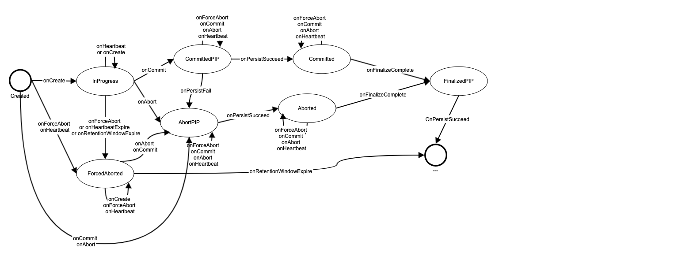

# 1. Overview
This is a temporary design document for detailed description of transaction states, persistence and replay. Once it is mature, we will merge the content here into the master [K23SI design doc](./K2-3SI-TXN.md).

For a typical K2-3SI distributed transaction, there are Transaction Record(TR) that is managed at TRH (designated Transaction Record holder partition) and MTR (MiniTransactionRecord) that is managed at participant partitions. Both TR and MTR are managed in memory and persisted in WAL. Of course, each transaction write-set, i.e. the SKV record(s) written/updated in the transaction, are in WAL as well, typically appearing first as Write-Intent record(with data), then as finalized state change record(Key only, with flag indicating it was committed or aborted).  

TR and MTR has less persisted states and simpler transition map, while their in memory states and transition map are much more complex. 

This document will describe these states and transition in following order:
1) Persisted Transaction Record (TR) states and transition map
2) In Memory Transaction Record (TR) states and transition map
3) Persisted MTR states and transition map
4) In Memory MTR states and transition map

  

# 2. Persisted Transaction Record (TR) states and transition map
There are only 5 Transaction states, as in the TxnStates graph below described in [K23SI design doc](./K2-3SI-TXN.md).

1) `InProgress(S1)`   - transaction is created, in progress.
2) `Committed(S2)`   - transaction is commited
3) `Aborted(S3)`   - transaction is aborted
4) `Finalized(S4)`  - transaction, after comit/aborted, complete finalization and transaction record is removed from memory.
5) `ForcedAborted(S5)`   - transaction, for one of three different reasons, is forced to be aborted, which is different from S3 in the case that it may never have complete write-set information to go through a proper finalization process. 

### Possible persisted TR records sequence inside WAL
In Write-Ahead-Log(WAL), For Transaction Record, as truth authority for a transaction state, it have exacly above 5 persistable states, appearing .

As shown in above picture, inside WAL, the sequence of TR record states can be one of following:
 
- (a) Typical committed transaction : InProgress(S1) -> Committed(S2) -> Finalized(S4) - Transaction is started, committed and finalized
 
- (b) Typical aborted transaction : InProgress(S1) -> Aborted(S3) -> Finalized(S4) - transaction is started, aborted and finalized

Also, when ForcedAborted state occurred, the sequence of TR record in WAL can be
 
- (c) Most typical fored aborted transaction : InProgress(S1) -> ForcedAborted(S5) -> Aborted(S3) -> Finalized(S4)  - transaction is stared, foreced aborted for one of three reasons, and then client properly request abort with complete write-set information for finalization, continue go through S3 Aborted and S4 Finalized afterward.
 
- (d) Less common race condition caused forced aborted case :  ForcedAborted(S5) -> Aborted(S3) -> Finalized(S4) - As write operations can happen currently at TRH and participant partition, a push operation comes to TRH so early that the first write at TRH is not arrived to TRH yet, thus the transaction is forced aborted. Client becomes aware later when first write arrives at TRH and then properly abort the transaction instead of creating it.
 
- (e) Client Disappearing : InProgress(S1) -> ForcedAborted(S5) : When transaction is started, it is forced abort for one of three reasons, but client crashed and never end the transaction properly. Such TR will be removed when Retention Window Ends(onRWE).
 
- (f) Orphan Write-Intent push : ForcedAborted(S5) : Some orphan Write-Intend in participant partition triggered other confliciting transaction to push on TRH, where there is no TR in memory, we created the TR in this state and client is not aware of this (re)created transaction thus no finalization. Such TR will be removed when Retention Window Ends(onRWE). The reason causing orphan Write-Intend in general is above sequence (e) where the client never give complete write-set for a foreced aborted transaction to proper finalize. 

One rare but possible state sequece in WAL:
 
- (g) Failed to Commit caused abort : InProgress(S1) -> -> Committed(S2) -> Aborted(S3) -> Finalized(S4) : transaction is started, tried to commit but couldn't sucessfully got comit record persistance confirmed after max amount of retries and timed out (even the commit record S2 is indeed persisted in WAL), then start to abort the transaction and it got aborted suceessfully and finalized. Note, from client point of view, the transaction is never committed successfully and thus aborted and finalized. As in such case, the commit request was not acknowledged success to client but an abortion instead is. 

### TR replay rules during partition reload.
All position in above sequence paths of state transition could happen to a transaction in WAL. During replay, depends on which state record is the last one, we will push the transaction to next sate according to replay rules. They can be discribed in simplified way as following:
- If last state record is `InProgress(S1)`, it will follow above (e) sequence,force abort this transaction. Replay in this case as if the client is crashed. 
- If last state record is `Committed(S2)`, it will follow above (a) sequence, trying to finalize the transaction. 
- If last state record is `Aborted(S3)`, it will follow above (b) sequence, trying to finalize the abortion. 
- If last state record is `ForcedAborted(S5)`, it will follow above (f), keep the S5 record in memory till RWE (or got client proper request for abortion in possible but rare case, then follow (d), moving to `Aborted`(S3)). 
- Of course, if last state record is `Finalized` (S4), no further state transition need to be done as it is final state.

Also notice that `Finalized` (S4) state of transaction only exists in WAL, but never in memory. 

For a transaction, TR (and MTR) are persisted normally togeter with data (SKV record Write Intend, or SKV record status change record) for persistence optimization, but to simplify the document, we ignored the data (SKV record) persistence here. One fact we should point out about persistence is that when applicable, TR/SKV and MTR/SKV records are persisted combined in one persistence request to persistence layer and TR or MTR record is before SKV record. So for any persisted state changes(of TR/MRT and SKV data), in WAL, new state records of TR/MTR always appears before those of SKV data records. This important fact can be used for correct execution (including state transition validation) as well as debugging validation.

  

# 3. In memory Transaction Record(TR) states and transition map at TRH(Transaction Record Holder)
 

## 3. 1 Extra In memory Transaction Record States, Persistence In Progress(PIP) states 
With async peristence request, for all 5 above persisted states of a TR, there is a in momory state when persistence is requested and not yet complete, i.e. Persistence In Progress (PIP) states. We give a give them near Sx.9 code to corresponding persisted state. The transition between a PIP state to its persisted state (e.g.  `InProgressPIP`(S0.9) and `InProgress`(S1)) is triggerred when persistence asyn call succeeded.
1) `InProgressPIP`(S0.9) - before `InProgress`(S1)   
2) `CommittedPIP`(S1.9) - before `Committed`(S2)   
3) `AbortedPIP`(S2.9) - before `Aborted`(S3)   
4) `FinalizedPIP`(S3.9) - before `Finalized`(S4), actually `FinalizedPIP`(S3.9) is last in momory TR state as `Finalized`(S4) is only a peresited state never exists in memory.
5) `ForcedAbortedPIP`(S4.9) - before `ForcedAborted`(S5) 
 

All above 5 PIP states and their persisted states, except `Finalized`(S4), <b> total 9 states </b>, compose full set of in memory states. 

Async perisistence request may fail as well, and when it fails(time out etc.), a transaction state may transit to other in memory state instead of its corresponding persisted state. Detailed discussion for such persistence failure will be discussed below.

 

## 3. 2 In memory Transaction Record States transition - basic cases
 

### <I>Typical Committed transaction in memory state transitions</I>

### <I>Typical Aborted transaction in memory state transitions</I>

NOTE:
 
- Persistence completion response can be for different states, `OnPersisted(I)` is for `InProgress` record got persisted successfully. Similarly, `OnPersisted(C)` for that of `Committed`, `OnPersisted(A)` for that of `Aborted`. 
- Transition between `InProgress(S1)` -> `CommittedPIP`(S1.9) (in commit case) or S1 -> `AbortedPIP`(S2.9) (in Abort case) is triggerred by client `End(Commit)` or `End(Abort)` request respectively.
- Once transaction is in `Committed(S2)`, Finalizing process, which is sending finalization request(s) to all participant partition(s), is triggered. Such request in this commit case is for commiting the Write-Intent(s). While for abort case, it will be for aborting the Write-Intent(s). Upon all requests sucessfully complete, the transction enters `FinalizedPIP` state, which is also have flag indicating it is for Committed case `FinalizedPIP(C)` or for Aborted case `FinalizedPIP(A)`.
 
## 3.3 `ForcedAborted(S5)` cases when `Push` operation is not involved.
 

`ForcedAborted(S5)` is a state can be transited into for three reasons, inlcluding `PushAbort`, `Transaction Heartbeat Timeout(HBTimeout)`, `Retention Window End(RWE)`. `Push` is a important and relative complex operation , which will be discussed in next section 3.4. Following are cases that `ForcedAborted(S5)` is triggered by other two reasons.
### <I>ForcedAborted transaction by HBTimeout and TWE in memory state transitions</I>
                                                  |
 

Note:
- When a transaction is in `InProgress(S1)` state, TRH need to have hearbeat message from client (if no operation on TRH) periodically to make sure client is still alive or detect orphan transaction. When hearbeat timeout happens, client and TRH are disconnected and the transaction become orphan and should be forced to abort. Similarly, when `Retention Window Ends`, which means transaction over run max allowed time, it should be forced to abort as well.
- `ForcedAbort(S5)` state of transation may be known to client after the transaction gets into this state. In such case, client will request to `End(Abort)` transaction with complete write-set of transaction to finalize it. The state will transit to `AbortedPIP(S2.9)`. More likely, when client is disconnected, the `ForcedAbort(S5)` state will stay in memory till `Rentetion Window End(RWE)` in case there is orphan write-intent from other partitions (triggering push request which will be discussed later.)

## 3.4 `Push` operation

### <I>`PushAbort` state transitions</I>
 

NOTE:
- Common `PushAbort` operation - Most common cases when PushAbort happens, the transaction is in `InProgress(S1)`, or less likely case `InProgressPIP(S0.9)`, the transaction will transit to `ForcedAbortPIP(S4.9)` case starting force abort process.
- Push on non-exist transaction - When a push operation gets to a TRH, the Transaction may not exist in memory. The transaction (record of any state) may or may not exists in WAL either and even it does, there is no efficient way to find the last transaction record from the WAL. Such situation could happen in a few uncommon cases, e.g. in an optimized case where we allow concurrent (first) write operation at TRH as well as participant partition. The write-intent at participant partition may be pushed before the TRH receive the write request set up TR. In this case, we will recreate a Transaction Record in memory but in 'ForcedAbortPIP(S4.9)' state, follow the `ForcedAbortted` process. 
- An important observation is that once a transaction get into `Committed(S2)` or `Aborted(S3)` state, it can never get into forced abort path, as such commit/Abort record will be persisted with full write-set of transaction, and so transaction always have such info to move into `FinalizedPIP(S3.9)` state, even when crash/replay happens.
- For persistence failure(timeout), we will discuss later.

### <I>Other `Push` triggered state transitions</I>
 

NOTE:
- Depends on the state of the incumbent transaction, In progress transaction result maybe one of two between `PushAbort` or `Win` for the incumbent transaction. Committed or Committing transaction alawys win. For aborting or aborted transaction, challenger transaction wins(`PushAbort` for incumbent).
- When transaction is in `AbortPIP(S2.9)` or `ForcedAbortPIP(S4.9)`, even a push will result into `PushAbort`, but we can't give the response till the transaction is indeed aborted(Persistence of Abort record done). Otherwise we break the rule that truth authority of a transaction state is TR, to be more accurate, the TR state in WAL, as memory state when inconsistent with that in WAL may be lost when crash happens. 

  

## 3.5 Persistence Failure(PFailure)
### <I>Persistence Failure(PFailure) triggered state transitions</I>
 

NOTE:
- There are 5 persisted states, thus there are 5 persistence failure`(PFailure)` case to deal with.
- `onPFailure(InProgress)`, transaction will have to abort. As the TRH doesn't know the complete transaction write-set, it has to get into force abort process, into `ForcedAbortPIP` state. 
- `onPFailure(ForcedAbort)`, transaction in `ForcedAbortPIP(S4.9)` state can't get persistence done, there is no other way out but stay in this state, keep retrying the persistence request(with backoff) and issuing operation warning. But transaction state correctness is maintained.
- `onPFailure(CommitPIP)`, transaction (after max out retry counts or timeout with commit persistence request) will get into normal abort process, as TRH has complete write-set information from client (with its `onEnd(Commit)` request). 
- `onPFailure(AbortPIP)`, transaction in memory state will stay in `AbortPIP(S2.9)` state. One possible difficult issue is that if Push request comes in, as we previously mentioned, we could not respond to that till the abort persistence request is done successfully, i.e. the state moved into `Aborted(S3)`. This may blocking other conflicting transactions if the persistence keep failing. Of course, a fall back work around of this issue is to let this partition offload and load at different server, hoping that will work aournd contingous persistence error (likely due to previous hosting node network issue, a reload from other hosting node is likely solution). More importantly, an optimization without lose correctness is that as long as the transaction is never been in `CommitPIP(S1.9)` state(i.e. it is impossible that `Committed(S2)` is the last state record in WAL), we could notify the `PushAbort` result to push challenger even in `AbortPIP` state, even more, since the transaction write-set is available, it is ok to finalize(abort) all write-intent in other partitions as well in this case. 

 

## 3.6 Finalization Failure(FFailure)

### <I>Finalization Failure(FFailure) triggered state transitions</I>
 

NOTE: 
- Once transaction get into `Committed(S2)` or `Aborted(S3)`, finalization request(s) will be send out to all participant partitions. Failed to receiving all successful response will keep the Transaction in this state and retry.
- Partial finalization optimization - In practice, when only one or just a minor few participants failed to finalizing, an optimization is to record/persist (again) only these failed write-set subset keys(or key ranges), so, in case the TRH is reloaded, only these failed few partition(s) will be called to retry finalization.

## 3. 7 Complete Transaction Record in memory States and transition
### <I>Complete Transaction Record in memory state transitions</I>
 

NOTE:
- This is the complete TR in memomy state and transition map as described above for a general distributed K2-3SI transaction. There are several optimization for simple transactions which doesn't need to literally go through each states. 
- With Async persistence process at different states, the transaction could move to next operations in parallel till when it can't to preserve correctness. Such optimization could impact above general state transition map as well.
- The discussion of these optimization is following section 3.8.

 

## 3. 8 Optimization cases in K2-3SI and its impact on Transaction Record States and transition 
 
### 3.8.1 Read-only transaction 
Read-only transaction doesn't need to keep track of transaction states in WAL at all. Regardless for a transaction the client knows it is or not a read only transaction when it start the transaction, no transaction state is maintained ever in K2. After a transaction starts (at client), only when there is a first write operation, the transaction state moves into `InProgressPIP(S0.9)` at TRH which is select based on the first write, otherwise, there is even no TRH and read request comes in with a transaction timestamp without MTR either. In such read-only transaction, the client knows the transaction is a read-only and at the end, it doesn't need to issue commit either. There will be no TR/MTR trace for such transaction. 

In this sense, in K2-3SI protocol, for read only transaction, it can be treated as a set of unrelated read operations, except with the same timestamp, as there is no transaction state maintained for it. 

 

### 3.8.2 Non-Distributed single write transaction
The most simple transaction contains only single write operation (maybe on mulitple SKV record of same partition) into one partition. The client is aware of such case and should start the transaction with such info. In such case, there is no `InProgress` related states, nor finalization process. i.e. `Commit` and `Finalize` states are combined.  The state transition can be described in following graph.
### <I>Complete Transaction Record in memory state transitions for Non-Distributed single write transaction</I>
 
NOTE:
- The Commit record in WAL need to be marked that the record also means finalization. 
- Still, if the Commit persistence request failed(timeout), the transaction will move to `AbortPIP(S2.9)` (with Finalization) state. In such situation, there may or may not be the `Committed(withFinalization)` record in WAL, but the client is not acknowledged about the transaction commit result. So only when `Abort` persistence request is sucessfully persisted, the TRH can acknowledge to the client that transaction was aborted. In WAL, only latest state record counts regarding to the transaction state during relay.
- When `Push` request comes to the transaction, the handling is same to general case, as described in the graph as well. 

### 3.8.3 Non-Distributed multiple operations/steps transaction
Another expanded case from 3.8.2 for non-distributed transaction is that it contains muliptle interaction between client and TRH(only partition related with the write operations in the partition). In this case, the last write operation/step can be combined with commit request for the transaction and as all write-set(write intent) is local as TRH, there is no need for asyn finalization process. 
### <I>Complete Transaction Record in memory state transitions for Non-Distributed multipel operations/steps transaction</I>
 
NOTE:
- Due to the parition may be split or merger, only when at the last write oepration, the client is for sure knows about the transaction is such non-distributed mulitple steps transaction. So, only at this last write step, client could and should notify TRH abour such transaction. This holds true in case transaction ever got into `ForcedAborted(S5)` state, client have such info about transaction to optimize away finalization process. 

### 3.8.4 General optimization - pipelined operations for distributed mulitple steps/operations transaction.

For a distributed transaction contains mulitple steps of write (and read) operations, a general optimization approach is to allow client to move to next step when previous one is acknowledged by participant partitions (the write operation is kept in memory and in parallel asyn persistence of the change record is happening). This way the transaction operations/steps can be pipelined. 

There are two im
Further more, the participant can directly notify the TRH on the complete of persistence later, where the TRH was notified with each intended write by client at the same time when it was issued to the participant. Then whole transaction could have higher parallelism (of persistence and operations) and less network message roundtrip. In such optimization case, it is possible that when client requests commit, not all write-set was successfully persisted.   

For this case, a in memory TR state T1.8(CommitWait - ForReady) is introduced, which means the TR got request for commit, but not receiving all the sucessfull persistnce notice yet.
 

Table 6.1 - common case commit requested at state 1 (InProgress) but not all persistence operations are done/notified to TRH

| Stages                        | Triggering Action                    | In Memory State(s)                        | WAL Persisted State  | Triggered (Async) Action                                |
|-------------------------------|--------------------------------------|-------------------------------------------|----------------------|---------------------------------------------------------|
| T1(InProgress)&CommitNotReady | Commmit transaction requested        | T1(InProgress) -> T1.8(CommitWaitForReady)| T1                   | None                                                    |
| 1.8 Wait for ready            | Last persist sucess notification     | T1.8(CommitWait) ->T1.9(CommitPIP)        | T1                   | To persist TR in state T2(Committed) state into WAL     |
 

 

Table 6.2 - Special (optimized/quick) commit requested at state 0.9 (InProgressPIP)

| Stages                        | Triggering Action                    | In Memory State(s)                        | WAL Persisted State  | Triggered (Async) Action                                |
|-------------------------------|--------------------------------------|-------------------------------------------|----------------------|---------------------------------------------------------|
| T0.9 Starting transaction     | Commmit transaction requested        | T0.9(InProgressPIP) -> T1.8(CommitWait)   |NONE or T1(InProgress)| None                                               |
| T1.8 Wait for ready           | Local T1(InProgress)TR persisted&not last persistence | NoChange T1.8(CommitWait)| T1                   | None                                                    |
| T1.8 Wait for ready           | last persistence notification local or remote |T1.8(CommitWait) ->T1.9(CommitPIP)| T1                   | To persist TR in state T2(Committed) state into WAL     |
 

# 4. Persisted MTR states and transition map
There are only 3 MTR states that could be persisted in WAL:
1) M1 (InProgress)  - transaction is created, MTR created in memory
2) M2 (Committed)   - transaction is commited, which means also finalized at this participant, and MTR deleted. 
3) M3 (Aborted)     - transaction is aborted, which means also finalized at this participant, and MTR deleted. 

The persisted MTR state transition (completed) contains two path following:
 
(a) M1 -> M2 : transaction/MTR is started, commited and deleted(after sucessful finalization)
 
(b) M1 -> M3 : transaction/MTR is started, aborted and deleted (after sucessful finalization)

During the partition reload and replay the WAL, if a MTR has reached M2 or M3 state, it is completed in this participant and nothing need to be done. If for a transaction in WAL, M1 is met without M2 or M3, at the end of replay, the participant will trigger a query to TRH about the transaction state. Based on current transaction state at TRH, the MTR and related SKV changes/WriteIntent will be handled differently.
1) If the transaction is ongoing, (i.e. in state of T1-InProgress, or T0.9-InProgressPIP, or T1.9), the MTR and related changed SKV will be left alone. 
2) If the transactin is in committed (i.e. in state of T2), the MTR and related write-set can move to state of committed&Deleted M2. Note, at TRH, state T2.9 is invalid in memory state for the transaction means this is a fatal error/bug, as this means the TRH already received successful Commit&finalization from this participants, but this participants sends out such notice without sucessful persistence M2.
3) If the transaction is in abort (i.e. in state of T3.9, T4, T9.9), the MTR and related write-set can move to state of aborted&Deleted M2. Note, at TRH, state T4.9 is invalid in memory state for the transaction means this is a fatal error/bug, as this means the TRH already received successful Abort&finalization from this participants, but this participants sends out such notice without sucessful persistence M3.
4) If the transaction is no in memory at TRH, A ForceAbort T9.9 will be generated (just like being pushed) at TRH, the  the MTR and related write-set can move to state of aborted&Deleted M2. Note, the TRH will not send out any finalization request in ForceAbort situation.  (Danger, if the system has bug here, it will cause data loss!!!).
 

 

# 5. In memory MTR states and transition map
There are 3 in memory MTR states:
1) M1 (InProgress) - in the process of transaction read/write operations
2) M1.9 (CommitPIP) - Received Commit request, processing it, e.g. persisting MTR and related SKV write-set (WriteIntent) state change to commited.
3) M2.9 (AbortPIP) - Received abort request

MTR is created in memory with first write operation of a transaction requested on the participant partition, and persisted first time with InProgress state together with first write operation SKV data/WriteIntent (in front of SKV data record in position) in WAL. Upon finalization requests from TRH arrives (for both commit and abort case), its in memory state changes to M1.9 or M2.9, and trigginger persistence of M2 or M3 record (together of SKV data/Write Intent state change to commit/abort) into WAL.

In participant partition, there is a container for all in memory MTR (on going transactions). Each in memory MTR, besides transaction ID info (where to find TRH etc), contains a list of WriteOperations, each WriteOperation contains a list of keys of SKV that is written in this WriteOperation. Each WriteOperation, same with the Write Intend/Keys it contains, has persistence state as PIP or Persisted. This also makes MTR in memory state doesn't need a InProgressPIP state, unlike TR which has such in memory state. 

## 5.1 MTR States and transition - basic cases

### Table 5-1 - MTR <I>Typical transaction life cycle (committed)</I>
| Stages                    | Triggering Action                    | In Memory State(s)                        | WAL Last Persisted State | Triggered (Async) Action                                |
|---------------------------|--------------------------------------|-------------------------------------------|--------------------------|---------------------------------------------------------|
| First write               | First write with MTR arrives         | {emptry} -> M1(InProgress)                | N/A                      | To persist MTR in state M1(InProgress) into WAL         |
| Consequent write          | Consequent write with same MTR arrives| Unchanged M1                             | N/A or M1                | None on MTR, but persisting new WriteOperation          |
| (WriteOperation) Persisted| Wrrite Persistence complete          | Unchanged M1                              | M1 (InProgress)          | None on MTR, But update WriteOperation and WI in memory state from PIP to persisted|
| Commit finalization       | CommitFinalization reqeust arrives   | M1 (InProgress) -> M1.9 (CommitPIP)       | M1

Note, when MTR in memory state is created upon write request, first WriteOperation with PIP is created under MTR and all its containing SKV records/WriteIntends are added in indexer in memoery with PIP state and are being persisted together (positionally behind) with MTR into WAL. 