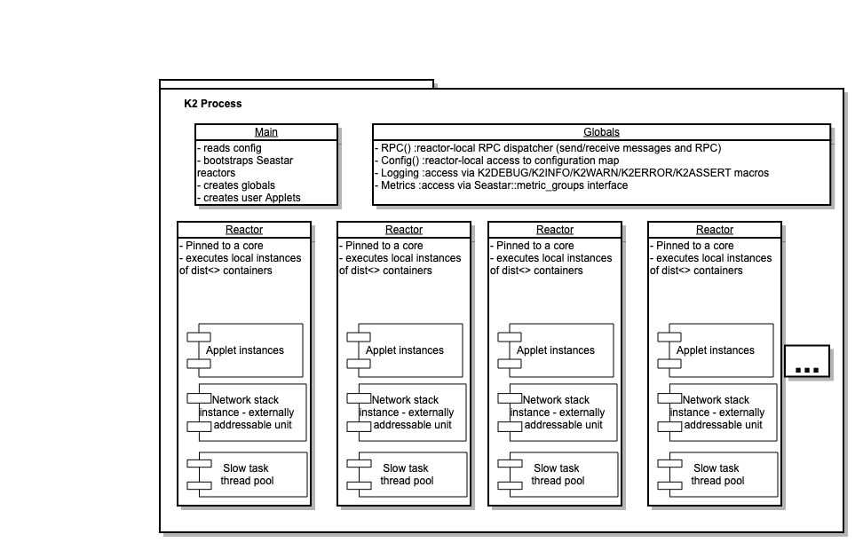
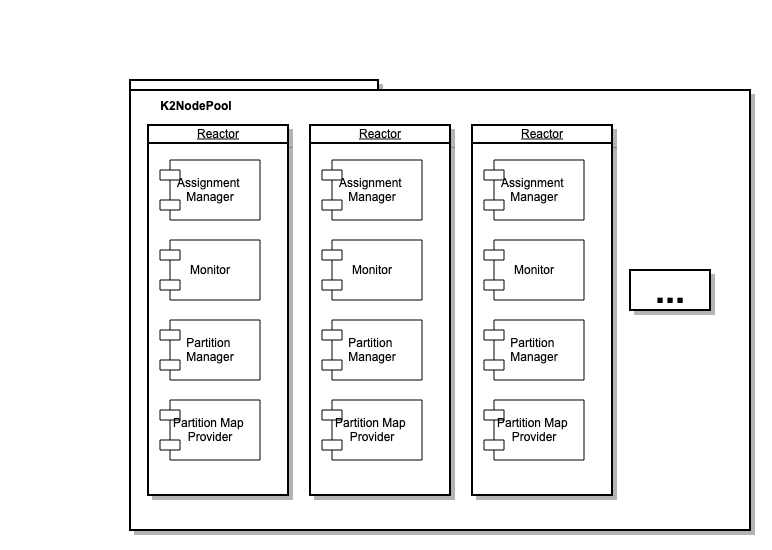
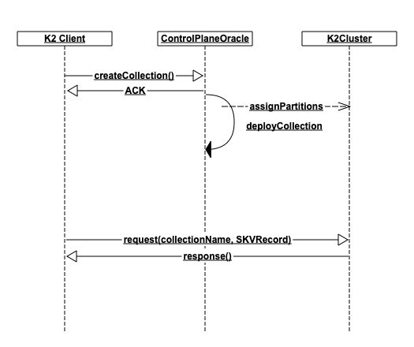

This document describes the architecture for a K2 process.

# General process architecture


We use Seastar to manage our processes. When our process is started, we create N reactor instances - each instance pinned to a particular core. The number of instances and their core assignment is driven via command line configuration.

The user code is packaged in Applets. An applet is simply any class which has a start and stop methods (see many examples under k2/src/cmd/demo)

Underlying services are initialized by the K2 Appbase, to provide access to infrastructure such as:
- RPC/Messaging
- Configuration
- Logging
- Metrics

# K2 Nodepool
In our architecture, a K2 cluster is a cluster of K2Nodes. Each K2Node essentially maps 1-1 to a CPU core, (a reactor in the K2 process) and is externally addressable - it can send and receive messages addressed to it. Our partition maps will contain endpoints, naming particular K2Nodes which would be responsible for particular data ranges.
The K2Nodepool is the name for the application which we run in order to start these K2Nodes. It is started with pre-determined number of K2Nodes - we can't add/remove K2Nodes at runtime from a node pool - we can only start/stop nodepools in order to manage capacity.



The K2Node is simply a set of Applets which we start in each reactor in order to compose the functionality of a node in the K2 cluster. This includes:
- Assignment Manager: This applet receives external partition assign/offload commands from our ControlPlaneOracle and is responsible for creating new partitions or removing existing ones
- Partition Manager: This applet is responsible for data-plane management. It manages and drives the task-oriented modules which we support (e.g. K2 SCC Transactions). It receives external messages (delivered as Tasks to the modules), and sends responses to clients from module response tasks.
- Monitor: This applet is responsible for collecting usage statistics and sending them to our ControlPlaneOracle allowing the CPO to monitor the health of the cluster and take scaling/failover actions if needed.

# Working with data in K2
To understand the component design, we should cover the data organization in K2. The data is organized in Collections:
``` c++
struct Collection {
    class PartitionMap {
        Partition getPartitionForKey(Key key);
    } partitionMap;

    std::hash_map<String, String> userMetadata;

    struct Metadata {
        String id;
        enum HashScheme {
            Range,
            Murmur
        } hashScheme;
        enum StorageDriver {
            K2_3SI,
            K2_KV
        } storageDriver;
        class CapacityStrategy{} capacityStrategy;
    } metadata;
};
```
Collection objects help us manage user data. They specify
- `capacityStrategy` (total size, ReadIOPs, WriteIOPs): this determines the allocated capacity in K2 and will allow for dynamic resizing.
- `hashScheme`: (e.g. range or hash) determines how we're going to process keys in order to route requests to the correct partitions.
- `storageDriver`(e.g. K2's Sequential Serializable Isolation driver): This determines how the data will be accessed, stored, and processed. Transactions covering multiple Collections will only be allowed if all collections have the same storage driver.
- `partitionMap`: the live set of K2 nodes which hold partitions of data from this collection
- `userMetadata`: Collections can also allow user metadata (future use cases may include tagging for search/monitoring/automation).

ACLs will also be associated with collections in order to manage access.

The steps which a K2 client application needs to perform are:


Essentially, the K2 client at some point has to create a collection, specifying the name, storageDriver, hashScheme, and initial capacity requirements. Once the collection has been created, we allow the user to issue requests against it.

It should now be clear why we require the collectionId in each request - the requests are always collection-specific and we support multiple collections in a single K2 cluster. We take the provided key, and hash it according to `collection.hashScheme` into `collection.partitionMap` in order to determine which partition owns the request. The request is sent to that partition.

It is important to note that we support compound keys of the form:

``` c++
struct Key {
    String partitioningKey;
    String rangeKey;
}
```

We always hash the partitioningKey to determine the partition for a record, but we store the records with the practical key of `"${partitioningKey}:${rangeKey}"`. This allows our users to ensure separate records reside on the same partition by using the same partitioningKey but different rangeKeys.

## Assignment Manager
