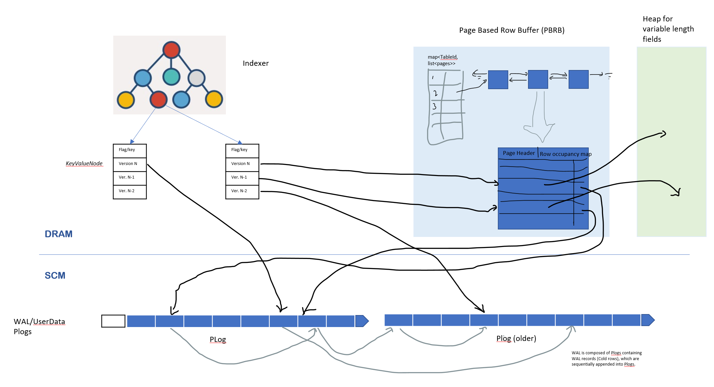

# Chogori Partition node Functionalities design overview

## 1. Functionality scope of the document

This document contains the design for 1) memory(DRAM and SCM) usage, i.e. in memory data layout, including indexer, leaf Multi-Version Node, KV data layout, serialized(persisted) data layout. 2) WAL record generation, persistence, caching and reference by indexer 3) Snapshot of partition, incremental snapshot of partition. 4) Related with WAL and snapshot, recover of partition.  5) data retention, GC, including in memory cached garbage data GC and on disk persisted garbage data GC. 6) data schema version upgrade/DDL support. 7) Standby Instance replay/follow up with master instance and offload background operations.

These features are intermingled together thus we have this overview design spec to give overall description and interaction of them. Later, we will have separated spec for detailed design for each of these features respectively as needed.

NOT in scope of this document: 1) indexer design, HOT or HashMap based indexer, 2) partition split and merger. 3)columnar store is not included here as current SKV is a row store essentially. Other type of possible services, e.g. GraphDB, is not mentioned, but the design should be expandable or compatible for these different services as well.


## 2.	Phase/Milestone accommodating designs (simplified Sep. Release design)

Chorgori-SQL project has phased delivery plan. The goal for first SQL phase, which ends at end of September 2020(thus, a.k.a Sep release),  is to be able run TPCC over SQL on Chogori-SQL. For Sep. release, in K2 node layer based on what we already implemented and open sourced , we plan to 1)use HOT indexer to replace the existing map for versioned KV management, 2)Enable PLog to persist WAL (and recover partition as stretch goal), 3)Design and implement SKV(schematized KV) and SQL extension(SQL specific physical operators that are proper to execute on single K2 partition).

The Sep. release design for K2 Nodes on functionalities in scope of this document is relatively simple and straight forward. 1) we assume there is only DRAM in K2 Nodes, no SCM. 2) We will not do any memory management but relay on system/Seastar platform to do that for us. Hot Indexer and row data use memory directly. Versioned row data keeps using current std::deque<DataRecord> 3) we also persist full record that is updated into WAL (in comparison of plan to persist only delta record after this phase). Similarly, all rows inside DataRecord are full rows as well 4) We do not support/implement partition snapshot, GC, but as stretch goal, we plan to support partition recover from replaying the whole WAL of full records. 5) we do not support/implement schema version/DDL change, nor standby instance as well.

At partition level, for Sep. release if we want to support recover of partition from WAL, we need to persist not only the WAL, but also some partition meta data, including the list of Plog Ids that contains WAL, other meta data about partition, e.g. key ranges, etc. 
The rest of the document will focus on these design issues beyond Sep. release. For this document, we will call the phase “Phase_next”, as it will likely to be detailed planned and break down to multiple phases down the road. And we put the design all in this fake phase and they can be break down into different future phase for implementation of course. 


## 3.	Phase_next design
### 3.1	Memory usage design
#### 3.1.1. SKV – Schema-aware KV, logical basic data model of Chogori platform
Even we say the KV is the basic data model of Chogori platform, as it is so simple thus can be versatile for various service data models we want to support with Chogori. But a naïve KV is not sufficient for efficient model related operation. Thus, a SKV store interface, where SKV here means a schema-aware KV and schema is understood at SKV store layer, is at core of Chogori data model. A SKV is a set of fields, where some subset of fields combined is partition key, some other subset of fields combined is range key, and the rest fields are value. A SKV is located in a specific Chogori partition based on its partition key, and the position of the SKV inside the partition is based on both its partition key and range key(as SKV inside a K2 node cold have different partition keys). For Chogori-SQL, a row in a table in SQL is mapped into a SKV  in Chogori. At least for now, we want to support following few data functionalities at this layer:
1)	Efficient Select. Here select (of SKV ) is similar to SQL model select operator, with projection of a subset of fields of SKV and filtering on some subset of fields.
2)	Multi-version of SKV. This is for supporting concurrency control and transaction protocol like K2-3SI.
3)	Column family. This is for efficient support of different fields of a SKV may have different frequency of being updated and/or being accessed. E.g. for an employee table, an employee row’s salary field and home address field may have big frequency difference of being updated or accessed. This is same concept supported in some well-known system like RocksDB, Spanner, CockroachDB etc.
4)	Interleaving tables. This is for efficient support of tables that has interleaving relationship, same feature as in Spanner. Detail description is ignored here.

The detailed design of SKV/SKVStore is at its own design spec. The information mentioned here is minimal needed for this document. 

#### 3.1.2 Indexer
SKV inside a partition is managed by a K-V indexer. As of know, there is one indexer per partition. Even there is possible mulitple SKVTables(or partial SKVTables) reside in one partition, they are all in one indexer. K-V indexer’s data model is only Key and Value, where Key is a byte array, and Value is a templated struct. Indexer has no idea about schema-awareness in SKV. Its responsibility is limited at <b>supporting efficient K-V operation</b>, including insert/upsert, delete, find and iterate. As indexer <b>does not understand schema</b>, it is SKV layer’s responsibility to combine Partition key and Range Key to for the key for indexer for KV operations. 

Besides efficient in-memory KV operations mentioned above, another critical requirement for indexer is <b>minimizing the memory footprint</b>. As mentioned later in this document, all indexer including value struct are stored in DRAM. Thus the size of indexer structure, key presentation and templated struct value size need to be minimized. 

For indexer data structure choice, for ordered indexer, we chose HOT. The detailed benefit analysis of HOT is ignored here. We also use std::map for perf/footprint comparison and testing purpose. For unorder indexer, it is not decided yet, maybe unordered_map or CuckooHash. But it doesn’t impact the design decision in this document. Even the indexer itself doesn’t understand the template struct for value, we need to design it here for completeness.

#### 3.1.3 Indexer’s leaf, value struct - <I>KeyValueNode</I>
The templated value struct for indexr, named as <I>KeyValueNode</I>, can be designed as three parts: flags part, key part and value part. The key part are included here as both Hot and CuckooHash(or other hash indexer) need to have key accessible from leave node, as the indexer itself doesn’t have full key(in HOT, only “switching” bits is kept in indexer; in hash indexer, only hash value of Key is needed in indexer). 

<I>KeyValueNode</I>, is defined as 64 byte struct for minimizing the size as well as cache line alignment. The first 8 bytes is for flags, second 8 bytes is for key pointers, the rest 48 bytes will be used for versioned value for both version (8 bytes) and pointer (8 bytes) up to three versions. 

Struct <I>KeyValueNode</I>
|     16 Bytes unit   |     First 8 bytes                     |     Second 8 bytes                        |
|---------------------|---------------------------------------|-------------------------------------------|
|     Bytes 0-15      |     Flags(8 bytes)                    |     Key pointers (8 bytes)                |
|     Bytes 16-31     |     Latest ver. timestamp(8 bytes)    |     Latest ver. Ptr/location (8 bytes)    |
|     Bytes 32-47     |     Latest – 1 ver. timestamp         |     Latest -1 ver.  Pointer/location      |
|     Bytes 48-63     |     Latest -2 ver. timestamp          |     Latest -2 ver.  Pointer/location      |

Notes:
1)	Indexer doesn’t really understand KeyValueNode, as long as it provides needed functionality of indexer, e.g. the HOT indexer needs to have a Key accessor API defined in KeyValueNode. All these parts are interpreted by SKVStore layer.
2)	Flags – It include various flag for the struct itself and the SKV record. E.g. the status for latest version of SKV record to support K2-3SI (WriteIntentPersisted, WriteIntentPersistInProgress, CommitPersisted, CommitPersistInProgress). 
For each version of the SKV record, there are flags as well. E.g. if the version is deleted(tomestone entry) or not, and if the pointer/location is a address in memory (for hot tier data), or a (Plog) location some offset(4bytes) in a Plog (id in-memory index) (for code tier data) There are two design choices here, one is to put these per version info into the Flags(8 bytes) here, or leverage the fact that only 48 bits is currently used in a memory address for both X86 and ARM and using swizzing pointer to put these per version info in high 16 bits of pointer/location. To simplify the design and to be future proof(as memory space will increase from 48 bits), we prefer not using swizzing pointer but put the per version flags in the first 8 bytes of the struct as well.
Another usage
3)	Version Timestamp – In Chogori with K2-3SI, the K2TimeStamp we use contains a uncertainty window of TimeBegin, TimeEnd and a TSOId, where TimeBegin and TimeEnd are 8 bytes and TSOId is 4 bytes. Here the space for timestamp is only 8 bytes. We use this 8 bytes only for TimeEnd, as with K2-3SI almost in all case we only need to compare TimeEnd values of two K2TimeStamp(and only in very rare occasion that these two value are the same, we then need to compare the TSOId). 
4)	Pointer/Location – Depends on where the SKV record is (either in DRAM when it is hot data, or some Plog when it is cold data), it is either a 8 bytes memory address pointer, or a 4 byte PlogId (in memory index as PlogId itself is 24 bytes, thus partition should maintain an in-memory only array of PlogIds seen in the partition) plus 4 bytes offset inside the Plog. There will be other possible flag needed for per version SKV record, which can be stored at the flog part mentioned before. E.g. 1, as Plog(holding SKV record data) is stored inside code tier of memory(SCM) which can be mapped into memory as well, so when this field is a pointer to memory address, it still may be in Plog as “cold” data. We will need a flag to indicate this, separating the flag indicating this part is a pointer or a PlogLocation. Another example is after we support delta row/WAL record (where a version of row only contains the delta changes from previous version, to reduce space usage), we can have a flag to tell if this version of a full or delta SKV record.

When new version of SKV record is written, the KeyValueNode is in-place updated with new Latest Version and its address, with existing latest become latest-1, etc, and the last old latest-2 is removed from the structure(if the old lates-2 is hot data in DRAM, we should free the memory as well), beside necessary flag update. All these change should be done by SKV layer without indexer’s involving. This applies to SKV record deletion as well, as deletion is inserting a new version of tombstone. 

As indexer is constructed at partition starts up, it could be optimized that indexer will allocate the memory for KeyValueNode sequentially from the same piece of memory so that neighboring leaf entries in the indexer will have their KeyValueNode allocated next to each other thus reduce cache miss when iterate the indexer. Of course, inserting new KV afterwards may have to locate memory in other places and fully removed (after data retention GC) KV may cause memory holes/fragmentation, but we will leave this for OS to deal with till this become a problem.

Full version chaining is maintained by persisted/cold SKV record, where each persisted record contains Plog/Offset location of previous version row. All hot SKV record in DRAM contains Plog/Offset location(can be cold tier memory address of PLOG/Offset) of its own version. Thus it is safe to evict hot version whenever needed, or replace code version with a hot version in DRAM address. 

At initial load of a partition from a snapshot, all the KeyValueNode for each key only contains one cold version, and then more version will be added into KeyValueNode when replaying WAL after the snapshot, or later on runtime new version created by user requests. A cold version in KeyValueNode can be replaced by hot version upon creation or read operation. A in-DRAM hot version always contain the key or in-dram pointer to key so that the background DRAM GC process, when evicting this version from DRAM, can find and update its owning KeyValueNode through indexer. 

#### 3.1.4 Three tier memory usage, SKV record’s data management
##### Three Tiers of memory
As described in other document, we are not considering bigger than memory database(no spill out into slow storage media like SSD/HDD out of memory), and we will actively manage memory over Seastar platform. We model the memory infrastructure at Chogori Server layer as three tiers, 
1)	CPU cache, which is not directly visible to software, but we need to design our data structure and algorithm to minimize cache miss. (latency 1ns @L1, 3ns @L2, 20ns@L3)
2)	DRAM, limited, a few(4-16) GB per core, latency 50-80 ns, bandwidth 20GB(single thread)
3)	SCM, OptanePM, 10-20 times more density, Latency 300-500ns. 

The idea is that all the serialized data in the format of PLog will be stored at Tier III(SCM). The indexer will be fully kept inside tier II. The interesting focus here is for SKV record data, some hot data will be cached in full row format in DRAM and the rest will be kept as row record in Plog in Tier III. 

##### Hot SKV Record and Cold SKV Record
Hot SKV(schema-aware KV pair, holding a SQL table row) is the record (of particular version) kept in DRAM, with its pointer(memory) in the indexer KeyValueNode. Hot SKV record is full record in the sense it contains all fields that this SKV record has for its version, in comparison to Delta SKV Record which only contains fields that is changed in its version. Hot SKV always contains a pointer(location info, in the form of PLogId index (4 bytes) and offset) to its cold version, which can be used to update its KeyValueNode pointer/address with when the Hot SKV record is evicted from the DRAM. 

Cold SKV record is the SKV record (of particular version) kept in slower SCM, in general as a blob located in some PLog with some offset. When it is present in the KeyValueNode of indexer, the pointer/location fields contains its PlogId index(4 bytes) and offset. 

##### SKV version chain management
As our SKV store is a MVCC system, each SKV may contains multiple versions, we need to have a chain approach to enable accessing every (live) version of the SKV. Following is how version is managed.
1)	Each version of cold SKV, besides containing its own version(K2TimeStamp), contains the location of previous version of SKV(cold as well).
2)	Hot SKV record, which contains its own version(K2TimeStamp), doesn’t contains location of previous version directly, but through its location of cold row of same version, it is possible to find previous version(besides latest three version is in KeyValueNode already).
3)	This design indicates currently we support up to three hot version(latest) only, as there is only three slots in KeyValueNode. If this limit turns out to be a perf issue, we can extends that and there are multiple different approaches to extents that and the choice should be made based on future knowledge on the work load. 
4)	In current design of KeyValueNode, we have three versions of SKV record, which can be all hot rows. Currently, we suspect three hot versions (or two committed version with latest one as write-intend) should be enough for efficient version data access. This means, if a request need to read the version that is older than the Latest-3, it need to chase the cold version chain and fetch/reconstruct the row for that version, which will be slower. If we find this is performance issue, we can fix it by various different ways, e.g. for Hot Row, it can contains the pointer to previous version of hot rows (besides the pointer to the cold row of its own version), this way, we can have a in memory(DRAM) of chain of versioned hot rows. Each versioned hot row, if not the top 3 latest version row owned by KeyValueNode, is owned by later version row. 

##### Fixed length fields, variable length fields, nullable fields of a SKV record and Out-Of-Place fields
SQL support nullable column, and also for a column it could be fixed length or variable length (varchar e.g.). Our SKV record fields need to support these types of fields as well. 

For a cold full SKV record, we can reuse what typical SQL system encoding(serialization) a row regarding to nullable, and/or variable length fields (in a page, either on disk or in memory pool). Typically, at the header of the row, for each nullable column, there is a bit indicator to tell if this column/field in this row is null or not, if not null, the value of the fields presents in its indexed position in the row. For variable length column/field, typically, in its column/field position, first is its length, followed with the data. When the max size of variable length is bigger than a threshold (e.g. varchar(max)), it will always hold a pointer(location) in the full row for this column/field, pointing to the location where this piece of data is really stored in the system. For call these fields <b>Out-of-Place fields</b>. For Chogori situation, the pointer(location) to Out-Of-Place fields will be the PlogId and offset where the variable length data is stored. For a cold delta row, only changed fields (before and after values) are kept. And typically, if changed fields is a variable length with size greater than an threshold, the old value of the data can be set as a pointer to previous persisted value instead of taking too much storage space for delta row. The new value inside a partial row may be a pointer as well when it is Out-Of-Place fields with size larger than some threshold. As cold delta row is used in WAL, we will discuss this topic in more detail there.

For a hot SKV record, currently for simplicity, we only support full Record(contains all the fields). But we also want its size is fixed so we can efficiently manage the DRAM memory. Of course, only SKV record of the same SKV schema(a SQL table is mapped to a Chogori SKV Schema) share the same length. For nullable and variable length which its max possible length is smaller than a threshold(e.g. 32 bytes), we can put them in place within the hot row, meaning we may not efficiently use the memory, when the nullable fields is null we are wasting up to the threshold number of bytes in memory, similarly when variable length fields is not at it max length, the bytes between its length to max length is wasted. The thresholds are design decision that can be coded into the SKV schema. For optimization purpose in the future, we can dynamically adjust the threshold for each field, e.g. if we find out a nullable fields have value(of fixed size) for almost all rows and frequently read, then we can put its value always in-line within the hot row to avoid chasing the pointers. Of course, there is a trade off that when such field is not frequently updated, keeping the pointer allow us to share the same copy across versions. 
For simplicity, we call such hot row, containing all fixed length fields (with pre-set sized nullable and variable fields) with pointers to non in-place fields, as hot full row, and call these non in-place fields as out-of-row fields. Out-of-Row fields, if kept in DRAM heap managed by K2 platform, are managed by their owning hot full row, which means once the owning hot full row is evicted, these fields are deallocated from memory as well. Not necessary all out-of-row fields need to be in DRAM, as some of them could be cold, or very large thus not worth to move between SCM and DRAM. 

When moving a row from it cold format to the hot in DRAM format, we copy all the fixed sized fields and in-place nullable, variable length fields, for the other fields, we can kept a pointer and the value could be copied into memory or kept in SCM(here a swizzing pointer may need to be used or the hot row header contains such pointer type info). 

##### SKV Hot Full SKV buffer - In memory Page Based Row Buffer(PBRB)
The most important benefit of a page based SKV record is improving cache hit ratio for SKV records neighboring each other when they are accessed at same time, as the page likely will be prefetched into the CPU cache when frequently accessed.

Unlike typical B+ tree page where every row sequentially is put into a page, and if one row is accessed, the whole page is cached in DRAM, we cache individual SKV record on demand into a page to improve DRAM usage(more frequently seen in OLTP workload). Of course, here we are talking about Hot Full Row only inside the page. We name such buffer <b>Page Based Row Buffer (PBRB)</b>, as it is still managed in page, but individual row are the granularity of caching decision, in comparison of B+ tree, where the whole page is the management granularity. 

Each PBRB page contains only SKV records from one Chogori SKV table. A SKV table is the SKV records that shares the same schema in a collection. The reason are a) for each Chogori SKV Table(mapped into one index of SQL table, e.g. the primary cluster index, or one of secondary index), its hot full row size differently from that of other schema. 2)Also, each page contains page header for space management which need to be efficient and uniform across all rows inside it.   

So, the buffer for hot SKV records (not including variable length fields) is conceptually composed of a <b> list for free pages and a map<TableID, List<Page>> managing the list of used pages </b> for each Chogori SKV table.

Page size is configurable. When it too small, the space and management(page split/merge) overhead is relative high. When it is too big, as the rows in the page is not in order, we may lost the cache hit ratio. Based on current CPU cache size, memory size, 64KB is suggested as initial default value and we can adjust this default value after implementation and perf profiling. 

A <b>cached row address</b> inside the KeyValueNode is true memory address in DRAM, within the page where the row is located in. We need to access the page start of a hot row efficiently for various functionality need(e.g. looking for a free spot for a new version within the page), thus it is required that page is allocated in memory with address starting at multiple of page sizes and page size must be power of 2. This way, by setting a hot row address’ the last bits (of page size) to 0, we can quickly get the page address. E.g. when we use 64KB(16 bits) as page size, we can set a hot row address’ last 16 bits to 0 and then we can got the address. 

##### Buffer page internal structure
A Buffer page for hot SKV records is conceptually composed of three parts 
|     Header (64 bytes)   |     Row occupancy bitmap     |     rows    |
|-------------------------|------------------------------|-------------|

1)	<b>Header</b> (64 bytes, cache line aligned), it contains following fields (subject to change):

|  Magic (2 bytes)  |   SchemaId (4 byte)  |  SchemaVer (2)  |   PrePageAddre (8)  |   NextPageAddre (8)  |  Num of HotRows (2)  |  Reserved (38 bytes)  |
|-------------------|----------------------|-----------------|---------------------|----------------------|----------------------|-----------------------|

Maigic is human easily recognizable type pattern, e.g. repetitive 0x10101010, mostly for debugging purpose. 

SchemaId is the id of the Chogori SKV  Schema(mapped to SQL table), indicating what table’s row this page is holding.

SchemaVer is the schema version that this page is holding. Normally, as buffer page is in memory object, it always holds the latest version of rows. But when schema version changes, existing buffer pages will not immediately migrate, thus, we need to keep the version here. We only need to check this version when there is a version change and before all the buffer page (of this schema) are converted, i.e. there are two versions on fly. 

PrePageAddre and NextPageAddre are the addresses of previous and next page for this Schema’s hot rows. As we will explain later, hot rows are roughly in order (or keys) within the page and between the page as well, similar to B+ leaf page but not strictly in order. We think this is sufficient to bring the benefit of improving CPU cache hit ratio, with flexibility of individual row level cache management and supporting multi-version per row. 

Number of hot rows is number of hot rows kept in this page, this number must match with number of set bit in the row bitmap.

Reserved fields can be used for various purposes. E.g. it could be used to keep the other statistics of the rows in the page, e.g. holding the addresses of min, max, middle rows(keys), and accuracy of such statistics, etc. Here further detailed design is needed.

2)	<b>Row occupancy bitmap</b>:

it is a bitmap for the rest of page spaces on where the memory is used at the unit of a hot full row. As each row size is fixed (for a schema at its particular version), we can pre-calculate easily max number of rows a page could have thus derived the size of bit map. E.g. if we know the row size is 128 bytes, then a page of 64 KB can hold at most 512 rows, thus a bitmap of size 64 bytes is sufficient. The set bit indicates where the address in this page is used by a hot row. 

3)	<b>Rows</b> part:

Rows part is split into slots of size of a hot row. When a slot is used, the number of hot rows is incremented and the occupancy bitmap corresponding bit is set. 

The hot row in memory layout is following:
|     CRC32(4btyes)    |     RowVersion(16)    |     Location of cold row (8)    |     Bitmap for nullable fields(x bytes)    |     Field0    |     …fieldX…  |
|----------------------|-----------------------|---------------------------------|--------------------------------------------|---------------|---------------|

a)	Crc32 is CRC for the row, It is updated whenever the row is changed. As we support MVCC, so very rarely an update will happen (when one transaction write the same row twice) so normally it is calculated only once during the row is inserted. We need to have this since the row may live long time in memory thus we need to protect it from random access pointer accessing it without knowing the data is corrupted. When such corruption is detected, we can opportunistically try to rebuild the row from its cold location (inside the corrupted hot row).

b)	RowVersion is version for this row is the serialized format of K2TimeStamp.

c)	Location of the cold row is the location (PlogId index and offset) for the same row in cold Plog.

d)	Bitmap for nullable fields – for all nullable fields, there is a bit (same index in the bitmap as that of all nullable fields) in this map is null or not. Note, if it is a in-place nullable fields, the actually field space is still reserved/occupied but no data, if it is out-of-place nullable fields, the 8 bytes pointer is not set. 

e)	Then all fields are following. All fields are known fixed length. For in-place variable length fields, the first one byte are actual length for the field(assuming we only keep up to 255 bytes of variable length field in place). 

f)	Efficient access of the fields – 
- First, we will have schema object (for particular SKV  schema and SKV  version) that contains all info and computed info to support efficient access of the fields, e.g. size of nullable fields bitmap, and direct access of the bit for any nullable fields in this bitmap, similar go with the starting offset of each field. 
- Second, just like in PostgreSQL, we expect that we will use LLVM to generate efficient code for the schema instead of interpret the schema at runtime to access fields.

g)	K2-3SI write-intent hot row’s mini transaction record. Mini transaction record is need for push operation, which should be available in MTR cache, thus, in hot row, we don’t keep it to save DRAM space. We will keep location for mini transaction record in cold row, which hot row have access. 

##### Buffer page usage

Unlike B+ tree leaf pages in traditional disk based RDMS, where the page is also persisted data container besides caching data container thus every consecutive rows are presented in the page, the Chogori buffer pages is in DRAM only cache pages, contains only recent used rows. But in Chogori, we still want these hot rows to be in key order as much as possible to improve CPU cache hit ratio as neighboring hot rows are likely to be used at the same time again. This ordering is not a strict requirement and the cost of not having them in order or close to each other is lowered CPU cache ratio. So, if maintaining order computation is too high, we can always give up the strict order desired characteristics.

So both at inter page level and intra page level, this ordering is desired but not strictly required. Thus, for a Schema within a partition, we will have chained pages containing key ranges roughly next to each other and may over lapping. For within a page, it is ideal that rows are roughly in order. 

Another requirement need to mention is that for each row, we could holding multiple but limited amount of (currently designed as 3) versions of instance. Ideally we want these multiple versions to be together in the same page so that 1) when a new version coming in, it could kick out the oldest version if it exist and reuse the slot. Such easy approach maintains previous location affinity 2) easier to maintain the order of different rows. 

Thus all algorithms related with buffer page usage should be a trade-off between maintaining the ordering(or exactly, the locality affinity of neighboring rows) and computation cost(latency) for doing it. The ideal algorithm should be low cost (especially when in user request processing hot path) and fuzzily good enough, and ideally having “converging” properties that gradually order the rows inter and intra pages. (Note, this is a very interesting research area). Following a simpler set of algorithms are described to intrigue the interest to providing better algorithms.

When allocating a new version of row where there are already cached hot row version(s), first check if there is any version(s) of this row need to be evicted, if yes, evict these version(s) and pick one of evicted slot (optimally close to the survival versions of this row) for this new version. There are various reasons that a hot row version need to be evicted, 1)If all versions of the row in KeyValueNode are hot, we need to evict the oldest row as that’s the limit of number of hot version we keep. 2) if any hot versions that are no longer in data retention window, except still need for other reason, they should be evicted.

When a row is moved into hot row page and it is the first version entry that become hot, the location for this row can be set based on its neighboring row location. The neighboring row (immediate neighbor may not be hot) can be get from indexer. A simple approach is to get previous and next hot row(pick the latest version which must be hot) addresses, and then if these two addresses are the same page, then pick a empty slot from the same page(case 1). If these two pages are different, pick an empty slot with lower occupancy rate(case2). When pick a location from the page that both previous and next neighbor are in(case 1), and their position are in order, we can try to pick a free slot in between. If it is not possible, we fall back to pick a free slot somewhere in the page, ideally close to one of neighbors. When pick a slot in case 2, we can try to pick a slot between the beginning or end of page and the neighboring row, depends on which side of page we choose. Here the occupancy map can be used and efficient SIMD instruction can be used for faster empty slot selection. 

When trying to insert a new row into a page and the occupancy rate of the page is high(higher than configurable high threshold, say 95%), we can registered a background task to do the split page. Also, when the occupancy rate is low (say 20%), we can register a background task for page merge. 

In extreme case, when trying to insert into a page and there is no empty slot, we can allocate a new page put it as new neighboring page of the one we tried insert into, and insert the row into this new page and registered a background task for neighboring page balance with this new and original target page. 

The eviction process is described in following section 3.2 Memory GC.

##### Buffer page slit, merge and neighbor page balance

These tasks are background async task, so the first thing to do when carrying out the task is to check the page condition if the task is still need to be done, as between the task is registered and the task is picked by background executor, the page states may be changed, even significantly, by run time. 
The split task can be designed with different approach, ideally, maintain and improving the ordering of rows. The most simple and brutal force split is to just move half of rows into a new page and update pointers in indexer to them. More supplicated design and approach can be done, if we have more detailed statistics on the page. 

### 3.2	Memory GC 
#### 3.2.1 Memory GC Overview
By the term Memory GC, we mean the row eviction management, page split and merge of in-DRAM Page Based Row Buffer(in this doc, we also call it PBRB), so that we can have high hit ratio on the data/SKV in the Page Based Row Buffer while control the memory usage for Page Based Row Buffer. 

In current design (with KeyValueNode specifically), for each SKV record, we could keep multiple (up to 3) versions which can be all hot versions. Also depends on how much DRAM we can give to Page Based Row Buffer, if there is enough buffer space, there is chance every SKV record may have one or multiple version cached as full hot row. Of course, on reality, we will not have all these DRAM to cache each and every SKV record with all three versions. The reason is that it will be huge waste of expensive DRAM, as likely at any moment, majority of the SKV records will be cold data, not visited by user, and even for the SKV record with activity, very likely not all three versions are needed. 

We can define an <b>Eviction Watermark</b>, basically is a version(K2 timestamp) which a cached SKV record in PBRB should be evicted if its most recently accessed version is older than Eviction Watermark. For a new SKV record that is just written/updated, its most recently access version is it recorder own version. But for an older SKV record, it may be created long time ago but read recently, its most recent accessed version can be get from the K2-3SI Read Cache. During the normal operation, when we access a SKV record, we always check if in its KeyValueNode, there are cached version needed to be evicted based on comparison of Eviction Watermark and its most accessed version. We will discuss how to decide the Eviction Watermark later in this section. On the other hand, when we read a cold SKV record, if its version is newer than Eviction Watermark, we cache it into PBRB, otherwise, we leave it as cold. 

Page Based Row Buffer will be started with fixed size of total DRAM, or total number of pages.  When partition is loaded, we expect pretty much all the SKV record pointed by the KeyValueNode are cold record in WAL or UserData Plogs, except a few SKV record that we relayed (after the latest snapshot), thus most if not all buffer pages are free pages in PBRB. When data is queried or inserted by user request, they will be cached in the PBRB of some page. When the page is full or close to be full, the page will split into two when half of data spill over to a new page from free page list. So the total free pages inside PBRB will be reduced over the time. When the total free pages is used up, new SKV record need to be cached and there is no space in existing page as well, new SKV record can be only cached with space on the current page of other hot (frequently access) SKV record. Such situation will reduce overall system performance, as hot records are not cached and furthermore may causing thrashing, wasting system computing resource as well. 

While with Eviction Watermark and evictions during the normal operation, it may slows down the speed using all the free pages, but it may be not enough to control the speed of using free pages and prevent fully use up of all free pages. So we may need background memory GC iteration of indexer to proactively evict records and merge pages (to free pages). 

The goal for GC is to use as much pages inside Page Based Row Buffer as possible and reach a dynamic balance of row eviction rate is roughtly the same rate as newer rows get cached, and all the rows cached is roughtly fully at and above Eviction Watermark.

#### 3.2.2 Background Memory GC Iteration

Background memory GC Iteration is triggered by the <b>used page percentage ratio</b> of PBRB. E.g. when the used page percentage ratio is reaching 75%, we can kick off the Background Memory GC iteration. We call this percentage the <b>memory GC triggering ratio</b>. By default, the background Memory GC iteration is low priority task. And when the used page percentage ratio is reaching a high value, e.g. 95%, we could bump up the priority of background Memory GC iteration. We call this percentage the <b>memory GC full-speed ratio</b>. Both memory GC triggering ratio and memory GC full-speed ratio are configurable and can be even dynamic analyzed and adjusted. Here we described a two level GC iteration above, it is possible that we may have mulitple level of priorities for task, e.g. low, mid and high, and we can have mulitple level GC iteration as well. E.g. triggerring with low priority at used page percentage at 70%, full-speed with mid priority at 95% and high-speed with high priority at 98%. Of course of these percentage are configurable and dyanmically adjustable.

When Memory GC is running at full-speed, it is running at the same or higher priority in comparison of that of user request processing, thus it has a naturally pacing(slowing down) effect on user request processing, thus the cache in-taking process.

As said, the goal for Memory GC is to use as much pages as possible and still maintain a dynamic balance, thus we should have a <b>target used page percentage ratio</b> that memory GC should maintain. Conceptually, we could like the GC iteration process not competing the computing resource for user request, so we can set the target used page ratio for GC to be the memory GC full-speed ratio. Memory GC iteration background task is long running task thus will pause pieridacally and each time it is above to yield, it re-register itself with adjusted priority for next round.  

An optimization for background Memory GC Iteration is that we can remember last free round of iterations on their effectiveness on different table and even some key ranges within table and only runs the background Memory GC iteration on these most effective tables or key ranges at some time. The detail design for such optimization can be extended later.

As total SKV record amount can be much larger than that which has cached version in PBRB, so the background Memory GC iteration may be more efficient to iterate on the valid records inside the used pages inside PBRB in comparison to iterating on the indexer itself. As in this case, the indexer itself can be sparse, with most of entries only have cold data. This choice can be even more accurately applied at table level instead of partition level. 

The background Memory GC iteration will iterate all the cached record, and based on comparison with Eviction Watermark, evict records that no longer should be cached. And if the neighboring pages occupancy rate is reduced to the merge threshold(e.g. 40%), it will register a merge request on the neighboring pages. 

Both In regular user request processing, or in background Memory GC iteration, when we hit a SKV record with cached version(s), we will compare that with Eviction Watermark and decide if we should keep the cached row or evict it. The comparison and eviction logic is same in both cases. 

#### 3.2.3 Eviction Process and Eviction Watermark
Eviction can happen during normal user request processing as well as Background Memory GC Iteration. It both case, we compare with existing cached hot row with Eviction Watermark and if the cached hot row's last access version is older than the Eviction Watermark, it is evicted.

When a hot row need to be evicted from the buffered page, there are three steps 
1) free the space exclusively owned by the variable length heap by this row.
2) if this version is still pointed by KeyValueNode, replace the hot row address there with that of its cold counterpart. 
3) mark the slot in the buffer page occupancy map as free slot. 

##### Eviction Watermark Comparison 
When we use Evcition Watermark to compare with existing cached row deciding if the cached row should be evicted, we go with following logic. 
1) If there is only one committed version(there is no write-intent), i.e. latest version of the SKV record that is cached, we compare the Eviciton Watermark with this cachced record's last access version, which is the bigger value of the record version and the last read version from ReadCache. If the Eviction WaterMark is higher, evict the record, otherwise, keep the record. 
2) If there is an write-intent, we compare its version(written version) with the Eviction Watermark, if the Eviction Watermark is higher, we evict the DRAM version of write intent, replacing with its persisted cold version.
3) When there are multiple cached versions, if the first version is write intent, process the write intent the same way as above. And if even the write intent, which is newer version is evicted, all other (older) versions cached should be evicted as well. If there is not write intent, we compare each cached version from the latest to oldest following the same logic describe in 1. where there is only one cached committed version. Once a cached version is evicted, we can evict all older cached versions after that.

Note, being able to evict Write-intent is one of must-have feature to support very large or long running transactions for K2-3SI, as these changes (write-intents) can be safely evicted from DRAM which can be limited sized.

##### Eviction Watermark Adjustment - triggering event and frequency
Eviction Watermark is probably the most important parameter in usage Page Based Row Buffer and memory GC process. It is dyanmically adjusted based on the used page percentage ratio. The more there are free pages, the more generous, i.e. the older, the Eviction WaterMark should be, and vice versa.

Thus, Eviction Watermark adjustment can be efficiently triggered at when free page in PBRB is used or returned. Actually it is not necessary that the Eviction Watermark is adjusted at every free page used/freed event, as it can be too granular. We can keep a used page percentage ratio change counter since last adjustment, together with last adjustment time, and use these two parameters to decide if Eviction Watermark need to be adjusted or not. When a free page used/freed event happens, we adjust the counter and check the time elapsed since last adjustment time, if the counter reach the threshold and/or the elapsed time reach the threshold, we will adjust the Eviction Watermark. The counter is used since we need to adjust the Eviction Watermark based on current used page percentage ratio. Also the Eviction Watermark is related with current time, so when enough time elapsed while even used page percentage ratio are not changed much, we still need to adjust the Evcition Watermark. Furthermore, the counter threshold and elapse time threshold can be dyanmically adjusted based on the current used page percentage ratio, i.e. when the used page percentage ratio is high, we can reduce both threshold to adjust the Eviction Watermark more frequently thus the eviction can be more sensitively when there is less free pages.

##### Eviction Watermark Selection - providing LRU eviction policy
Eviction Watermark selection is based on both used page percentage ratio and time. Essentially it provides a LRU eviction policy.

when PBRB's used page percentage ratio is low, e.g. lower than memory GC triggering ratio, we can simply set the Eviction Watermark to be the <b><i>Now()-retentionWindow</i></b>. This means all the cached row that if it is possible to be read by a transaction (as it can be started only within the retention window) will be kept. This is most generous situation. This is still a moving value together with elapse of time. 

When PBRB's used page percentage ratio reaches the memory GC trigger ratio from lower side, it means the Eviction WaterMark was not aggressive enough. Thus more aggressive Eviction Watermark should be picked. The Eviction Watermark can be chosen based on the current histogram of K2-3SI ReadCache, current Used Page percentage ratio, Target Used Page percentage ratio, and last few round of memory GC iteration statistics(discribed below) and recent user request triggered RBRB usage statistics (discribed below), to establish a liner regression function, and from the function with these input, pick the new Eviction Watermark. the function should give more aggressive watermark with higher used page percentage ratio and drive the PBRB usage to the targe usage ratio.

There is research oppurtunity to use reinforcement learning DNN for such Eviction Watermark selection.  

##### Eviction Watermark, PBRB page usage, used page ratio etc. statistics and usage
There are quite some statistics related with Eviction Watermark and used page ratio worth to collect, and may be guide the decision on memroy related decisions, including key configurable or adjustable parameters, like Eviction Watermar section above, and other partition behaviors. Following is a sample list of statistics we can collect and what they can help on decision making. 

1) PBRB cache hit ratio - this is rather the result gauge we need to check effectivenss of related work
2) User request triggered hot row insersion count into PBRB and number of hot rows evicted, since last Eviction Watermark change. This can give the hint on how aggressive the Eviction Watermark is, and can help to dynamically adjust Eviction Watermark.
3) Statistics on percentage of slots really used in used page. This can help to adjust page merge/split triggering ratio. This can be at whole PBRB level, or per table level. 
4) Number of rows read but missed from PBRB, and reasons for that, either older than Eviction Watermark or not. If lots of rows older than eviction watermark were read, (and at this time, the used page ratio should be high, likely higher than <b>target used page percentage ratio</b>), it means we do not have enough DRAM for PBRB, and it can indicates the partition is too busy and maybe should be split. 
5) Memory GC background iteration related statistis, run time, evicted row count and iterated row count, avg. eviction watermark difference to the iteration time, etc. This gives overall performanc of memory GC iteration process, and with recent rounds statistics, we can know Eviction Watermark is selected efficient or not and futher guide the selection of Eviction Watermark with other information. E.g. if last few rounds of GC iteration evicted low percentage of cached rows and used page ratio is increasing and used page ratio is approaching or above target ratio, we want adjust the Eviction Watermart more aggressively.   

Much more similar statistics should be collected and above are just a few examples on usage of them. Also it worth to mention these statistics data can be modeled to be input for ML (e.g. Reinforcement Learning) algorithm/network to help on parameter and other deicsion making.  

### 3.3	WAL design – user data change record
WAL contains all user data change records to keep user transactions, and any other system change records that are related with user transactions (i.e. system transactional changes, e.g. a new epoch of the partition due to partition start up, split/merge) into the WAL. Here in this section, we will focus on the user data change record design. The other system change recorder in WAL will be discussed in related features. 

#### 3.3.1	Full row and Delta row
For Sep. release, for simplicity, we only support full row. Beyond Sep. release, we will support both full row and delta row and use delta row by default.

Full row in is the serialized all fields of a SKV record(in Chogori SKV store context), with other serialized data structures needed to be a record inside WAL, e.g. record header, SKV record version(K2Timestamp), pointer to previous version, CRC32 for the row. We can call these as WAL record overhead fields.

Of course, for out-of-place will be kept at a pointer/location in full row. There are two possible approach that Out-Of-Place field data itself is persisted. One likely common approach is it come with rest of fields and a persisted in one shot together with full row. Another possibility is that for real large out-of-place fields, the application layer may first persist that field direct into a Plog first, and pass the pointer/location of that fields with rest of field in to K2 layer and only the pointer/location need to be persisted in the row into WAL. 

Dela Row only contains user fields that were changed in the operation where this row is generated, besides the WAL record overhead fields. In general, for a changed fields, delta row contains both before and after change value. If the value is out-of-place fields, we contains pointers to them. If the before value is too big, we can contains the pointer to its before value in previous version row as well. 

Ideally, just like accessing hot row in DRAM, we should have LLVM generate fast access code to cold row and to generate a hot row from previous full hot row with this version of cold delta row and from after version of hot row, as both situation are needed. E.g. when a row is first time accessed (after partition load) or been evicted, it may be a cold Delta row, we need to generate full hot row from it with previous version of full row (say created with last snapshot). In this case, we are generating a hot full row from older cold full row and cold delta row. In another case, where we have latest version of row in Hot buffered page, but need to access its previous row, which is a cold delta row. In this case, we are generating a hot row with post version hot row and cold delta row (containing before change of changed fields). 

The full Record and delta record can be defined as following:

<b>Full Record</b>: <mark>(NOTE: Need to integrate with SKVRecord payload based implementation)</mark>
|     <i>Magic Bytes (2 bytes)</i>   |     <i>CRC32     (4btyes)</i>          |     <<i>Record Type     (1 byte)</i>    |     <i>Serialization format version (1   byte)</i>    |     <i>Record Length (4 bytes)</i>    |     Rowflags(2 bytes?)    |     Schema ID and version (4+2 bytes)    |     Row     Version (16)    |     Location of previous version row     |     Location of Mini Transaction Record     |     Offsets for each fields (x bytes)    |     Field0    |     …      fieldX     …    |
|------------------------------|---------------------------------|---------------------------------|------------------------------------------------|--------------------------------|---------------------------|------------------------------------------|-----------------------------|------------------------------------------|---------------------------------------------|------------------------------------------|---------------|----------------------------|

1)	<i>Magic bytes</i> is 2 bytes of human easy reggeized bytes to indicate this is a start of a new record inside the WAL. E.g. can be 0x1010 repeated 4 times. Just for easiness of debugging.
2)	<i>CRC32</i> – crc for the rest of fields 
3)	<i>Record Type</i> – 1 byte, support up to 256 different types of record in WAL, one most used should be User Data record.
4)	<i>Serialization format version</i> – 1 bytes, the serialization formation of this type of record. 1 byte is enough to support 256 versions, which can be recycled assuming only limited amount of continuous version are supported(otherwise, the data must be rewritten during GC to upgrade to latest version).  
5)	<i>Record length</i> – length of bytes from following CRC32 to the last field of the record. 

NOTE: These first 5 fields can be thought as Record header, which is same for all different type and version of records in WAL. All fields after these header fields are uniquely defined by the Record Type and Serialization format version.

6)	Flags is some rudimentary information about this type row with 1 bit for each piece info. e.g. In case of user data record, it is a full row or a delta row, it is a write intent or a commit/abort record(for K2-3SI), the locations of previous version or mini transaction record is relative offset of full PLogID+offset, etc
7)	If this record is a user data record, the SKV  schema ID and version of it, from which we can know schema info including being able to identify the number of fields, which fields are out-of-place fields, etc. 
8)	Row version of this row, K2Timestamp.
9)	Location of previous version – The persisted address of previous version of this row. By default it is PlogID + 4 byte offset. But it can be optimized with relative offset if the previous version of row is at the same PLog.
10)	Location of MiniTransactionRecord. The persisted address of mini transaction record. It can be relative offset from the current address, if the minitransactionRecord is persisted together with this record(relative offset can be used if this record and its miniTR is in the same Plog). This is for K2-3SI push operation.  
11)	Offsets for each fields – relative offset (from the beginning of the record) for each fields as there are variable length fields and nullable fields length (thus each fields will have different offset for different row). Note: for nullable fields, if it is null, we could use 0 as indicator inside the offset list.  
12)	Fields part. – Null fields doesn’t exist here. Out-of-Place fields holds a location(PlogId + 4 byte offset, which can be optimized). Variable length fields length can be calculated from its offset and next non null neighbor offset. 

<b>Delta Record:</b> <mark>(NOTE: Need to integrate with SKVRecord payload based implementation)</mark>
|   <i>Magic Bytes (2 bytes)</i>   |     <i>CRC32     (4btyes)</i>          |     <<i>Record Type     (1 byte)</i>    |     <i>Serialization format version (1   byte)</i>    |     <i>Record Length (4 bytes)</i>    |     Rowflags(2 bytes?)    |     Schema ID and version (4+2 bytes)    |     Row     Version (16)    |     Location of previous version row     |     Location of Mini Transaction Record    |     Changed fields info (x bytes)    |     Field0    |     …      fieldX     …    |
|--------------------------------|---------------------------------|---------------------------------|------------------------------------------------|--------------------------------|---------------------------|------------------------------------------|-----------------------------|------------------------------------------|--------------------------------------------|--------------------------------------|---------------|----------------------------|
1)	All starting parts/fields are the same with full Row till Changed fields info.
2)	Changed fields info is a serialization format of the data structure describing all changed fields, including number of them, offset of them, indexes (inside schema) of them, if contains before-change value, in-place or out-of-place, etc. Note: For first subset of fields, which are Key fields, there will be no changes, but still need to be presented. A possible space saving optimization is to ignore the key fields (maybe only keep a Hash value of that for validation) as they can be retrieved from one of previous version of the full record.  
3)	For K2-3SI, there are special type of Delta Record:
a.	Commit/Abort Record, which only contains Key fields (again, can be optimized out), besides these fields till Location of previous version row, which pointing to the same version write intent. One of the bit in Flags can be used to indicate if it is Commit or Abort.
b.	Tombstone record, which only contains Key fields. It can be either write-intent, or commit/abort record. 

##### Version chain optimization
For each SKV record change, it in general will go through the two stage persistence steps. First, it is persisted as a write-intent (either Full or Delta) record, then a finalization record indicating the write-intent’s final status(committed or aborted). The finalization record’s pervious record pointer always pointing to its own write-intent record, so that during the WAL replay, it indicates the write-intent’s final status. For a write-intent record, its pervious record pointer could naïvely pointing to previous version SKV’s finalization record. But, this will cause extra pointer chasing when visiting the version chain for previous version (which could be frequently needed for Delta rows), since in K2-3SI, when a write-intent can be written, the previous version is guaranteed to be committed and finalized, so an optimization can be done is that for write-intent record, the previous version pointer can be set to pervious version’s write-intent record directly. 

Above essentially is talking about cold Row version chain optimization. For in DRAM Hot Rows, we can do similar that the DRAM Hot row pointing to its own version of cold row’s write-intent, since the status of current version is kept in KeyValueNode already. 

#### 3.3.2	WAL Plogs, WAL replay and K2-3SI related logic
WAL conceptually is a stream of records. The most straightforward implementation is to have a sequence of PLogs and append the stream of records into these Plogs in order. It is expected that single sequence of Plogs (i.e. only one Plog at any moment of time for WAL to append records) should be sufficient to meet the bandwidth requirement for WAL. The reason is following 1)As the records was generated from the user requests almost exclusively, and these user requests comes to the partition/K2 node through network, thus the input is limited by single K2 node network bandwidth for user requests first. 2) We can assume the CPU core processing power is not bottle neck, which can be not correct and even it is not correct, processing power will further limit the throughput of transaction, or rate of WAL record generated. 3) The rate of persisting the generated WAL record is related with batching of the records, network bandwidth of the K2 node to Persistence layer and Persistence layer(Plog server) processing throughput. Here the processing throughput should be higher than the network bandwidth and processing is CPU centric and even memory bandwidth limit (with RDMA direct into persist memory). Assuming the ballooning effect (size ratio of those of WAL record generated from the user request) is not significant, then the assumption that single PLog bandwidth should be sufficient. Last of not least, even if this become an issue and can’t be solved directly, we can always use multiple concurrent Plogs, which is more complex though and should be avoided if we can.  

The records inside WAL need to be replayed to build the indexer upon the start of the partition. When a partition never had a system snapshot yet, it will need to rebuild the indexer from the whole WAL. More likely there is already system snapshot when the relay happens. The logic of replaying with snapshot is related with snapshot as well so we will discuss in the section 3.3. about Snapshot. Here we only describe the process the replay from very beginning of WAL of a partition.
The process is similar but much simplified version of ARIES algorithm. The reason is multifold,  first, Chogori is a in-memory system and use Log is the database model, where we don’t have traditional data pages/files; second, we support only K2-3SI protocol (with MVCC), essentially there is no undo records in WAL. The replay process is the process rebuilding the indexer. When we see a new record, depends on what record it is, we may insert a new KV, or new version of a KV, or update the state of a version of KV in the indexer. By default, when we insert of new row(new version) into the indexer(KeyValueNode), we put cold row into KeyValueNode. Based on the allocated size for DRAM page buffer(e.g. 2GB), we can proportionally chose a starting point of WAL so that each record from that point will be replayed with hot row into the DRAM Page buffer(e.g. when the left over WAL size is 0.5GB). The starting point can be intelligently suggested by the partition itself based on the size ratio of hot row and cold row and kept in partition’s metadata for replay process to use. 

#### 3.3.3	K2-3SI related logic during WAL replay
To support K2-3SI, there are (Full) Transaction Record at the partition which is TransactionRecordHolder, and at participant partition for the transaction, there is a MiniTransactionRecord. Both type of transaction Record need to be persisted and their state will be changed during the life cycle of a partition.

##### K2-3SI related WAL Record
If current partition is the transaction record holder, its WAL contains FullTransactionRecord with its state: 
1)	Pending (A transaction always started and persist with this state)
2)	Committed/Aborted
3)	Finalized (all changed records/write intents are finalized into committed version or clearly removed)

For FullTransactionRecord, we have thee sub-tyes for tis states respectively. FullTransactionRecord must be persisted when it is created or its state changed, as transaction status need to be persisted across partition shutdown/crash and reload.

For a K2-3SI transaction, if current partition is a participant (not transaction record holder), its WAL contains MiniTransactionRecord with its state. There are two states of MinitransactionRecord
1)	Pending – contains all mini transaction information. Its address is kept in all user data record of this transaction. 
2)	Finalized – with flag indicating this transaction is committed or aborted, basically, this record is added when finalization of the transaction is done, so that all records related with this transaction at this partition is consolidated/finalized. 

Similarly, for MiniTransactionRecord, we have two sub-types for its states respectively. MiniTransactionRecord must be persisted as the write-intent across partition shutdown/crash and reload need it to find out TRH and further more the status of the transaction.
The detailed record format can be defined as <mark>(add more detail here)</mark>.

##### K2-3SI replay logic at TransactionRecordHolder partition
When we replay a FullTransactionRecord holder record in the WAL, we use a live owning transaction cache (in DRAM) as container for all the records met. When replay a Pending record, we put this record as a new entry into live transaction cache with Pending state. When replay a matching Committed/aborted record, we update the entry into committed/abort state. When replay a Finalized record, we delete the entry from the live transaction cache. At the end of replay, we go through the live  owning transaction cache, for all committed/Aborted entry, we issue background async task to finalize these transactions. For Pending entries, if they are still alive during the next transaction heartbeat deadline, we live it intact. If it is beyond the heartbeat deadline, we mark it as aborted (and issue async finalize task). 

##### K2-3SI replay logic at transaction participant partition
At a partition where for a transaction it is participant, during replay process, we should have matched MiniTransaction records and related user records. We keep all on-fly MiniTransactionRecords and on-fly-write-intend records. If it encounters a pending MiniTransactionRecord, it put it in a live participating MTR cache. If it encounters a  write-intent records, we put its key under the matching MiniTransactionRecords in the cache. If we hit a matching commit/abort record for a write-intent, we drop the original key entry under the MinitransactionRecord cache entry, and mark the MTR entry state as “Finalizing”. If we encounter a finalized record for MTR, its entry should have no pending write-intent keys and we can safely remove the MTR entry. At the end of WAL reply, for these on-fly MTR records marked as “finalizing”, we can kick off async finalizing task for this transaction locally(mark the commint/abort for all user records on disk and in memor under this MTR, and then persiste the MTR with state of finalized and remove it from cache). F these on-fly MTR records market as “pending”, we can kick off a async background task to resolve them(by visiting their transaction record holder partition). 

#### 3.3.4	WAL Plog impact from Snapshot and GC
When a new Plog is added into WAL and WAL records are appended into this PLog, the Plog become the last(newest) Plog that need to be replayed in case the partition is reloaded. 

When a system snapshot (full or incremental) is taken for the partition, from particular Plog in the WAL, this one and older Plogs before it contains data that are fully covered by the snapshot(and or snapshots before this this snapshots if its incremental snapshots). The detail of this will be discussed in Snapshot section and ignored here. But the point is that these “older” Plogs will not participant the partition replay process, as the snapshot will be loaded first when the partition boots up. 

So, for these older Plogs can be moved into a state where it can be GCed, all the data in the PLog should be already covered by a snapshot(i.e. won’t need to be replayed when partition loads up). Actually it is possible to GC a PLog in WAL (after it is sealed) when it is still one of the Plogs that need to be replayed(not covered by some snapshot), but the algorithm and logic is complex and can easily be error prone. As by default, all the records in the WAL should be sequentially replayed, so it is tricky to keep track which ones can be skipped and then the containing Plog can be GCed when valid data ratio dopes below the threshold.

### 3.4	Snapshot (of Indexer)
Snapshot provides two functionalities to the partition; one is to keep a consistent backup of the partition (at snapshot timestamp) and the second is to enable quick load of partition. For the first functionality, there is a whole set of business-related logic on the management of snapshot life cycle. Such life cycle management of snapshot is not covered here as it is business requirement specific and have little impact on architecture and design of snapshot process itself, once we keep such life cycle management logic as a separated sub-system. The second functionality has similar purpose of checkpoint process in traditional RDMS, but simpler in Chogori. Basically, with snapshot, when partition is reloading, it will load the snapshot of indexer into DRAM first and then replay WAL that was generated after the snapshot was taken.  When replay these new WAL records, we simply update the indexer directly. At the end of the relay, the indexer will match with that when the partition offloaded/crashed, and the partition is ready to accept live client request.

Here in this section, we will focus on how snapshot is generated and its impact on other functionalities of the partition, e.g. WAL replay, data retention window, GC, etc. 

Depends on the purpose of the snapshot, we separate the snapshot into two main categories: <b>System Snapshot</b> and <b>User Snapshot</b>. <b>System snapshot</b>’s purpose is to speed up replay process (though it provides a consistent backup that could be used in other purpose, e.g. in speeding up user snapshot). System snapshot is triggered periodically by the Chogori system. System snapshot is normally at whole partition scope and happens independently among partitions within same collection. Another usage of system snapshot to to help the Plog GC which we will discuss later. <b>User snapshot</b> is triggered upon user’s request. Normally user snapshot happens at the scope of collection (mapping to whole database in Chogori-SQL) or a SKV schema(s) (mapping to a SQL Table in Chogori-SQL).

System snapshot can further be categorized into <b>full snapshot</b> and <b>incremental snapshot</b>. System Full snapshot keep a complete snapshot of indexer and every SKV record pointed by the index (at the snapshot version). System Incremental snapshot is partial snapshot of the indexer which only contains  indexer entries changed since last system snapshot has taken (last system snapshot can be either full or incremental). The purpose of introduce System Incremental snapshot is to have a lower cost (or faster) approach (compare with System Full snapshot) to track indexer changes and reduce WAL replay. As most likely, a partition will not be shutdown/crash and reload between two full snapshots, thus a full snapshot (and incremental snapshots after it) will not get chance to be used(read) as next full snapshot will replace it (and all incremental snapshots in-between). We define the snapshot set of all incremental snapshots and the system full snapshot they are derived on as <b> A system snapshot family</b>, and the full snapshot in the system snapshot family as <b> the base system snapshot </b>.

There are a few key design and implementation requirements for system snapshot.
1)	Non-intrusive. Means the system snapshot should avoid or minimize the conflict with user transaction, e.g. causing user transaction to abort. 
2)	Fast enough. System snapshot purpose first is to reduce the amount of WAL to replay, so at minimum, it should be able to catch up with live transactions which causing WAL to grow. Furthermore, as discussed later, System Full snapshot will be used as basis for Plog GC and other purpose, thus, a highly efficient system snapshot is important to keep PLog GC process running proper as well. For this, snapshot process should do minimum operations. Particularly, the design here will not do any (re)persistence of SKV records but just the indexer and KeyValueNodes pointing to them.
3)	The design should be transferrable to a standby instance of the partition (in the future when Chorgori system contains both primary instance and standby instance(s) for a partition). This will further reduce the primary instance load so it can focus handling on user quest. 

#### 3.4.1	System full snapshot
Overall, taking a partition system full snapshot is to select a snapshot version(or snapshot timestamp, which is a K2Timestamp), then start to traverse the indexer and serialize it (e.g. the HOT indexer) including the leaf KeyValueNode, but only one version that should be visible for the snapshot version. But there are several design issues following we need to address.

##### Snapshot version selection
First issue is the snapshot version/timestamp. The snapshot version should be bigger than that of last snapshot(could be a incremental snapshot) otherwise the snapshot won’t have new changes thus no need to be taken. Then the snapshot version selection is a trade-off, on one side, we want to it to be as current as possible, as the more current, the less WAL to replay in case it is needed. But on the other side, if it is too current, it may be intrusive and causing ongoing K2-3SI write transaction, which started with a timestamp older/earlier than snapshot timestamp, to abort. The safe timestamp/version to use is <b> <i> now() – RetentionWindow</i></b>, i.e. the current starting of retention window, since there is no transaction will be able to start before this version or impacted by this version (if they already started after this version). If the retentionWindow is too large, it means the WAL that needs to replay (records of transactions after the starting of current retention windows) can be large as well. 

Another little bit more aggressive version for the snapshot can be the version that is nominal smaller that the version/timestamp of oldest/earliest live transaction(let’s call this version <b>MinLiveTxnVer</b>). This version will not be intrusive to all the known live transaction, but still could be intrusive to the live transaction started earlier than snapshot version but not yet arrive to this partition, i.e. not known to the partition yet. BTW, all known transactions can be get from the MiniTransactionRecord Cache in the partition. The reason that the snapshot version can’t be fresher/later than MinLiveTxnVer is that the snapshot semantically is a read transaction happens on all records in the partition (thus need to update low watermark of ReadCache), and all the live transaction which may have put write-intent can’t be reverted for a later/fresher read watermark which didn’t exists at the time when the write intent was put. A slightly less aggressive snapshot version choice can be MinLiveTxnVer – one network trip latency(say, 10us), this way, we could accommodate these transactions that may already on the network coming to this partition. For the current implementation, we can start with <b><i>MinLiveTxnVer – 1</i></b>. 

Furthermore even this MinLiveTxnVer – 1 could be very old in case the oldest live transaction is an outliner old, even it is still within the retention window. Also we should not that such live transactions really means they are not finalized, and some of them may be already committed (when the snapshot traverse to the SKV records). So if we allow the system snapshot to be more aggressive, we could pick version that is later/fresher than MinLiveTxn. What’s more, we could also allow waiting for the live transaction to complete during the snapshot process. 

Still we will discuss briefly the Plog GC and memory GC/eviction impact on the snapshot. Once we select a version for the snapshot, we could kick off the traverse of the indexer. It is guaranteed that the data for the snaspshot version is available due to the GC design we will discuss later on. Basically, the reason is that we design GC process only on older Plogs and not used by last successful full system snapshot, which means newer version of data can never be GCed. 

##### Persistence and traverse of indexer and KeyValueNodes
Once we select snapshot version, the snapshot is built with following process. 1) we update the ReadCache lower watermark to be this snapshot version. 2) we traverse the indexer (HOT tree) and serialize the indexer. It has to be done in a child first fashion as the persisted parent need to keep the address of persisted child. This can be done either using post-order traverse or level traverse (from leaf layer to root of indexer).  If we keep relative address offset between parent and its children, it is possible that we can just reload whole indexer tree with one big chunk of memory copy from local SCM Plog(once it is cached from remote Plog) which contains the indexer snapshot to DRAM. Thus the subtle difference of these two traverse approach is when they were reloaded into memory, the memory address distance between a child and its parent is different, which may have some impact on CPU core cache hit ratio (the closer the better). But consider the fan out ratio of the HOT tree, which is reasonable large, such difference between two traverse approach may not make a difference (we need to test and verify this) once the snapshot is reloaded into memory. So, the post-order traverse is recommended to be first implemented as it doesn’t need another queue during the process as needed by level traverse and post-order traverse is expected to be faster than level traverse.

The leaf KeyValueNodes need some special handling. First as we only persist the version of data for the snapshot version, the persisted format can be reduced than the in memory format which contains 3 versions. The detailed design for persisted format is ignored here. When we reload the indexer snapshot, we could bulk allocate DRAM memory for all KeyValueNodes to save memory allocation cost. Second, a more tricky issue is that it is possible that when we takes a snapshot, for a SKV (and its KeyValueNode), there is no version/data for that snapshot version, since the SKV may be deleted by that time/version already, or the first version for that SKV is newer than the snapshot version. In this case, the HOT index nodes path (from root to the leaf) leading to this KeyValueNode may still contains the related bits information about this KeyValueNode, so it is a little troublesome to clean it up. So, what we can do is that we can have an empty(key only without value) persisted KeyValueNode for this SKV, and just persist its ancestor nodes as they are during snapshot the indexer. But during reload of the indexer, we can scan (SIMD gather and compare for optimization) all the KeyValueNode and find out all such empty SKVs, and then do a special delete/cleanup of the indexer (HOT tree) to remove them from the tree index node path. We choose to clean up the HOT indexer when reload the snapshot instead of during taking the snapshot as snapshot process is much more frequent operation than reloading snapshot(reloading of particular version of snapshot highly likely will not happen as partition will not shutdown/crash between that snapshot and next full snapshot).

Another issue with deleted version of a SKV for a snapshot version, is that for full snapshot, we can safely use empty persisted KeyValueNode to stands for it. But for a incremental snapshot, if the deleted version(tombstone version in our MVCC system) is between the previous snapshot and current snapshot, we need to keep the tombstone version in the persisted KeyValueNode. But during indexer snapshot reload, we can delete the entry as empty persisted KeyValueNode. Note, all these indexer tree clean up is done before replay the WAL for the transaction (record) happened after the snapshot which can recreate the SKV with newer version. 

##### Local SCM staging and batch IO into Indexer snapshot LogStream
The persisted indexer and KeyValueNodes should be kept in their own LogStream (a sequential list of Plogs for the same purpose) so the data and IO traffic will not be mingled with other activities. 

We can use partition local SCM to first persist/buffer the indexer and KeyValueNode, and accumulate the sufficient amount of data and then issue asyn network task to save it to remote Plogs. In order to do so, all the pointers inside the indexer need to be relative offset, which need to change HOT related code to enable this. 

Assuming we have enough amount of local SCM, the buffering into local SCM can continue to operate while async saving into remote Plog is ongoing. We expect total indexer data is at magnitude of 1% of total partition data, thus this should be acceptable. 

Each time when we start a system full snapshot, we should persist the data into new Plog(s) and this way it will be easier for GC process. As we can remove the whole set of plogs that contains a full snapshot and all incremental snapshot based on that when this set of snapshots are replaced by new full snapshot. Such indexer snapshot LogStream change need to be kept in partition matadata LogStream.

##### Plog Data Usage book keeping of WAL LogStream and UserData LogStream 

One task the system snapshot process need to do is Plog management. User data is first saved into plogs in WAL LogStream, and then after the system snapshot, some of these plogs will not need to be replayed during partition load. To simplify management of WAL LogStream, we can move these plogs into a different logstream holding user’s data, named as UserData LogStream. 

Another task specifically for system full snapshot process is that it need to keep a list of all plogs contains persisted SKV records that the indexer pointing to, so that with the indexer(and KeyValueNode) and this list of plogs, we can fully recover/restore the partition at the snapshot version. These plogs can be in WAL LogStream or UserData LogStream which doesn’t matter under this context of replaying. One tricky issue for keep track of the list is that the snapshot may encounter Delta SKV record for its snapshot version. A system full snapshot need to able to recover all the SKV record (of its version) independently. This means, if a Delta SKV record is encountered, the snapshot process need to track the Delta SKV record along this SKV version chain all the way to the first full SKV record and keep all these Plogs involved in the version chain as part of the snapshot as well.  

Here we give a defination <b> PLog Data Usage </b>, which means number of bytes of of data referenced by a system snapshot in a user data PLog (either in WAL LogStream or UserData LogStream). For the list of all Plogs containing persisted SKV records referenced by this snapshot, system snapshot process further need to keep track of exactly <b> PLog Data Usage </b>. This statistics is must have for PLog GC process and how it is used will be discussed in Plog GC section. We collect PLog Data Usage in system snapshot process instead of having a much more costly separate iteration of the indexer and all SKVs (including Delta record and Full record) for collecting this number for PLog GC as snapshot has to be done (and more frequently than GC iteration) and it is very cost effective to collec such number during the snapshot iteration.

Furthermore, there are other activity/update need to be done during the system full snapshot process to help Memory GC and Plog GC, but we will discuss them in detail in GC section later in this document. One thing to note is that, all these activities/update are simple in-memory (DRAM) operation along the way of traversing the indexer, non-intrusive and causing little if any delay to snapshot process. 

##### Breakdown of long running snapshot process

The exact total running time limit of system full snapshot is based on many factors in our system design, e.g. from the most impacting factors to less impacting ones, we can have if we have a hot standby partition instance(where WAL is actively replayed, and ready to be switch to primary instance with little WAL relay), if we have a standby partition instance to offloading the snapshot process, what is time limit to reload a partition once it is done, etc. But the key point is that snapshot, especially system full snapshot is a long running process and has to be break down so that live user requests is processed with higher priority. 
A naïve break down is just assuming the snapshot process is an non-blocking in memory process(as we use buffered write into local SCM first then non-blocking async remote write into Plog), the process can be break down based on time unit it has been run. 

Another interesting but complex approach is that if we pick an aggressive snapshot version, and willing to wait a write intent(with smaller version) encountered that is conflicting with snapshot version, we can put this SKV as a separate blocked “mini-task” and work on other SKV records (here we need to break down the indexer tree at the bottom level into lots of “mini-task” at each indexer leaf node’s KeyValueNodes are a mini-task) and keep track of only these blocked “mini-task” and current main progress. This way, the snapshot process can pick more aggressive snapshot version but not as intrusive. When each time that the process is restarted we can check these blocked “mini-task” is unblocked or not(if the transaction in question committed or not). 

#### 3.4.2	system incremental snapshot
System incremental snapshot is the system snapshot that only keep track of changed SKVs between current version (that of current incremental snapshot) and previous system snapshot. The previous snapshot could be either a system Full snapshot or system incremental snapshot. After one system full snapshot, there can be multiple system incremental snapshots at different time/version. 

System incremental snapshot is lower cost snapshot than the system full snapshot to reduce amount of WAL to replay during the partition reload. During the partition reload process, it will first load last system Full snapshot, and then load all incremental snapshot after the full snapshot in the order of their version. The load of incremental snapshot is essentially replay of all then SKVs in the snapshot into the existing full indexer. So, if the incremental snapshot happens too frequently relative to the rate of data change so that the SKVs inside the incremental snapshot mostly only is one newer version from previous snapshot, then such incremental snapshot doesn’t reduce the load of replay at all. In this case, incremental snapshot is useless thus too frequent incremental snapshot should be avoid. But we expect incremental snapshot to be helpful, as likely the change of data in general is concentrated on a small portion of a partition so that between last snapshot and current incremental snapshot, the SKV changed are likely to have changed multiple times. In the production system, we need to monitor this statistic (avg version changes for incremental snapshot SKV record) to judge the effectiveness of incremental snapshot and adjust snapshot process accordingly. 

System incremental snapshot version selection need to consider its distance from last snapshot (based on the frequency and usefulness of incremental snapshot discussion above) as well as being not intrusive which is discussed for full snapshot version selection. 

System incremental snapshot is created by traverse the indexer and persists all SKV records for the incremental snapshot version that is also changed from last snapshot into persisted KeyValueNode, then rebuild a in memory smaller indexer pointing to all these changed SKV KeyValueNodes. After that, the smaller indexer (a.k.a the incremental snapshot indexer) is persisted.

Ideally, we will try to use the same Plog in Snapshot LogStream that holds previous snapshot for current incremental snapshot, as the life of this incremental snapshot will be the same as its dependent previous version, i.e. will be deleted at the same time. 

For persisted SKV recorded used Plogs (in WAL LogStream or UserDataStream), the same process of moving Plogs from WAL logStream into UserDataStream will be carried out as in system full snapshot. Each Plog extra usage byte count (for SKV versions between last snapshot and current incremental snapshot and separated to the full SKV record if there is one between the two versions) are kept in the similar pattern. Such info can be used for update Plogs list that need to be Plog GCed, similar to the same process for Full snapshot. Also similarly, the incremental snapshot need to be break down as it is a long process as well and live traffic has higher priority. 

##### Optimization of incremental snapshot

There are a couple ways to optimize the incremental snapshot. The production effectiveness of these optimization need to be carefully measured though from theoretically analysis they should be helpful. Following is the description of them.

One optimization of incremental snapshot is that instead of iterate the whole indexer for the changed SKV record since last snapshot, which can be time consuming and wasteful if most of SKV record in the indexer don’t have a new version, we can build a stand-alone smaller indexer for all changed SKV record on the side (let’s call it incremental indexer) with the main indexer. I.e. whenever there is a change, we need to make the change in both indexer (for look up operation, only looking into main indexer). We start a new incremental indexer for next incremental snapshot when we taking the cut for current snapshot. Then for the incremental snapshot, we can just persist the incremental indexer (with their KeyValueNode). This is a trade-off for the time of iteration on one point with memory. As the incremental indexer is expected to be small (indexer itself is expected to be roughly 1% total partition size, and incremental indexer is expected to be roughly, say, 10% of main indexer, and without the KeyValueNode), this approach may give better overall system performance as it even out the one heavy incremental snapshot operation into every SKV change and reduce the wasteful iteration of main indexer. To keep the incremental snapshot not intrusive to the live transaction, we need to keep track of live transactions at the moment that the incremental indexer is created, and then after all these live transactions are committed/aborted, we can iterate the old (incremental) indexer for the changed entry on the version (for the moment that the incremental indexer is created). 

Another optimization of the incremental snapshot is in background merge the neighboring incremental snapshots into one. Assuming changed SKV records have locality/concentration, then neighboring incremental snapshots are likely to contain the same SKV (at different version). By merge them together, likely we can reduce total amount of changed SKV, thus reduce the loading time during partition load. During such merge, the Plog(s) usage need to be recalculated for the changed SKVs. Both the merge and plog usage algorithm should be straightforward and ignored here. Note, such merging may not be beneficial overall, as most likely the snapshot will not be used as all as partition likely won’t be down/crashed and reload between this (full) snapshot and next full snapshot. 

Furthermore, it is also possible to merge incremental snapshot into its base full snapshot, but we need to control the write-amplification, since such merge need rewrite the full snapshot. We need to compare this optimization with doing new full snapshot. (BTW, a note here is that this optimization will not have negative impact on the PLog GC which is dependent on the full snapshot, as it is effective the same, as long as the full snapshot’s Plog usage is correctly maintained). If we add size-controlled layer of incremental snapshots, this will be essentially similar to the LSMT compaction process and all the well-known perf analysis there is applicable here as well. Potentially, the snapshot process can be a continuous incremental snapshot with background merging and never need to have full snapshot directly from main indexer anymore since it is continuously generated with merging in more incremental snapshots. 

The merging of snapshots making these snapshot life cycle dynamic and adding the complexity of management of them, especially considering the coupling of snapshot and GC, thus we should make some trade-off here. 

#### 3.4.3	System snapshot triggering condition and management

For system full snapshot, the best triggering condition is size of WAL increased since last snapshot and the total size of incremental snapshot sizes between last full snapshot. The sum of the two values is effectively the size of total number of SKV record need to be replayed during partition reload. We can use count of SKV records for these statistics in implementation for simplification as well as better accuracy (as replay is just rebuild the indexer without move/copy of persisted SKV record, so count is better measure of amount of work than the size). 

For system incremental snapshot, the best triggering condition is the total number of SKV record changed since last snapshot, as well as how many of them are repeated changed on the same SKV record. When both counts are high, it is better to start incremental snapshot. 

The threshold of the counts of changed SKV record for snapshot is impacted by the design first, as mentioned before. The most important factor is if there is a standby instance of partition which follow the primary instance to reduce the need of “cold” partition load, thus able to allow less frequent snapshot. Without standby partition instance, we need to profile the system in various places, including replay speed, snapshot speed, etc. and business requirement on tolerance of partition load time to decide the most proper value for the threshold. A rough back-of-envelope calculation can be carried out as following: Assuming that each partition is 100GB and indexer size is 1%, roughly 1GB. Bulk loading of the full snapshot of indexer should be less than 1s. Here we assumes all the persisted indexer internal pointer is relative offset pointer so that no need to change/fix the pointer, thus the loading is really just moving a bulk piece of data(roughly 1G, even the reduced-sized persisted KeyValueNode doesn’t need to be loaded and can re-construct a full size KeyValueNode on fly when visit one) from SCM to DRAM. Then the amount of WAL we allow to relay is decided by the time limit set on replay and replay speed. Let’s say we allow another 4 second to replay the WAL, as replay of each record is an internal operation on partition, but a simplified one without network or (remote) persistence activity. Our Chogori is design to be able to handle 10k user operation per second, while the replay operation is just re-insert or update the indexer, without network and remote persistence operations on user data. Let’s say we can handle 20 times the throughput, i.e. 200k replay operations per second, then we are allowed to process roughly 800k to 1M changed SKV record during relay. Thus we can set this number as the threshold. Of course, all these numbers are rough guestimate and need to be updated with perf profiling of the implemented system.

The system snapshot life cycle management is relatively simple as once a new full snapshot is created and when as this new snapshot version becomes older than the starting of the retention window, then the older full snapshots (before this new full snapshot) and all incremental snapshots based on the older full snapshots can be safely deleted. (Also all the user data Plogs used by older snapshots but not in newer snapshots can be deleted as well.)

#### 3.4.4	user snapshot

User snapshot is the snapshots that is triggered by user for user need like backing up a snapshot consistent view of data and more being able to issue (read-only) query on the snapshot. 

#### Data of user snapshot
For system snapshot, the data scope is always at partition scope. But for user snapshot, the data scope is at either K2 Collection scope and (one or multiple) K2 SKV Schema(s) scope (which is mapped to SQL tables and their secondary indexes). 

#### The Process of taking user snapshot

The user snapshot is triggered from client with a snapshot version and scope selected by client. Depends on the business requirement, the snapshot version selection may be assistant by K2 client as well to reduce the intrusiveness (and well as making sure it is in retention window). Depends on the scope of the snapshot, one or multiple or even all partition of the collection will be involved and become the snapshot request targets. 

Once version and scope is set, a naïve implementation is to traverse the indexer for all the SKV record for that version and within that scope and persisted all the reduced size persisted KeyValueNode and generated indexer. A faster implementation will be based on latest system snapshot (can be System Full Sanpshot or Incremental Snapshot) and generate a “Incremental” snapshot for only SKV records that are changed since last system snapshot. Then, later on in background with low priority, it is possible to regenerate the full indexer for the user snapshot, removing the dependency on the system snapshot. The user snapshot indexer snapshot with persisted KeyValueNode should be in its own Plog for easy deletion later on (maybe in a new LogStream UserSnapshotLogStream).

The indexer snapshot and the snapshot pointed SKV data Plog and their usage need to be kept in the partition meta data as well. The life cycle management of user snapshot is a business functionality requirement and will mostly not be covered here. The key point is that the partition should keep track of the user snapshot in it. Another issue is that when the SKV data on the Plog need to be GCed, regardless the SKV data is moved into a new UserData Plog(to delete old Plog) or simply dropped(version not needed for the partition), it should be the time that the user snapshot keep its own copy of the SKV data to decouple it with partition. Also, we will do an incremental remapping record between the old address of SKV data and new address of the SKV data for the user snapshot indexer (to avoid re-write the user snapshot indexer).  

The SKV record data pointed by the user snapshot (indexer) has its life cycle as well. Plogs (in UserData LogStream) contains these data may become garbage collection candidates. When such situation happens, there are mulitple way to keep the data for the snapshot and we will discuss this more in detail in Plog GC section.

Based on business requirement, it is likely the user snapshot is required to kept long time after retention window and even kept but not used for long time. In these case, the data user snapshot reference to should be copied out to its own data Plog to avoid blocking GC. 

### 3.5	Plog GC
Plogs are used for holding mainly three types of different data for a partition: 
    a) The SKV data
    b) The indexer snapshots data
    c) partition metadata

We do not mingle these three types of data into the same Plog (or LogStream). The reason includes a)decouple the functionality logic, including the GC logic for these different type of data. 2) improve these data GC efficiency as these data have different life cycle and GC cycle, thus being in different Plog will help that.

As mentioned in other places, we use LogStream to hold a list of Plogs. For three different type of data, we have different LogStreams. Currently we use two LogStreams, one is WAL LogStream, one is UserData LogStream, for SKV data. For Indexr snapshot data, we use Snapshot LogStream. For Partitoin metadata, we use Metadata LogStream. As there maybe long running background task need to keep the intermediate state data between each running session, and these data currently are part of partition metadata, there maybe need in the future to seperate these long running process metadata with rest of partition metadata, as there functionality, life cycle and data velocity are different. But here we ignore such difference for the time being. Thus, we can think there are four different LogStream in each partition. 

#### 3.5.1 Plog GC on SKV data

##### SKV data life cycle and GC overview

SKV data is generated with transaction, first written into WAL, i.e. PLogs for WAL LogStream. During system snapshot, the SKV data is covered by the system snapshot and no longer needed to be replayed in case partition reload. When all valid SKV data in a WAL Plog is covered by system snapshot, the the WAL Plog is moved into UserData LogStream. As WAL is required to be size limited to control the partition reload time, for the limited amount of WAL PLogs, we do not GC them before moving them int UserData LogStream. Once a Plog is in UserData LogStream, it could be GCed.

For the SKV versioned data in a Sealed PLog (in UserData LogStream), as new version of the same SKV record will be generated, the old version moving out of retentionW window. When system snapshot with newer version of SKV record is created and moves out of retention window as well, the old version data become garbage. In this way, a Plog will naturally contains less and less valid data. Theoretically, given long enough time, all SKV data in a Plog will eventually become garbage and then the PLog can be deleted. But some data has long tail effect (no new version for long time) and that will cause likely some PLogs keeping low percentage of useful data for long time. Such situation is not acceptable as such Plog has high waste of space. So, when valid/useful data percentage ratio in a Plog reduced to a low percentage threshold, we should identify the valid data and copy them into new/other Plogs to speed up the space freeing process.

Also, all LogStream has monotonic time order of Plogs of their time lastly being appended, and at any time, there is only one Plog in a LogStream can be actively writte/appended with data (We assume such single Plog as sufficient written bandwidth, as they are network and persistence media bound. If not, there is workaround.). For Plog GC, this order is important. Together with the fact of Plogs are immutable once sealed, such order give us guarante about all ordered plog list in a LogStream coontains data that were persisted in the order of time. This order, combining with the fact that system full snapshot contains all the data needed for the partition from the snapshot time on, and any newer data must be in newer or same Plogs specified by the system full snapshot, we can draw the observation that any plogs older (in prior position in the LogStream) are all garbage data, thus can be safely deleted. One extra thing need to note is that if such Plogs are still referenced by some user snapshot, we still need to keep them or move the data out for the user snapshot before we can delete them.

So, the overall steps for PLog GC of SKV data is 
1) Collect <b> PLog Data Usage </b> for all plogs referenced by a system snapshot. 
2) When there are more than one (full) system snapshot need to be kept (e.g. all of them are within Retention window), each Plog may have a Plog Data Usage for different system snapshot. We need to estimate a Combined PLog Data Usage, which means the number of bytes used in all these system snapshot in the Plog.
3) With Combined PLog Data Usage (and possible other business condition that requires data to be moved out of this Plog), we can identify a list of PLog GC candidate (e.g. Combined Plog Data Usage Percentage ratio is low, and/or absoluate value is low). We only put sealed PLog that is no longer need to replay (i.e. moved from WAL LogStream to UserData LogStream already) into GC candidate list.
4) With list of PLog GC Candidate, we need to iterate the Indexer and mark in-memory all these SKV records who has data in PLog GC Candidate. 
5) When there is chance to change the SKV record with the mark for GC, the new version SKV record will be a full reversion persisted to break the dependency of the data in the PLog GC candidates. Such change can be triggered by user requested change that will write a new version of the SKV record, or background PLog GC iteration, which will re-write the SKV record existing version as a full version into different newer Plog. 
6) With new system (full) snapshot, some (if not all) of previous GC candidate will contains no data referenced. And these Plogs can be deleted once this new system snapshot moved out of retention window, which means previous version of snapshot will for sure not to be used thus it is safe to delete these Plogs. With this new system snapshot, the >Plog Data Usage </b> is updated and the GC candidate is updated as well. And these steps repeats. 

There are few notes
a) We will try to rely on the user request change to rewrite the SKV record that need to be GCed as much as possible. But there will always be some SKV record that user won't udpate for long time. For these record if they are reference data in GC candidate, we will use background PLog GC re-write iteration to re-write them. This is similar with memory GC, but memory GC in general will happen more frequently.
b) System snapshot iteration is used for collect Plog Data Usage (described in step 1 above) and can be used to mark SKV record that is referencing data in GC candidate as well (described in step 4 above). Actually, other background iteration task could do step 4 as well when applicable, as step 4 is lightweighted, purely read operation and updating in memory bits (in KeyValueNode). The key point is that we want minimize the background iteration process and do not plan to create a seperate iteration process for step 4. 

We will discuss in detail each above 6 steps below.

##### Step 1/6 - PLog Data Usage Collection
As discussed in the system snapshot, <b> PLog Data Usage </b> is the number of bytes of SKV data in Plog referenced by a system snapshot. Plog Data Usage is value for one Plog in a system snapshot. 

For any full system snapshot, one SKV record will only have one version in the snapshot. During the system snapshot iteration over a SKV record, if this record is a <b>full row</b>, then only the PLog Data Usage for the Plog contains this full row record got increased with the size of record. If the record is a <b>delta row</b>, then all previous delta versions till the closest full row (base full row) need to be recorded with its size and which Plogs it is on, and all Plog Data Usages for these Plogs are increased respectively.

For any incremental system snapshot, one SKV record will still have only one version in the snapshot. But the incrmental system snapshot relies on previous versions incremental system snapshots and the base full system snapshot in its <b> snapshot family </b> to present a updated full snapshot. Thus, even we still define the PLog Data Usage info for a incremental snapshot is the incremental data referenced by newer version of SKV data(or this version snapshot) till back tracked to the previous snapshot version or the latest full row, we should be aware that when we consider PLog Data Usage for a incremental snapshot version for GC purpose, we should consider the inclusive sum with that of all previous version of snapshot in the snapshot family. 

As in any snapshot, the version of SKV record is always committed record, we only keep track of the record with data (the record generated when write intent was persisted). The K2-3SI finnalization triggered status change record is ignored, as well as any abort related records are ignored as well, in any Plog. Similarly, other type of record, e.g. K2-3SI MTR and TRH related records are ignored as well. 

<mark> Give a detailed example of tracking Plog Data Usage here. </mark>

##### Step 2/6 - Combined PLog Data Usage across multiple system snapshot family
For any system snapshot family, the PLog Data Usage for a plog is the sum of that for all snapshots inside the snapshot family. 

But when there are mulitple system snapshot families that have data in a Plog, it is very hard to track exactly how many bytes of data are referenced by these system snapshot families, without redundant counting. As there are cases that there may be some full row that are base rows across mulitple snapshot families, thus counted inside PLog Data Usage in all these snapshot family. To distinguish these overlapped data when doing system snapshot can be complex and high cost (of reading more data).

The most conservative approach to estimate the <b> Combined Plog Data Usage </b> is to add the Plog Data Usage for each snapshto family together (capped at the total size of the PLog). Too conservative will keep a PLog unnecessary long time before it will be put into GC candidate list, thus causing the system real utilization rate low. If we define an discount rate (for PLog Data Usage for snapshot family) as estimate of how much data are unique and not further used by newer version of snapshot family, then it makes sense to estimate the Combined Plog Data Usage as the discounted sum for all snapshot family. Further more, as the older the snapshot is, the more quickly it will become obsolete(moving out of retention window), then it makes sense to discount PLog Data Usage from older snapshot more aggressively as even if it is too aggressive, the snapshot family will become obsolete soon and the data referenced by it will become garbage. Another reason to justify aggressive discount rate is that after some time, when the most active SKV records are re-written, the left over data referenced by the snapshot are relative stable (with lower value) and they are not expected to change very much and are all redundant across snapshto as well, since the PLog is immutable. Though the exact default discount rate should be verified in production data, here we give an initial recommendation, 0.3.

An example to estimate Combined Plog Data Usage is following: Let's say, for a PLog, there is 5 system snapshot family with PLog Data Usage are (from latest to older) 100, 110, 120, 60, 0, then the estimated <b> Combined PLog Data Usage </b> is 100 * 0.3 ^0 + 110 * 0.3 ^1 + 120 * 0.3 ^2 + 60 * 0.3 ^ 3 + 0 * 0.3^4 = 147

##### Step 3/6 - Deciding PLog GC candidates
PLog GC candidates are the list of Plogs for each partition that we want to remove data reference to them. There may be mulitple reasons that a Plog become a GC candidate, but the most significant ones are those related with Combine PLog Data Usage:
1) If the Combined PLog Data Usage over total size of PLog dropped to below a pre-defined GC threshold, e.g. 50%, (for now, ignoring other factors, e.g. this PLog may be used by a User Snapshot for the simplicity of discussion), then the PLog is put into the <b>PLog GC Candidate List</b>.
2) If the size of the PLog is extradinary small (got error and sealed very early), we should put it into GC Candidate list.
3) The PLog can be put into the GC candidate list for other business reason, e.g. if it is too old, etc.

##### Step 4/6 - Marking SKV Record (KeyValueNode) that contains data in PLog GC Canddiates through iteration 
With PLog GC Candidate List available, we want to move the data out of these Plogs. The data is moving out though two possible ways. One is naturally, when new version of data is created by user request and old version is moving out of retension window. This process could be slowed down a) when we using delta rows for new version, and older delta rows and full rows are still needed which may be in the GC candidates. Further more, b) some SKV record in GC Candidates may not have update for long time, which could slow down the natural moving significantly as well. For case a), we can speed up the process by marking the SKV record that contains data in PLog GC candidates, so that the new version will be written in full row (into new Plog in WAL), once the SKV record is marked. For case b) we have to iterate the whole indexer to find these SKV record and move them (by rewrite a full row of latest version). 

As the system snapshot process need to keep track of Plog Usage for each SKV reocrd, we can leverage this iteration process to mark inside SKV record's KeyValueNode that if this SKV record contains data inside GC candidates. Note, here we only mark it if the SKV record have such data in latest versions till the latest full row version. Any older version record can no longer related with future snapshot, and will be eventually moved out of retention window with the last snapshot associated with it and effectively GCed. 

System snapshot process can keep track of how many SKV records are marked for GC, as well as total records for the whole partition.  This counter, or its percentage over total number of record, can be one of the reason to trigger the PLog GC (re-write) iteration, after each snapshot process.  

##### Step 5/6 - PLog GC (re-write) iteration
Plog GC iteration is a catch all process to make sure data in PLog GC candidate will guaranteed to be moved out and the candidate can be deleted afterwards. It can also speed up the GC process. But it is expensive to run as it will iterate indexer (pollute core cache), moving data, etc. So we want to minimize number of its run and during each run, minimize the data it moves if possible. 

The triggering condition of PLog GC iteration can be mulitple, including number/ratio of PLog GC candidate(after system snapshot), and/or timer based, and/or number of GC marked SKV record based (after system snapshot), or other conditions required by business. 

PLog GC Iteration will re-write full row of existing latest version of SKV record. If a GC marked row could soon be re-written by user requests (before next system snapshot), there is no need for PLog GC Iteration to re-write it as it will unnecessarily write extra data and causing more work. A possible optimization is first check the latest versions for the GC Marked SKV record and recent system snapshots, where we can have up to 3 latest version in KeyValueNode, and do a estimate on how likely it may be updated by user request before next system snapshot, and then skip re-write it if so. For such skipped SKV record, we can take a flag bit in its KeyValueNode to indicating it is skipped, so that if PLog GC iteration encounter it again, it will not skip it again. Or the skipping estimatation algorithm takes into account of PLog GC iteration round duration time so that it won't be skipped more than max allowed time (e.g. seems one PLog GC iteration is a reasonable default value).

For SKV records that is re-written by PLog GC iteration, likely they are very stable record and less frequently updated. We want such records not to be mingled with active updated data in the same PLog otherwise, these data soon will need to be moved again when active data become obsoleted by newer version of data. So, one optimization is to have specaill PLog holding these GC re-written data. We can have a PLog, always as the first PLog of UserData LogStream, to be the destination of these data.

##### Step 6/6 - Deleting garbage PLogs
Once the good data in GC candidate PLogs are moved out into new (different) PLogs, the new system snapshot (say, <i>Snapshot N</i>) will not have such PLog in its data usage Plog list, while the previous system snapshot (say, <i>Snapshot N-1</i>) still have. As each system snapshot will start with a GC candidate List, and after the snapshot, based on updated PLog usage information, likely some more PLogs will be added into this GC candidate List, and also some PLogs that were in the GC candidate List at start no longer referenced by the new snapshot, such Plogs is safe to be deleted when <i>Snapshot N-1</i> moving out of retention window and being deleted. 

Basically, after each system snapshot, we can check if previous system snapshot family is moving out of retention window and if so, they can be deleted, together for all Plogs that were GC candidate but no longer be referenced by newer system snapshot families(to be exactly, not referenced by the one snapshot family newer and next to the family to be deleted), they can be deleted as well. 

For each system full snapshot, at the end of it, it need to keep record of lists of PLog it involved, first the list of removed PLogs, i.e. those plogs that were GC candidate at the start of snapshot but no longer referenced by this system full snapshot. Then the list of PLogs it referenced to(let's call it <b>Referenced Data PLog List, or Referenced List in short</b>), and among them, a subset is the new GC candidate list(and within the new GC candidate List, for debugging purpose, we should mark these newly added GC candidate Plogs as well). BTW, for system incremental snapshot, we only adding new PLog into Refrenced List or adding byte counter on PLogs already in the Referenced list, there is no change on the list of removed PLogs. 

Upon completion of each system full snapshot, we can trigger PLog GC handling logic if needed. It can be needed for mulitple reasons, e.g. the list of removed Plog is not empty, or there is need to kick off the PLog GC iteration due to marked SKV record count or incrased GC candidate list etc.

#### 3.5.2	System Snapshot PLog GC
As described before, system snapshot is grouped into different System snapshot families, with each family containing a starting system full snapshot and zero to muiltipl incremental snapshots based on it. 

System snapshot data, including the serialized indexer and KeyValueNode, are kept in Plogs that only contains system snapshot data, and such Plogs forms System Snapshot LogStream. Whenever we start a new system snapshot family (i.e. a new full snapshot), we always use a new PLog. As we delete system snapshot in the unit of family, thus a family never share Plog with other family so we can cleanly delete all snapshot data Plogs belowing to the deleted family.

Whenever we finishes taking a (full or incrmental) snapshot, we can check if the oldest snapshot family is fully moved out of retention window and if it is, we can safely delete it. Of course, if there are more than one families become obsolete, we can delete them all.  

The information describing the system snapshot are system metadata records, including those describing a system snapshot information, including its basic information(like creation time, etc), snapshot data plogs, Referenced Data PLog list, removed PLog list, etc, are all kept in partition meta data. Upon the creation, change and deletion of system Plogs, new records were added into partition metadata to reflect the change.

#### 3.5.3 Partition Metadata GC
Partition metadata can be seen as two categories. The first category is the data that is basic identigy or decription of the parition, e.g. its unique id, its partition key range, last load time, its parents(ancestor if needed) etc. The second category is the system background process state that need to be persisted across partition offload and load, e.g. partition snapshot informaiton. Some time it is hard to distinguish the two and a rule of thumb is that if there is too much such date (i.e. the frequency it is generated and peresited is high) then we can treat it as the second category. Even currently we say we just use one Metadata LogStream to holding all the persited metadata, we can have two or more LogStream for metadata, once of basic partition info, and other(s) for background process states. 

In general, all metadata(or their pointers) is hold in memory as well as are persisted in the metadata Plog (in metadata LogStream). While the metadata is updated, we will append new record into metadata Plog(s). As the first thing a partition load is to load its root metadata Plog and any other metadata Plog(s) if any, so we want to make sure the total size of metadata PLog is reasoanble small. Thus we have the need for metadata GC. The metadata GC process is just to rewrite current snapshot of metadata into a new metadata Plog and register this new metadata PLog as new root metadata Plog of the partition with CPO. 

So, if we have two or mulitple Logstream of metadata, we can seperate the metadata GC process according to its categories as well. For background process state data, their GC process can be based on its business need, which may allow larger data accomulation(even after partition reload) and these data will not pollute the basic metadata Plog and significantly reduce the frequnecy of basic metadata GC.

### 3.6	Page buffer usage, Memory GC, Plog GC, Snapshot integrated optimization 
<mark>To be added. </mark>

### 3.7 Partition multi-instance
So far, we assumed there is only one instance running per partition (of any collection) in Chogori system. As Chogori is fully in-memory system, it is not ignorable cost to have a secondary instance (or more) having all the data in memory (DRAM and/or SCM). But at the same time, for the reason that Chogori is a extreamly low latency transactional system, having a standby instance provides tremendous benefit, mostly in two area, 1) improve partitoin Availability 2) can offloading some tasks from primary instance so each partition can be larger size/workload, reducing total amount of distributed transaction and netwrok traffic in the system thus reduce total cost of service.

##### Benifit of multi-instance

High Avaialbility at partition level is very critical for Chogori. It is low latency transactional system, thus whenever a partition is down, all future transactions involved the down partition will fail, and if it is down unclean, leaving some data change (write intent) in other partition, these changed data state can't be determined thus block any future transaction related with these data. The parition can be offloaded in two major categories of reasons, one is expected and another is unexpected. In the expected category, the reason could be Chogori software upgarde, which should be expected to be freqeunt as an active cloud service, or other software, e.g. OS patches/upgrades, or data center hardware upgrade/configuration change. In the expected shut down, optimization could be done to pre-load the partition in different server and minimize the partition service break time. But there are still unexpected shutdown due to human operation error, software bug, power failure, etc. It is guaranteed to happen, even not that rarely. When unexpected shutdown happens, the cost of reload the partition is very high. Such cost contains two parts, first is failure detection and confirmation, second is partition reloading. The first part can be time consuming as prudent process, like mulitple heart beat msg must be lost and previous primary should be sure not in service, has to be done. The second part is also time consuming without standby instance as loading all the partition data remotely into memory and reply the WAL takes lots of time. The first part, based on our heart beat duration setting, can take milliseconds. This first part is unavoidable(of course can always be improved, bettering and following operation best practice, fixing bugs, adding hardware/power redundency). But the second part, with tens or over hundred GB partition data need to be copied over network, the time is at seconds level. Such second level service unavailable time with microsecond level transaction goals is generally not acceptable. With standby instance, we can essentially eliminate the second part cost of unexpected shutdown. BTW, the optimization logic for expected shudtown is compariable and similar to the standby instance logic in this part, so from engineering cost point view, we already paid the development cost for a big part of standby instance if we do optimization logic for expected shutdown. 

Offloading of primary tasks is another good reason to have standby instance(s). As we do not want to get into complex distributed consistency issue between primary and standby instances, here we only design the task than can be offloaded without impact the transaction consistency on the primary instance. Otherwise, it would be multi-active instances for one partition situation. Such multi-active instances logic is complex to keep consistency, more importantly, transaction need to coordinate between instances and  some instance should be on different server across network to support HA, thus transaction will have increased the netwrok latency which is not accepted in general for such low latency system. Even these non-transaction tasks offloading is improtant to improve the primary instance capability handling amount of user requests and amount of partition data, thus reduce total amount of partitions for a collection, reduce the probability of a transaction being a distributed one and/or reduce the amount of partitions a distributed transaction is involved, furthermore reduce system level transaction latency and increase throughput. Such offloading on primary instance is perticular benefitial to Chogori as it takes share-nothing at CPU core level architecture (to eliminate the high overhead of lock and coordination with tranditional multi-thread/core software architecture), and a partition (instance) computing capability is limited at one core, thus it effectively increased a partition computing capability with other CPU core and memory without unwanted the coordination complexity and latency between cores.

#### 3.7.1 standby-instance for High Availability
For the purpose of HA, the standby instance should be deployed on a machine in a different failure and upgrade domain of the primary instance in the cluster. 

Assuming there is no offloading activities in such standby instance, the most straight forwrd implementation is the the partition standby instance, once loaded, will continue to receive async notification on the latest change from the primary instance, including latest user transactions in for form of new addition to the WAL, new system snapshot, and other user data change caused by GC etc. Once receiving such notification, it read the data from related PLogs and replay the change for WAL/GC, register in memory new system snapshot without doing anything extra about it. Essentially, just replay data change on indexer so that the indexer contains at much and latest data as possible in comparison with primary. Once the standby switch to the primary, just minimal data in WAL and system metadata need to be replayed before it can start serving user request. 

To save the cost of such standby instance, in comparison with a primary instance, it can run with no DRAM for Page Based Row Buffer. Even if such standby instance will take some offloading task, it could run with no DRAM or reduced DRAM for PBRB. Only the indexer need to be kept in DRAM to minimize the DRAM usage. Also, while being standby instance, such instance could share a core with other partition standby instance. Upon swith to primary instance, we can allocate more DRAM for it and move it to a dedicated core if possible.

If we could only afford to deploy one standby instance, then HA should be the requirement for such standby instance, i.e. the standby instance should be deployed in a different upgrade/failure domain.

#### 3.7.2 standby-instance for read request offloading
Even for read-only transaction, K2-3SI by default only support SSI read, which can be impactful to write transactions. This means that the default SSI read can not be offloaded into a standby instance. But there are still two possible cases we could offload read-only transaction/requests with some modification. The first case is we could offload the ReadCommitted isolation level readonly transaction. (See  [K2-3SI ReadCommitted Design Spec](./K23SI-ReadCommitted.md)) As describted in the design spec, this type of read transaction is not intrusive to the write transaction, essentially it read only current seen committed version. Another type of read operation that can be offloaded is snapshot read on the versions that is older than retention window. This is assuming the lag between standby instances and primary instances are smaller than the retention window. This is similar to a read on user snapshot besides such snapshot version (beyond retentionwindow) has to be available across all partitions' standby instances. The likelyhood of having such functionality requirement is low, thus we focus on the discussion of offloading ReadCommitted read transactions. 

##### Synchronization Lag between Primary and Standby Instance
For ReadCommitted read transaction offloaded to standby instance, we still need to provide as accurate as possible the consistency across mulitple involved partitions. This can be expressed by condition that all read are on data within the <b>Max-Lag</b> between Primary instances and standby instances. This lag between primary and standby instances is composed of two parts, one is the lag between Primary instance change and the confirmed notification of changed to the standby, this part, the primary instance always know and can be sent to standby together with upcoming notification (<b>Known Last Notification Lag</b>). The second part is, which is purely on standby instance (<b>Local Replay Lag</b>), the lag between the notification of change from primary and the replayed change on standby. For standby instance, a simplified upperbound estimate of the lag between primary and itself can be 
```
 the second part (Local Replay Lag) + the Known Last Notification Lag from latest notification + local time lapse since the latest notification - local time between the latest notification and second latest notification
 ```
There could be more sophisticated and accurate estimate for this lag value. It is a topic worth pursuing but beyond the scope of this document. 

For a standby instance, if the estimated upperbound lag is higher than the Max-Lag, the read request can't be immediately executed. In this case, there are three ways to dealing with it, waiting for catch up before execute the read, or re-directly the read to primary instnace, or last resort, immediately failure the read request and let the user retry later, assuming the standby partition could catch up when retry happens. In general, we should try to wating for catch up. To do that, depends on what part causing the delay, the standby could either waiting for latest notification and/or replay the changes from notification to reduce the lap withing the Max-Lag.  

##### Sharing SKV data PLog on the same socket
One possible change could reduce the cost and sync lag of a standby instance for offloading read is to deploy the instance on the same socket (different core) with the primary instance. Lets call it <b>Neighboring Standby</b> With minor changes, we could allow the Neibhoring Standby instance share(only read) the SCM data plogs that primary instance owns. This way, we save the space needed for SCM, also the lap between primary and standby can be significant reduced, due to the fact that a) the change notification between Primary and standby is within the same process without network, b) there is no need for standby to load up the change data in PLogs as they are already awailalbe in SCM. 

Such deployment will be preferred model for standby instance with offloading read as purpose. Of course, as the standby instance a deployed on the same machine/process, it can't provide High Availability characteristics we would like to have from standby instance in this case. The basic idea is that when we can deploy more than one standby instances, we should always at least deploy one in different upgrade/failure domain for HA, and one at the same server/process for sharing data in SCM and low lag. 

#### 3.7.3 standby-instance for system snapshot offloading 
First, when there is a standby instance for HA purpose, which is constantly replay and catch up with the primary and ready to be primary when needed with little last bit of lagged WAL/change to replay, the need of system snapshot, from the reducing WAL replay during partition reload, is significant reduced. In this case, we could argue not to implement the incremental snapshot due to its complexity and little benefit. 

But we still need to have system full snapshot, as the last resort to control the partition reload time in case the HA standby was not somehow down when it is needed to swith to primary, i.e. when partition has to be reloaded from scratch somewhere else in a server. Also, system full snapshot is the tool we need for Plog GC as well, for collecting PLog usage information and deleting Plogs that are no longer used which can be confirmed with system full snapshot. Such full system snapshot is good candidate for offloading to a standby instnace. We will only offload full snapshot (and no full nor incremental snapshot needed in primary). 

When offloading system snapshot to a standby instance, the version of snapshot has to be no longer modifierable by write transaction to guarantee consistency. This can be achieved in two approaches 
- a) only use version that is older than the retention window to take the system snapshot on the standby
- b) As snapshot is not frequently taken, maybe we could allow aggressive version within the retention window (older than <b>MinLiveTxnVer</b> e.g.), but in this case, the primary has to increase the ReadCache watermark version to this snapshot version first, essentially disallow any write older than this version, and notify the stand by to use this version for system snapshot. 

Of course, the lag between the primary and standby instance has to be smaller than the system snapshot version. Between the two approaches above, we prefer the first one as it is less intrusive to live write transaction and there is no need to communicate between primary and standby for the snapshot version. Even this means potential the WAL need to replay in case a partition reload happens, with Standby Instance for HA, the chance of such reload/replay is very low.  

The heavy lift iteration part of snapshot process itself on a standby instance is the same as it is on the primary, except after snapshot are persisted with newer plog usage information into snapshot Plogs, the registration of this new snapshot has to be done by primary instance in metadata plog to keep the consistency. For the same reason, the deletion of obsolete PLogs is handled by primary instance as well. 

#### 3.7.4 standby-instance for PLog GC offloading
Plog GC iteration on primary is the iteration to re-wrie old but stable SKV record that has reference to GC candidate Plogs. To gurantee the data consistency and make a simple system, we should still let the primary instance to do such re-write. 

For other PLog GC related task, the heavy lifting is at system snapshot process, so for PLog GC, if we could offload snapshot, it is already some big amount of work offloaded. When snapshot iteration is done in primary instance, one extra thing it does while collecting PLog usage, is to mark SKV Record that contains data in GC candidate Plogs, waiting live request to rewrite full row in new version or GC process to move a full row in current version to break the dependency on the GC candidate Plogs. Unfortunately, this operation can't be done in standby instance. It is possible that the stanby instance snapshot iteration collect keys of such SKV record, and pass it along at the end of snapshot to primary for primary to do the marking. The total size of these keys can be too big to pass through network, one thing we could do is to write it into snapshot Plog and give the address of it to the primary and let primary to load it and apply. Another approach is not collect such info in standby instance and let the primary to iterate and find out which record need to be mark.

Between the above two approaches, we prefer let the offloaded snapshot process telling which keys(SKV record) need to be marked, so the GC iteration on the primary could just go throw each SKV record at indexer/KeyValueNode level without need to look into each delta versions etc. to check if it reference GC Candidate PLogs thus need to be marked or not, as such read can be prohibitive expensive as it read into slower SCM and maybe with mulitple read per SKV record. With known SKV record that need to be marked, the GC iteration is much lighted, it can just go through each record to do 1) if is already marked and need to be re-write, rewrite it, 2)if not marked and should be marked with key list provided by offloaded snapshot, it can decide if mark when the record is hot, or re-write when the record is stable right on spot. 

#### 3.7.5 other standby-instance discussion
##### Functionality preference and placement in the cluster
The following functioanlity preference list is suggested with resource allowrance from low to high
1) Basic HA standby instance 
2) one HA standby instance with Snapshot (and limited GC) offloading 
3) one HA standby instance with Snapshot (and limited GC) offloading and read offloading
4) seperate HA standby instance and Neighboring Standby instances for read offloading

As discussed, Basic HA should be deployed in different failure/upgrade domain, with no DRAM for PBRB, as there is no need to cache full row in DRAM when it is a standby instance. As snapshot process is mostly dominated with read the cold row in PLog/SCM, we can add snapshot offloading into such HA standby instance, which given more CPU resource, but still no need for DRAM for PBRB as PBRB is not very helpful for iteration any way. When we want to offload the read into such HA instance, PBRB, i.e. more DRAM, are needed as well. 

When we can deploy multiple standby instances for HA and functioanlity offloading, we should at least deploy one HA instance and one <b>Neighboring Standby</b> instance. Read offloading is prefered on Neighboring Standby. Snapshot offloading is prefered at Neiboring Standby instance as well slightly as well if impact on read offloading is not considered, as it can simplify the HA insance running logic and make it more reliable, and potentially using local SCM space instead of remote Plog to save temporary list of SKV keys that need to be marked (containing data in GC candidate) to slightly reduce network traffic.

##### switching between primary and standby instance for HA
The swithc of standby into primary should be orchastrated by CPO. It can be due to two cases, one is unexpected and another is a gracheful/expected. They are both solved engineering problems so not explained here. 