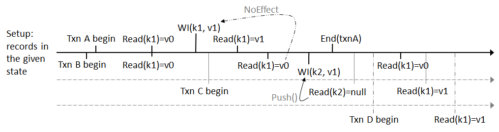

This document describes test scenarios for the K23SI transaction.
# Background
The K23SI transaction is described in detail in the [design doc here](../K2-3SI-TXN.md)

The test cases currently are constructed in a form of an integration test. The tests are in the test runner `chogori-platform/test/k23si/K23SITest.cpp`, which is a stand-alone application that can send/receive messages against a K2 cluster. The tests are currently executed via the integration tester `chogori-platform/test/integration/test_k23si.sh`

New tests can be added to the existing test runner in the same manner as the existing tests

Common notes:
- Generate keys with scenario prefix for range/partition, e.g. keys generated in scenario 05 are all prefixed with SC05_
- Use the Inspect verbs to validate state of transactions and data
- We may have to re-initialize a cluster in some cases. It is probably best for now to just start a new cluster with a new collection, creating collections with say a timestamp prefix so that we don't get collection name collisions
- There are global configurations which multiply the test cases. These are listed here
    - Hash/Range partitioning: we should repeat all tests and make sure they pass for both hash and range-based collections

# Test scenarios
## Scenario 00 - unassigned nodes

### Test setup
- start a cluster but don't create a collection so that the nodes are not assigned

### Test cases
| test case | Expected result | Possible fix needed |
|---|---|---|
|Any request (READ, WRITE, PUSH, END, FINALIZE, HEARTBEAT) | client should observe a timeout (as no response message will be sent) | We should fix this so that we return a bad request status. This would require adding msgtype in the variable message header, indicating RPC message there, and then responding via the RPC response path in the RPCDispatcher with the correct status |

## Scenario 01 - assigned node with no data

### Test setup
- start a cluster and assign collection. Do not write any data.

### Test cases
OP means each one of (READ, WRITE, PUSH, END, FINALIZE, HEARTBEAT)
| test case | Expected result | Possible fix needed |
|---|---|---|
|OP with bad collection name | RefreshCollection | |
|OP outside retention window | AbortRequestTooOld | |
|OP wrong partition(e.g. OP for p3 against p2)| RefreshCollection | |
|OP key which doesn't belong to partition (based on hashing) | RefreshCollection | |
|OP out-of-date partition version | RefreshCollection | |
|READ/WRITE/FINALIZE empty partition key, empty range key | OK/Created | we should probably not allow empty partition key. We should add an extra response status to indicate a "BadParameter" based on S422_Unprocessable_Entity |
|READ/WRITE/FINALIZE empty partition key, non-empty range key | OK/Created | we should probably not allow empty partition key. We should add an extra response status to indicate a "BadParameter" based on S422_Unprocessable_Entity |
|READ/WRITE/FINALIZE with only partitionKey | OK/Created | |
|READ/WRITE/FINALIZE with partition and range key | OK/Created| |
|cascading error: READ/WRITE/FINALIZE with bad collection name AND missing partition key| RefreshCollection||
|TXN with 2 writes for 2 different partitions ends with Commit. Validate with a read txn afterward| OK : commit for both writes need to succeed||
|TXN with 2 writes for 2 different partitions ends with Abort. Validate with a read txn afterward| OK : abort for both writes succeeds||

## Scenario 02 - assigned node with single version data

### Test setup
- start a cluster and assign collection.
- write the following data, and keep the records in the given state
```
("SC02_pkey1","", v1) -> commited
("SC02_pkey2","range1", v1) -> commited
("SC02_pkey3","", v1) -> WI
("SC02_pkey4","", v1) -> aborted but not cleaned
```

Notes:
- "aborted but not cleaned" will require some test capability to keep records in the FINALIZING state without automatic advance to perform finalization

### Test cases
- re-run the test cases from Scenario01 - we should get same results

| test case | Expected result | Possible fix needed |
|---|---|---|
|READ/WRITE of a valid key but bad collection name | RefreshCollection | |
|READ/WRITE of a valid key but wrong partition index| RefreshCollection | |
|READ/WRITE of a valid key but wrong partition version| RefreshCollection | |
|READ of all data records gives expected payloads | OK ||
|for an existing key that has never been read, attempt to write in the past| AbortRequestTooOld ||
|for an existing key that has never been read, attempt to write at same time as key| AbortRequestTooOld ||
|for an existing key that has never been read, attempt to write in the future| Created ||
|READ existing key at time before the key| NotFound||
|READ existing key at time equals to the key| OK||
|READ existing key at time after the key| OK||
| TXN with a WRITE and then END asynchronously with Commit. Finalize with abort for the same key at time interval. | persistence call succeeded |                     |
| TXN with a WRITE and then END asynchronously with Abort. Finalize with commit for the same key at time interval. | persistence call succeeded |                     |
| TXN with a WRITE and then END asynchronously with Abort. Validate with a read for the async_end_key. | read succeeded             |                     |

## Scenario 03 - read cache usage tests (read/write observed history)

- 
## Scenario 04 - read your writes(a txn can see its own pending writes) and read-committed isolation(pending writes are not shown to other transactions)

### Test setup

- start a cluster and assign collection.
- write the following data, and keep the records in the given state

```
("SC04_pkey1","rKey1", v0) -> committed
```

### Test cases

- The test logic is shown below: 

  

| test case                                                   | Expected result                                   | Possible fix needed |
| ----------------------------------------------------------- | ------------------------------------------------- | ------------------- |
| Txn READ of data records before it begins                   | OK (read prior value)                             |                     |
| Txn READ its own pending writes                             | OK (read pending value)                           |                     |
| Txn with older timestamp READ other txn's pending writes    | could not read pending value (read prior value)   |                     |
| Txn with newer timestamp Read other txn's pending writes    | could not read pending value (NotFound)           |                     |
| Txn with older timestamp READ other txn's committed records | could not read committed value (read prior value) |                     |
| Txn with newer timestamp READ other txn's committed writes  | read committed value                              |                     |


## Scenario 05 - concurrent transactions

### Test setup

- start a cluster and assign collection.
- write the following data, and keep the records in the given state

```
("SC05_pkey1","rKey1", v0) -> committed
```

### Test cases

| category                 | test case                                                    | Expected result                        | Possible fix needed |
| ------------------------ | ------------------------------------------------------------ | -------------------------------------- | ------------------- |
| fake-read-write conflict | Earlier Read txn encounters a WI, two txns have the same priority and tsoId | OK (read prior value)                  |                     |
| priority of Push()       | Txn with higher priority encounters a WI                     | created (challenger won the Push)      |                     |
| priority of Push()       | Txn with lower priority encounters a WI                      | AbortConflict (incumbent won the Push) |                     |
| timestamp of Push()      | Earlier WRITE Txn encounters a WI with the same priority     | AbortConflict (incumbent won the Push) |                     |
| timestamp of Push()      | Older READ/WRITE Txn encounters a WI with the same priority  | created (challenger won the Push)      |                     |
| tsoId of Push()          | WRITE Txn encounters a WI with the same priority and timestamp, but its tso ID is smaller | AbortConflict (incumbent won the Push) |                     |
| tsoId of Push()          | WRITE Txn encounters a WI with the same priority and timestamp, but its tso ID is bigger | created (challenger won the Push)      |                     |

## Scenario 06 - finalization

### Test setup

- start a cluster and assign collection. 
- Start a transaction that have not been End().

### Test cases


| test case                                                    | Expected result                                              | Possible fix needed                                          |
| ------------------------------------------------------------ | ------------------------------------------------------------ | ------------------------------------------------------------ |
| Finalize is a non-exist record in this transaction           | OperationNotAllowed                                          |                                                              |
| Finalize_Commit partial record within this transaction       | OK                                                           |                                                              |
| Finalize a record whose status is commit                     | OperationNotAllowed                                          |                                                              |
| After Finalize_Commit partial record, other transactions read the record while this transaction is still in progress | OK                                                           |                                                              |
| After partial Finalization_commit, txn continues and then End_Commit all records | OK                                                           |                                                              |
| After partial Finalization_commit, txn continues and then End_Abort all records | S500_server caught exception processing request (partial finalize success) | note：it is expected that the data will be in an inconsistent state |
| Finalize_Abort partial record within this transaction        | OK                                                           |                                                              |
| Record is read after it is Finalize_Abort  within the txn    | NotFound                                                     |                                                              |
| Finalize_abort a record who has already been finalized_abort | OK                                                           |                                                              |
| After partial Finalization_abort, txn continues and then End_Commit all records including the aborted records | S500_server caught exception processing request (partial finalize success) | note：it is expected that the data will be in an inconsistent state |
| After partial Finalization_abort, txn continues and then End_Abort all records | OK                                                           |                                                              |
| The TRH and MTR parameters of Finalize do not match          | OperationNotAllowed                                          |                                                              |
| During async end_abort interval, finalize_commit partial keys, validate the keys with READ | OK (finalize_commit keys can be read)                        |                                                              |

## Scenario 07 - client-initiated txn abort
## Scenario 08 - server-initiated txn abort (PUSH/ retention window)
