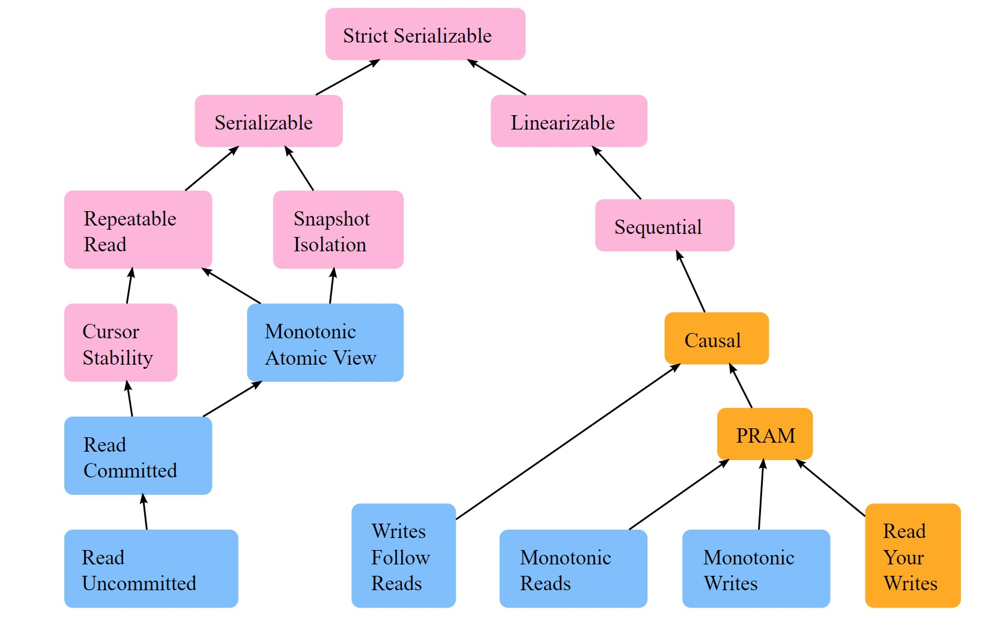
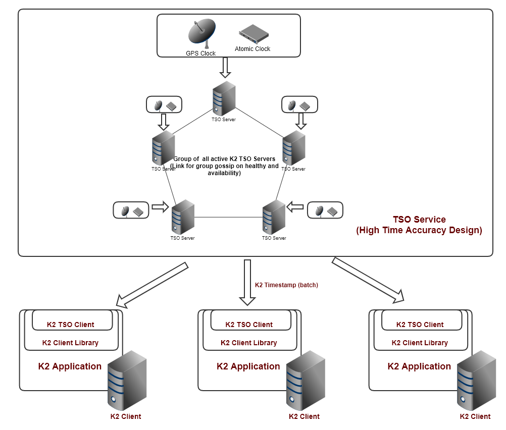
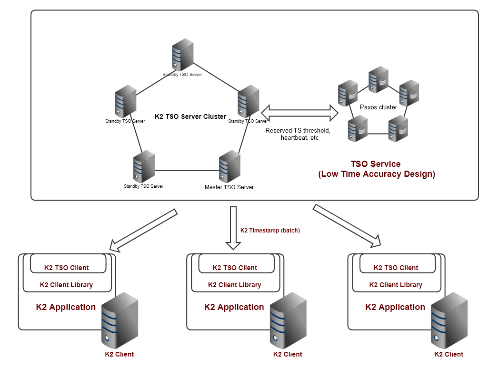

[-UP-](./TXN.md)

# K2 Timestamp and TSO
## 1.  Design goals
K2 TimeStamp is a specific designed data structure for timeStamp used for marking transactions' time in order to provide transaction isolation and consistency.  TSO(TimeStampOracle) is a service for providing K2 TimeStamps to K2 client clusters/data servers managing transactions.

The design goals of K2 Timestamp and K2 TSO are
- Functionality: support K2 global distributed transaction, at Sequencial consistent Serializable Snashot Isolation level(K2-3SI transaction protocol) and external causal relationship, with optimization for within datacenter avg 20 microsecond latency transactions.
- Performance: Issuing of K2 TimeStamp within the same data center should take less than 10 microsecond, ideally avg less than 5 microsecond.
- Scalability: Single TSO service can provide 50-100 million timestamps per second for the system, essentially support 50-100 million transactions per second(roughly 50 -100X current top TPCC record holder at 60 million tpmc or roughtly 1 million txn/s).
- Availability: K2 TSO as logical single point of failure, should be designed with high availability >= 99.999%. Designed no down time for software upgrade, no down time for single physical server replacement, minimal unavailable time(ideally <200 millisecond) for server crash recover.

```
Note(06/28/2020): Above goals were original set as for 1/1/2020, since then, TPCC new latest record as of today
is 707 million tpmc (or roughly 11 million txn/s). Originally TSO was thought to be a single active instance
system, thus single TSO service goal was set to be 50 - 100x of TPCC record then and such goal is still 5 -10
times of this new record. But as later this design specified, TSO service is a scale-out design (supporting
concurrent multi-active instances) and is not limit by single TSO instance throughput. Thus, together with other
sub-systems, whole Chogori(K2) is a fully scale-out system at data plane.
```

Besides general distributed system requirement, e.g. high availability, high scalability, low latency requirement etc. for K2 TSO design, K2 TSO is distinctively designed to support
##### a) K2 specific transaction protocol, K2-3SI.
##### b) Microsecond level latency(within same data center) but still support cross geo region transactions.

Of course, speed of light issue will causes unavoidable physical millisecond level network traffic latency across geo regions, such transaction latency will be more than unavoidable network latency. It worth to note here that these two distinctive characters impact TSO design significantly, especially on design assumption and simplification. We will explain more in detail in following sections.

## 2. Design analysis
With design goals above, let's derive some more detailed design key points.

### 2.1 Timestamp ordinal requirement from K2-3SI
First, we need to take a careful look at the requirement of transaction/event order and timstamp resulting from support K2-3SI. K2-3SI detailed analysis is at [K2-3SI Transaction Design Spec](./K2-3SI-TXN.md). Here we only give a summary of key points to related with TSO to help derive the design.

Following distributed transactional system consistency model explained by [](https://jepsen.io/consistency) K2-3SI, on isolation side (left side on the Jepsen model), supports [Serializable snapshot Isolation](https://jepsen.io/consistency/models/serializable); on the consistency side (right side on the Jepsen model), K2-3SI supports [Sequential Consistency](https://jepsen.io/consistency/models/sequential), just one level down from the top [Linearizable](https://jepsen.io/consistency/models/linearizable) to avoid expensive real time synchronization. To support transaction atomicity and cross transaction isolation, all operations in a transaction is marked with a "transaction time" (which can be a sequence number like LSN in MySQL, or a TimeStamp in Google's Spanner"). Typically, such "transaction time" is record of the commit time(or commit record LSN) of a transaction. In K2-3SI, to minimize the distributed transaction latency and increase the throughput, we choose the transaction start time as the "transaction time". This indicates the order of transactions (for isolation) is based on the start time of each transaction and operations/transaction confliction and resolution is based on such time as well. To support Sequential consistency, this "transaction time" also need provide total ordinal relationship between any two transactions which gives same order of any two transaction at any partition of the distributed system.

Assuming there is only single TSO at any moment for the whole system serving all other servers, the "transaction time" could be either a sequence number or a machine (system) time issued from the TSO. On theory, this simple approach would fulfill the requirement mentioned above. But there are three major engineering issue we need to solve/optimize.
- First, such singele TSO become system's single point of failure;
- Second, the single TSO could be potential performance bottle neck for the system;
- Third, when there are more than one geo-region, the servers at different geo-region may take unavoidable milisecond level network latency to get the "transaction time" from the TSO, even for the transaction only invovles on that origining geo-region. This is conflicting with the goal of high performance(low latency) for K2.

For first issue, typical engineering solution is to have multiple instances cluster with one as leader (acting TSO) and rest as stand-by. The leadership is maintained by leash (heat beat renewed) based on a paxos cluster(e.g. open source system like ZooKeeper or ETCD). One of the stand-by will compete to be new leader when the existing leader crash or stop service for any reason, e.g. software upgrade.

For second performance bottle neck of single server issue, the typical engineer solution is to scale up the server through better hardware and more efficient software. Also another practical approach is through deployment seperation, i.e. for differen database/deployment where transaction/data never overlay with each other, we can have seperate TSO for different database/deployment. Note, this approach normally is not prefered in cloud native system, where scale out of a single deployment support mulitple tenants is one of the basic cloud principles.

For the third issue, unless there is a TSO per geo-regions/Data Centers, requests from different geo-region have to travel to the other geo-reiont where TSO is deployed. This introduces mulitple TSO scenario which is complex situation worth its own section to discuss(section 2.2). Basically, the complexity results from multiple TSO is that each TSO will have slightly different time (time skew) due to time sync error, further more such time skew can be dynamic as each TSO clock may futher drift (i.e. speed of clock is different from true time change rate). In such case, we still need to find a way to order timestamps from different TSO and futher to support the transaction protocol (isolation and consistency).

To summerize this ordinal requirement analysis, in order to support K2-3SI, we need timestamp to be ordinal. If there were only one TSO, such requirement would be easy to achieve, by issuing strict monotoneous increasing sequence number or time value. But we need to support mulitple TSO for cross geo-region deployment. Further more we will see later that such multiple TSO will be significant helpful to support scale up and scale out in later part of this spec.

### 2.2 Multi geo region requirement and Time uncertainty window
K2 is designed to support microsecond latency transaction whenever possible. In multiple geo-region deployment, when there is transaction involves data partition at different geo region, there is no way to avoid network latency across geo-region, which is at several or dozens millisecond level. But in general sitaution, data (partition) is placed at the location near its usage to reduce network latency and usage. In multiple geo-region deployment, this means MOST (distributed) transaction only involves with partitions local within one geo-region(or within a Data Center). We have to set up a TSO in local geo-region (data center) to eliminate the need to take milliseconds level cross geo-region latency to get a timestamp for microsecond level transaction.

When mulitple TSO is introduced, if strinctly increasing sequence number is used at each TSO, then Lamport Logic Clock and Vector Clock need to be used to give a full order of events. The order establishment is particially based on messsaging between distributed participants. Such clock has great theoretical value but little engineering one due to the cross participant message latency and more importantly scalability limitation when cross geo region is involved. Instead, time uncertainty window(TUW), which is marked a tuple <TimeStart, TimeEnd> that gurantteed to cover the real time, can be used in such case which mulitple TSO can indepently issued time uncertainty window, thus a scalable solution. E.g. Google's Spanner system used time uncertainty window, and name it with set of related API they created for Spanner "TrueTime".

Time uncertainty window(TUW) has clear order when two of them do not overlap. If two of them overlap, one can not tell the order for sure. Most of systems using time uncertainty window take effort to avoid overlap. E.g. Google Spanner will still lock the data in transaction and wait out the length of uncertainty window when commit a transaction (before return back to client). Spanner, like most of transactional system using commit time of transaction time and lock data at the begning of transaction, by wait out uncertainty at commit moment, gurantees that there are no two transactions with overlapping time uncertainty window could happen on the same data. This way, Spanner achieves linearizable consistency. Together with supporting of serilizable isolation level, Spanner is a strict lineariazable system as defined in Jepsen model, or in Google's term "External Consistency". Another different example is CockroachDB. CockroachDB used time uncertainty window composed of two Hybrid Logic Clock value. Essentialy each value of begin/end of the window is composed of two part, first part is a low accurate time, and second part is a Logic Clock. Unlike Spanner which waits out uncertainty at transaction commit, CockroachDB wait out uncertainty at the start/execution of the transaction by retry the transaction with a later window when it hit another committed transaction with overlapping time uncertainty window.

To summerize this section, in order to support multi geo region, mulitple TSOs (at different geo region). When multiple TSOs are applied, the time stamp will have a form of time uncertainty window, but time uncertainty window approach need to solve the ordering problem of two two overlapping uncertainty windows. We will leave the detailed analysis of the problme in section 2.5

### 2.3 TSO throughput requirement - batching of TS requests, Share-nothing mulitple core server architecture
From TSO client to TSO server to get a timestamp, the major cost is the network message bandwidth and latency as the data size for a timestamp is small. So, it is very desirable to enable batch of timestamps for a request message over the network between client and server. Not only it will reduce the amount of total number of messages and bytes travled over network, but also for the client side request that can fulfilled with existing returned timestamp batch or the one on the road, the latency of getting a timestamp is reduced as well.

Once batch request is introduced, TSO clients (after get the batch from server) will become proxy of TSO to issue out timestamps to application. This means each batch has some limited TTL(TimeToLive). More over, as mulitple TSO clients at the same time having batches and issue them to application concurrently, it is somewhat like having mulitple TSOs in the system just like supporting multiple geo region case. It means we still need to have a way to define order of these timestamps concurrently issued from these batches at different TSO clients. And such order should obey our consistency and isolation requirement for the transaction protocol K2-3SI.

On the TSO serverside, as total latency budget for getting a timestamp is single digits of microseconds and most of them is allocated to network latency already. Inside the server, the generating of timestamp(or batch) can take less than 1 microsecond. So almost all necessary data needed for generating the timestamp(or batch) and the code has to be in the CPU core cache(L1 to L3) as any cache miss and vists main memory could take over handred of nanoseconds. And it also calls for a totally share-nothing, lock free, coordination free logic among CPU cores, since any cross core communication either through shared memory with cricital section or other sync prime protection can cause unpredicatble delay way large than microsecond level, or the message between cores could taking hundreds of nanosecond up to tens microseconds as well. This means each CPU core need to work standalone to issue timestamp(batch), again, such mulitple cores like having mulitple TSOs in our system. Furthermore, the timestamp(batch) concurrently issued from these cores need to have clear definition of orders, which need to support our consistency and isolation requirement for the transaction protocol K2-3SI

To summerize this section, in order to support scale up of TSO, improving throughput and reduce latency of timestamp request, both TSO client and TSO server calls for an equavaltent mulitple TSO architecture, somewhat in sync with need from supporting multi geo-regions. We leave the detailed discussion on the ordering problem in section 2.5 as well.

### 2.4 K2-3SI "External Causal" consistency requirement
K2-3SI not only support Sequential Consistency, but also support "External Causal" consistency. Causal consistency means between two events/transactions A and B, if B is caused by A ( A happens obviously before B), all the system participants can observe the correct order of events A and B, which is A before B. Causal consistency can be maintained when timestamps of event A and B are all get from same TSO and TSO only issues strictly increasing timestamp. K2-3SI support Sequential Consistency, which is a level higher and including Causal consistency. But Sequentical Consistency only defines an order of events that all system participants (within the system) have concensus on and it didn't address an situation we termed as "External Causal" relationship. This relationship is triggered by an user/application outside of the system, and it first carry out event/Trasanction A and upon the completion and result of A, it execute event/transaction B. The system itself(all partitions within) is not aware of causal relationship of A and B. In order to make sure the system supports External Causal consistency, the timestamp isssues by the system to A and B should be guaranteed to follow A before B order as well. This is not a trivial issue when there are mulitple TSOs in the system and A's timestamp is issued by TSO1 and B's timestamp is issued by TSO2.

Besides some engineering issue like different TSO network latency difference, etc., the main reason that External Causal consistency support is not trivial lays on the fact that the timestamp on a scalable distributed system is almost always a time uncertainty window, and the clear correct order of timestamps for events/transactions A and B need to be guranteed. This means they can't be any ambuguity caused by overlapping uncertainty window. So either these time uncertainty windows do not overlapping if they are issued from different TSOs.

This holds true for all the cases of multiple TSOs, including different TSOs per geo region, or mulitple TSO clients with timestamp batch acting like TSOs, or multiple CPU cores of TSO physical server which are issuing timestamp concurrently.

To summerize this section, to support External Causal consistency, if two timestamps for two events/transaction that potentially can have causal relationship, we need to make sure their uncertainty window doesn't overlap if they are issues from two different TSOs.

### 2.5 putting it together - ordering avoid uncertainty with uncertainty window timestamp from mulitple TSOs
One important characteristics that K2-3SI has which impact K2 Timestam and TSO design significantly is it consistency level, which is Sequential Consistency. This means for truely concurrent(i.e. no direct or indirectcausal relationship)  events/transactions, the order (or timestamp) of them doesn't matter as long as the whole system with all its participant has an concensus of the order. Unlike linearization consistency where this order has to be same as the real time order when these events/transaction happened, this order can be different from the real time of these events/transactioned happened, but when events with causal relationship, their order must reflect the causing event before consequenced event relationship. The key conclusion from this discussion is that if two concurrent events got their timestamps from different TSO, the order of these timestamp doesn't matter, i.e. when the timestamp is a time uncertainty window, even when two timestamps overlaps, we can define a system wide fully agreed order between the two timestamp, for example, ordery by the TimeEnd of the uncertainty window (and if that happens to be the same for two such timestamps, we can then order by the pre-assigned unique TSO Id).

When timestamps are issued frome the same TSO, we can easily guaranteed the strictly increasing order and even with uncertainty window, we can combine the uncertainty window with sequence number, e.g. using TimeEnd of uncertainty window as the strictly increasing sequence number (of course, we need to adjust the smearing logic when we need to adjust the time uncertainty window values due to time sync to guarantee the TimeEnd of the time uncertainty window is strictly increasing, which means the size of time uncertainty window may be larger than what time authority can provide).

So, using a time uncertainty window with TimeEnd acting like a sequence number (strinctly increasing from one TSO) as timestamp will work for situation if the timestamp are from the same TSO, or timestamp even are from different TSO but for truly concurrent events(without causal relationship). Furthermore, if two events happened so far apart from each other that is larger than the largest possible uncertainty window size, even timestamps of them may be from different TSOs, their uncertainty window will not overlap and order is certain.

One last situation we need to solve is to guaratee correct order for timestamps for External Causal related events. Whether or not two time uncertainty window overlap depends on two factors, one is how far away these two timestamp are from each other in real time sense, and the second factor is how large the size of uncertainty window is. As K2-3SI using the transaction start time as its transaction/event time, if the causing event A taking very long, longer to process and commit than the largest possible time uncertainty window size, the conseqencing event B will get a timestamp, even from different TSO, will not overlap. If we do not implement batch timestamp, and only use one core in TSO server and only one TSO server per geo region, than if A and B are in the same geo region, i.e. their timestamp are from the same TSO (which can issues strictly increasing timestamps, e.g. strictly TimeEnd value of the time uncertainty window as the timestamp value), their order can be guaranteed to be correct. If A and B happens on different geo regions with timestamp issued from TSO in their regions respectively like in a External Causal related situation, as it take at least cross region network latency between start of two transactions, which can be at millisecond level, if the time uncertainty window size is smaller than that, we again can guaranteed the timestamp value of event B is larger and not overlapping with that of event A.

So, when using (strictly) on TSO on a geo region, and the network latency across geo region is bigger than the time uncertainty window, we have a correct solution. To expand the correctness of the solution, we need to take a careful analysis on the time uncertainty window size.

The time authority in a data center without special preparation is typically NTP servers. The accuracy, or size of it time uncertainty window of such server today typically is at range of several milliseconds, and transiently it can be off by handreds of million seconds. As discussed above, when we have only one TSO in a geo region (data center), we are not impacted by the size of time uncertainty window. But for multiple geo regions(mulitple TSOs respectively) such large size of uncertainty can not be masked by the network travel latency between the geo regions, it basically means that the transactions involving data partitions at different geo regions will have a much wider window to have conflict. There is no way to avoid such conflict but have to deal with it by the transaction protocol. K2-3SI will deal it proactively by deciding which transaction to abort based on business scenario defined priority for each transaction.

With atomic clock, the time accuracy, or the size of time uncertainty window, can be as little as a few microsecond(fine tuned system should be able to have acuracy at a couple microsecond). So, if K2 TSO is equipped with atomic clock, cross geo region latency (at millisecond level, or 300KM distance needed per millisecond at speed of light) can easily mask the time uncertainty window size, i.e. two transaction with external casual relationship will be guaranteed to have non overlapping timestamp(time uncertainty window).

Furthermore, microsecond level atomic clock accuracy makes the batch request feature to increase throughput a possible. If we define a batch covering a time window that is bigger than the uncertainty window size, but smaller than a transaction total time (for transactions within a data center), then we can guarantee that any two events/transactions with causal relationship will get timestams from the batch that do not overlap as the first causing transaction A takes more time to finish and that time mask the batch window, so that the consequencing transaction B will for sure can only get a timestamp from another batch that is not overlapping with that for A. To guarantee this, we need to define a Minimum Transaction Latency (MTL) and we need to make sure MTL is equal or bigger than the batch time window size. Batch time window size is also the TimeToLive(TTL) for the batch, i.e. for how long the TSO client can use it once it got from server. On theory MTL can be just same value of batch's TTL, but we need to reserve some room for time adjustment situation, e.g. 20%, that will be the time smearing speed for TSO when it need to adjust time. So, time adjustment with such smearing rate will guarantee that for a MTL time apart, batches issues will strictly not overlap. to make sure MTL is obeyed, the K2 client should withhold transaction commit(success) result if the whole transaction takes less than MTL till this time threshold is met. This should not cause a system performance problem as MTL can be as little as e.g. 10 microsecond and the transaction taking less time than MTL and thus has to artifically delayed are rare. Another throughput feature, share-nothing mulitple core server, essentially are multiple TSOs as well, but the difference of timestamp/batch issued from different CPU core will be at nanosecond level difference, fully masked by the MTL and so such server design is not an problem for consistency correctness. The issues to minimize the latency of generating timestamp, e.g. without core coordination, will be a different topic discussed in the design detail second below.

From above discussion of high accurate atomic clock timestamps, MTL essentially masked away batch window size as well as uncertainty window size, allow multiple TSO clients issue timestamps concurrently. This is a very critical charactoristics. It means with MTL honored and atomic clock equipped for a data center, we can further indeed have multiple independent TSO servers. As each TSO servers issue timestamp/batch with time window size less than MTL, and these timestamp can be order as mentioned before (by comparing TimeEnd and then TSO unique ID if TimeEnd equals), concurrent transaction timestamp can be uniformly ordered (required by Sequencial Consistency) and causal related transactions can be correctly ordered without ambugity (required by External Causal consistency). Such mulitple concurrent TSO server architecture solved all the three issues we mentioned in section 2.1. i.e. TSO doesn't have singple point of failure, and is able to scale out unlimited and certainly can be deployed at every geo regions to benefit from low within data center latency. Of course, engineering wise, we can strengthen the system reliability by still runing internal time sync algorithm among these independent TSO servers to eliminate any out of order pariticipant TSO and even more, there are hardware/NIC based internal time sync algorithm (By MIT) wich can provide less than one microsecond accuracy for detecting any failed TSO server.

So, the conclusion of this section and whole part 2 is that depends on how accurate we can have our time authority, i.e. the time uncertainty window size, we can design TSO in two different way.
##### High Time Accuracy TSO system
 When the time accuracy is hgih (with atomic clock/GPS), we can defined teh syatem as an group of all active TSO server cluster in each geo region. all TSO server can issue out timestamp/batch concurrently. 

##### Low Time Accuracy TSO system
 When the time accuracy is low(with pure software NTP service), we can define the system as a TSO cluster in each geo region. The TSO cluster is composed of a leader TSO and one or more stand-by TSO and they are based on a Paxos cluster for leader selection and health monintoring. Only leader TSO issues out timestamp/batch. 

The difference between these two design is that, besides what is visible from pictures above (where K2 data server cluster are ignored), is that the K2 data server will need to handle timestamp overlap in low time accuracy situation. The handling logic is same as transaction conflict. Some optimization can be done but not discussed in detail here. The K2 TSO client and K2 TSO server internal are all the same in two design. In next section, we will discuss these two designs in detail, with common design first, then the high accuracy design as it is main target design to be used and last low accuracy design.

Unless explicitly mentioned, all presumed numbers in this document can be adjusted/configured proportionally in later phase of implementation according to our testing/profiling result. They are set explicitly here just for easier understanding of the document and the design.

## 3. Common design details for both High and Low Time Accuracy TSO system
Please note that this whole part 3 is dedicated to only common design for TSO system regardless it is High or Low Time Accuracy system. The difference will be discussed in part 4.

The high level architecture of TSO service in picturea above in common is
- K2 TSO service is composed of a cluster of TSO servers, either all active independent in high accuracy case or  one being master and actively serving requests from client and rest are standbys with support of a Paxos cluster in low accuracy case. Each TSO server has its own GPS clock and atomic clock(real deployment can share GPS cloc and atomic clock conditionaly) in high accuracy case, or just simply linked with a NTP service in low accuracy case. To simplify, in this section, we will only discuss the design as if there is only one active TSO server, which is true for Low Accuracy system, and sufficient for High Accuracy system as multiple active servers doesn't change the correctness of the design discussed in this part. To unify terms, we use time authority for the external real time source, which is atomic clock/GPS for High Accuracy system, or NTP for Low Accuracy system.
- There is a cluster of K2 Client, where the K2 Application is running. Each K2 Application contains a K2 Client Libary which delagate all request from K2 Application to the rest of K2 systems. Within K2 Client Libary, K2 TSO Client is the component proxy the tiemStamp request to K2 TSO service.
- There is also a cluster of K2 Servers for transaction operations. K2 Server cluster is ignored in above pictures.


### 3.1 K2 TimeStamp
K2 TimeStamp mainly is composed of two functional components, one is a bounded uncertainty window containing real universal time (which is not exactly known) just like TrueTime in Google's Spanner system; the other is UInt64 SequenceNumber.

The public interface of K2 TimeStamp contains accessor to these fields:
```
system_clock::time_point TStart()   - startTime of the TrueTime
system_clock::time_point TEnd()     - endTime of TrueTime
unint32_t                TSOId()    - The global unique Id of TSO
```
As well as a comparison api:
```
enumK2TSCompareResult Compare(const K2TimeStamp& other)  -> LT, GT, EQ, UN
```
Compare() API returns THIS value comparsion with OTHER in param, return an enum result of four possible values explained below. If two K2TimeStamps in comparison have same TSOId, we compare only Te, as timestamp(to be more exactly the Te part of timestamp) from the same TSO are conceptually strinctly increasing and unique. If two K2TimeStamps are of different TSOId, The comparison will be apply on the uncertainty window(inclusive both end)
```
LT - this value is less than the other value
     If two K2TimeStamp are of same TSOId,  this.Te < other.Te. If different TSOId, this.Te < other.Te
GT - this value is greater than the other value
     If of same TSOId, this.Te > other.Te. If of different TSOId, this.Ts > other.Te.
EQ - If two value are equal in very perspective, including TSOId. only applicable when TSOId are the same.
UN - Only applicable when TSOId are different and uncertainty window overlap,
     i.e. other.Ts <= this.Ts <= other.Te || other.Ts <= this.Te <= other.Te
```

Internal structure for Timestamp is
uint64_t _tEndTSECount  - counts of nanoseconds for tEnd's time_since_epoch(), from TAI (International Atomic Time, strictly increasing time from atomic clock with no leap seconds since UNIX epoch Jan. 1, 1970)
uint16_t TSOId         - TSOId
uint16_t TsDelta  - time difference between Ts and Te, in nanosecond unit

### 3.2 K2 TSO Client interface to K2 application(K2 Client Lib)
K2 TSO Client is the component resides inside K2 Client Library that is responsible to be the agent for K2 Client Libary for requesting K2 TimeStamp from K2 TSO server.

The interface K2 TSO Client exposed to K2 Client Library can be as simple as following
```
future<K2TimeStamp> GetTimestampFromTSO();
```

But our actual implementation has one extra input parameter of local steady time when the request is made, as following:

```
future<K2TimeStamp> GetTimestampFromTSO(const steady_clock::time_point& requestLocalTime);
```
the requestLocalTime param is the local stead_clock::now() when K2 Client Library start the processing the new request from application upon receive it. K2 Client Library need to keep track of this and K2 TSO Client need to know this as well. This is due to the fact we are using batch request between TSO client and TSO server for timestamps, with details in next section. Even K2 TSO Client could make a call to now(), but we should save this extra call as now() is already called in K2 Client Library.

### 3.3 K2 TSO server interface to K2 TSO client - Timestamp batch
We will use timestamp batched API in both high and low time accuracy designs. The detailed batch analysis is in following section. Here we give the definition of the batch structure first.

K2 TSO client batch request API to K2 TSO server is following,
```
future<TimestampBatch> GetTimeStampFromTSO(int batchSizeRequested)
```
batchSizeRequested is desired amount of timestamps for TSO server to generate, the server may or may not honor it depends on server side availability.

The returned batch is following structure:
```
struct TimestampBatch
{
    uint64_t TBEBase       - batch uncertain window end time, number of nanosecond ticks from UTC 1970-01-01:00:00:00
    uint16_t TSOId            - TSOId
    uint16_t TsDelta          - time difference between Ts and Te, in nanosecond unit
    uint16_t TSCount          - number of timestamp can be generated from this batch
    uint8_t  TBENanoSecStep   - step (number of nanoseconds) to skip between timestamp Te in the batch
    uint8_t  TTLus            - TTL of batch on the client side in microseconds

    static const Timestamp generateTimeStampFromBatch(const TimestampBatch& batch, uint8_t usedCount)
    {
        K2ASSERT(usedCount < batch.TSCount, "requested timestamp count too large.");

        uint16_t endingNanoSecAdjust = usedCount * batch.TBENanoSecStep;
        // creat timestamp from batch. Note: tStart are the same for all timestamps in the batch
        Timestamp ts(batch.TBEBase + endingNanoSecAdjust, batch.TSOId, batch.TsDelta + endingNanoSecAdjust);
        return ts;
    }
}
```
E.g. TBeTSEBase is 1576884547194846100 for time point at 2019-12-20:15:29:07, which is set with TSO server time uncertain window ending time plus the TTL, in nanosecond ticks, with some adjustment for base for the batch, which will be explained later. TSOId is ingored to explain here.
TsDelta could be up to 10000 (10 microsecond), it is eseentially the batch time window size.
Let's say TBENanoSecStep is 20 and TSCount is 10, i.e. this batch contains 10 timestamps, then  10 timestamps has Te = TBEBase + i * TBENanoSecStep, i = 0, 1, ... 10, in this example, they are
1576884547194846100 + i * 20 as shown in the function generateTimeStampFromBatch()

Upon receiving a timestamp batch from Server, TSO client within the timestamp batch TTL can issue timestamps from the batch by calling generateTimeStampFromBatch(). The TSO client keeps track of the count (UsedCount) of timestamps already issued from a batch to generate correct timestamp (by adding TBENanoSecStep * usedCount to TBEBase)

The reason that TBENanoSecStep is not 1 is related with the detailed design on the TSO server side, it is essentially the number of worker CPU cores on TSO server taking the requests and issuing batchs. With this and different TBEBase for different cores at the same time, we can generate unique timestamps (per TSO) across timestamp batches from different TSO worker CPU cores.

### 3.4 Batch design analysis
#### 3.4.1 Scalability and Performance requirement
Scalability is the key reason that we need to support batch timestamp request. At any time, there is only one TSO physical server which can handle certain amount of request per second(e.g. 1 millioon request per second). Without batching, this limit will be the upper limit of amount of timestamps, also, amount of transactions, a single region database can get. With a batch size of X per request, we can increase timestamp throughput to X times of the request throughput.

Current top TPCC record holder has throughput of 68 million TPmC, or roughly 1 million transaction per second for the whole system. We need to support 50 to 100 times of this throughput level with single TSO physical server. Current test indicates without any logic, each core of the machine in our lab can handle up to 2 million RDMA no-op msg, a back of envolop estimate is that with timestamp generation logic, each core throughput will reduce to 1/10 of simple no-op throughput, i.e. 0.2 million. With more than 20 cores on a server(and our share-no-thing architecture), the TSO throughput is 20*0.2 = 4 million timestamps. So a batch factor(10 - 25) will roughly fulfill the target of 50 to 100 million timestamps per second throughput.

The benefit for batch includes typical benefit from batching, e.g. reducing the load on client, network and server. One thing worth to explicitly point out is with batching, we can use limited client machines improve the simulation credibility to test out the limit of our TSO server implementation.

#### 3.4.2 Consistency Issues - relationship between batch, Time Uncertainty Window, MTL
##### Batch and relationship with Time Uncertainty Window
Essentially, a TimestampBatch is a group of K2 Timestamps. From TimestampBatch, timestamp can be regenerated. Regenerated K2 Timestamp's time uncertainty window need to fully cover the time uncertainty window if the timestamp were recieved directly from TSO server individually to guarantee the correctness when compare time between timestamps from different TSO. From correctness point of view, it is ok if regenerated uncertainty window has TStart smaller than that of direct server can issue, and TEnd larger than direct one.

At the same time, the TimeStamp generated from TimestampBatch need to have TEnd strictly increasing as well as it is guranteed to be unique if from same TSO. So we designed a TimestampBatch as described in section 3.3 which has a pre-defined algorithm to generate timestamp by manupulating the TEnd by adding a nanoseconds step between each timestamp. With different TBEBase for each TimestampBatch, uniqueness and strictly increasing requirement both can be met.

Please note, for both High time Accuracy TSO System and Low time Accuracy TSO system, i.e. regardless the size of time uncertainty window, above discussion holds true.

##### Batch and relationship with MTL
Essentially, a TimeStampBatch is a group of K2 Timestamps with TimeToLive(TTL). The TTL defines once the batch arrives at the TSO client, for how long the time window since the first request (which triggered this batch) that other following requests within this time window can use timestamp from this batch. To support causal relationship, this TTL can not be bigger than MTL(Minimal Transaction Latency). Otherwise, if TTL is larger than MTL, then two K2 Client may concurrently get a batch respectively with same TTL and after transact A get timestamp from first TSO client's batch and commit the transaction after MTL and then start a causal related transaction B and get timestamp from second client's batch as the batch is still alive (TTL > MTL), transaction B may get a timestamp smaller than transaction A's timestamp. So TTL must be equal or samller than MTL.

As timestamp TTL gives an extended time duration on the TSO client side for timestamps request at different time, such duration need to be reflected with real time as well. This means the the TTL essentially should be the duration that a timestampbatch cover on the server side as well. As time is expressed with time uncertainty window, it extended duration can be implemented as an artifical extended TEnd of uncertainty window with size of TTL. For High Accuracy system where the time uncertainty window can be smaller than TTL, we can just use TStart and TTL as uncertainty window size, so the generated TEnd is closer to the true TEnd. This is a minor cosmetic optimization which doesn't change correctness.

Actually since TSO server side may have need to adjust time due to server crystal clock counter drifting away from atomic clock, which can be only done with smearing algorithm due to the need uncertainty window TEnd need to be strictly increasing, TTL should be less than MTL to give room on smearing. The ration between MTL and TTL is the max rate that smearing can happen, so that even when smearing is happening, it is guranteed after a MTL durartion on the client side, a new timestamp will get from a batch not overlapping with any batch used at the begining of MTL duration.

##### Batch design - putting it together
To simplify the design for batch with above requirements met, we choose following design: 1) each batch of timestamps has the same base batch uncertainty window start time, say Tbs, and batch window end time, say Tbe, (Tbs, Tbe) is the super set of real uncertainty window on TSO server (Ts, Te) at the moment of issuing. Tbs simply set to be the microsecond level floor value of Ts for all timestamps in the batch, Tbe is set to the microsecond granularity fllor value of Te plus TTL. E.g, if (Ts, Te) is (SS.MS.001.050, SS.MS.003.100) meaning both are on perticular millis second and Ts is at microsecond 1 and nanosecond 50 while Te is at microsecond 3 and nanosecond 100, with assumption of batch TTL 8 micosecond, we will derive base batch uncertainty window (Tbs, Tbe) as (SS.MS.001.000, SS.MS.011.000). With such base uncertainty window and batch size, TSO client coud generate TimeStamp from base batch TimeStamp by manupulate the nano second digits of Tbe. Of course, this is based on design either differnt batch on one client will not have the same base Tbe at microsecond, or using the same range of nanosecond value, to avoid the possible duplicate client side Te generated.

### 3.5 Batch design TSO server side
K2 TSO server is a share-nothing corordiantion free between core/thread design on Seastar platform. Each core is dedicated to its own task/role. On TSO Server, which is a multi core system(we do not need multi-socket system, as cross socket synchronization can be too expensive), cores are split into two roles, only one core is control core, and the rest core are worker cores.

#### worker cores
Worker core key responsibility is to
1. handle TSO client request, issuing time stamp (batch). This is a normal priority task.
2. handle config data(TSOWorkerControlInfo defined below) update task issued from the control core. This is a high priority task.
3. collect and aggregate statistics data of this core for control core to collect. This is a low priority task.

Each worker core has following local config data needed to generate batch, all are set by the control core.
```
struct TSOWorkerControlInfo
{
    bool      IsReadyToIssueTS      - if this core is allowed to issue TS, could be false for various reasons
    uint16_t  TBENanoSecStep        - step to skip between timestam, actually same as the number of worker cores
    uint64_t  TBEAdjustment         - timestamp batch end time adjustment from current chrono::steady_clock::now();
    uint16_t  TsDelta               - batch starting time adjustment from TbeTSEAdjustment, basically the uncertainty window size
    uint64_t  ReservedTimeShreshold - reservedTimeShreshold upper bound, the generated batch and TS in it can't be bigger than that
    uint8_t   TTLus                 - TTL of batch on the client side in microseconds
}
```

A worker core doesn't coordinate with other worker core, as cross-core communication is expensive(>0.5 microsecond in SeaStar), so we need to make sure different work core will issue batch of different timestamp (even at the same nano second). Thus, for each work core, it will use its SeaStar core ID as starting base of nano second value in the TbeTSEBase and each timestamp in the batch will be number of work core, i.e. TBENanoSecStep away from each other. For example, say we have 20 worker cores and their id are 0, 1, ... 19, then for core 0, the nano second value in the starting batch (of the microsecond) will be 0, 20, 40, ... and core 1 will be 1, 21, 41, ... etc. For each microsecond, each worker core can issue at most 1000/number or work core time stamps.

To make sure a worker core doesn't issue duplicate timestamp across different client requests within the same microsecond, each worker core keep a local value of microsecondOfLastRequest, timestampCounterOflastMicrosecond, which are initialized to 0 both, so that we can avoid this issue.

The detail of steps of a worker core processing the cleint request is following:
```
1. Upon request arrival, check okToIssueTS, if false, return ServerNotReady error (should have different error code if current server is not TSO master instance).
2. get tNow = steady_clock::now(); tNowAdj = tNow + TBEAdjustment; calculate intended TBEBase = tNowAdj(set last three digits of nano second to 0) + coreId;
3. if TBEBase != microsecondOfLastRequest,
     then
     {      set timestampCounterOflastMicrosecond = 0,
            and set return value TSCount = min (1000/TBENanoSecStep, batchSizeRequested) as the max amount of timestamp in a batch is 1000/TBENanoSecStep;
     }
     else
     {
         if (1000/TBENanoSecStep - microsecondOfLastRequest) < batchSizeRequested
         then
         {
             busy wait till next microsecond (or schedule this task to the end of client request scheduling group and redo from begining)
             // after wait with new(next) microsecond TBEBase
             set return value TSCount = min (1000/TBENanoSecStep, batchSizeRequested)
         }
         else
         {
             set TBEBase += timestampCounterOflastMicrosecond *  TBENanoSecStep;
         }
     }
4. check updated possible last timestmap in the batch is before reservedTimeShreshold, i.e.
         if  (TBEBase + (batchSizeRequested -1) * TBENanoSecStep) > reservedTimeShreshold,
         return ServerNotReady error;
5. generating the return batch with update TBEBase, batchSizeRequested, TBENanoSecStep, TsDelta, TSOId and return to client;
   update microsecondOfLastRequest and timestampCounterOflastMicrosecond
```

#### Control Core
Control core key responsibility is to
1. Periodically sync up with time authority(either atomic clock/GPS clock in High Time Accuracy system or NTP in Low Time Accuracy) for real time. (Om High Time Accuracy system, depends on the atomic clock device we finally purchase and deploy, we will set the frequency of sync up, but now we expect it at least once per 10 millisecond). Base on the updated real time and current TSOWorkerControlInfo, if necessary, make modification to TSOWorkerControlInfo and send tasks to all worker cores to update their own. Essentially, this is to control all workers on the timestamps(batch) they can issue. We call this perioadical task TimeSyncTask at control core.
2. Periodically aggregate the statistics data for all worker cores for metrics reporting. Basically, low priority lamda tasks from the work cores with each worker core's statistics need to be aggregated and if necessary reported.

```
struct TSOWorkerControlInfo
{
    bool      okToIssueTS           - flag indicating if this core is ok to issue TS, could be false when shutdow is signaled
    uint16_t  TBENanoSecStep        - step to skip between timestamp, actually same as the number of worker cores
    uint64_t  TBEAdjustment      - batch ending time adjustment from current chrono::steady_clock::now();
    uint16_t  TsDelta               - batch starting time adjustment from TbeTSEAdjustment, basically the uncertainty window size
    uint64_t  reservedTimeShreshold - reservedTimeShreshold upper bound, the generated batch and TS in it can't be bigger than that
}
```
TimeSyncTask is responsible to check current machine clock is drift off from time authorities (e.g. Atomic/GPS clock or NTP). If it is drift large enough, it will adjust TBEAdjustment and TsDelta in TSOWorkerControlInfo and which will be sent to all the worker cores. Upon the start of service, in first TimeSync we keep the delta between time authority time and local machine steady clock, e.g. TAI in high Acuracy system(number of nano seconds), _diffTALocalInNanosec. TBEAdjustment is initialized with _diffTALocalInNanosec. Upon futher TimeSynTask, we check new time value from time authority and compare with local steady_clock to check if local steady_clock drifted(differs from _diffTALocalInNanosec) and if it does, we adjust _diffTALocalInNanosec and TBEAdjustment. Besides local steady_clock drift (away from Time Authroity), another reason TBEAdjustment may change could be that the time uncertainty window size change from Time Authority. Such change is rare and can be ignored when in High Accuracy system, but can happen in Low Accuracy case with NTP.

Change on TsDelTa is relatively simple, once TBEAdjustment's update is set and time uncertainty window is known from time authority. Basically, it will be adjusted so that derived Ts is the true time Ts at the moment of update. The tricky issue is updating of TBEAdjustment.

TBEAdjustment is the adjustment to be done to current steady_clock::Now().time_since_epoch().count() to generate TBEBase, the base end time for the timestamp batch to be issued. There are two reasons to have this adjustment.
1. The steady time of TSO server is time since the machine booted, has a difference to the time given by time authority(atomic/GPS clock or NTP).
2. After some duration of time, When the time drift sufficient large between master instance of TSO server and the time authority, we need to adjust the simple delta.

It is very important to point out again that when we update the TBEAdjustment,TSO server need to do the smearing of the time to make sure 1)the ending time of timestamp is not going backwards. 2) the rate of smearing is not exceeding the ration between MTL to batch TTL. 1) is for making sure the TEnd of timstamp is strinctly increasing, 2) is to make sure already issued out timestamp batch preserves causal consistency with new issuing time stamp batch. This is done both at the control core and worker core. When the value need to be updated is large, large than 1 microsecond, the control core smearing it to 1 microsecond per X microsecond. X can be set fixed, e.g. at 10 microsecond, or depends on the value of adjusment we need to do, the bigger it is, the smaller X to be set to reduce the total time duration for the smearing. Also on the worker core side, when smearing backward happens(i.e. new TBEAdjustment is smaller by 1), work core need to make sure to wait at least one full microsecond after microsecondOfLastRequest before it can issue new timestamp batch so that the timestamp never has smaller Te in the timestamp batch.

Since worker core is using system clock and TBEAdjustment to have accurate time stamp batch, we do not allow TSO server system clock change. It can be changed when the instance is on standby mode. This way, we can simplify the implementation of TimeSyncTask handling. When TSO server starts up (transitioned from standby mode), it could adjust machine system clock after get the real time from time authority (atomic/GPS clock or NTP), as well as other parameters in TSOWorkerControlInfo, before seting up worker cores. After that, essentially the control core take over the time adjustment through TimeSyncTask.

There is no server side load balance between worker cores for design simplicity and robustiness, furthermore such simple design and implementation minimize the latency and server cost, the load balance can be easily at K2 TSO Client side. A simple random or round Robin load balance between worker cores on the client side should be sufficient. Of course, for High Accuracy system, where there are mulitple active TSO servers, the load balance between TSO servers is different issue and will be discussed in section 4.1

### 3.6 Batch design TSO client side
Batch complexity is transparent to the application completely and to the K2 Client Library as well. As K2 Client Library need to enforce MTL, it need to keep record of a transaction request arrival time from the application(requestLocalTime). This requestLocalTime is needed for K2 TSO client to check if it can use on hand timestamp from existing batch. (K2 TSO client could call steady_clock::now() internally and thus totally decouple from K2 Client Library, but we want to save this otherwise redundant call which costs 20-40 NanoSeconds in our test). The API between K2 Client Library and K2 TSO client as mentioned above already, is.
```
future<K2TimeStamp> GetTimeStampFromTSO(const steady_clock::time_point& requestLocalTime);
```
Inside K2 TSO Client, (i.e. the implementation for above API), it manages two main array/deque data structures.
```
    std::deque<ClientRequest>  _pendingClientRequests;
    std::deque<TimestampBatchInfo> _timestampBatchQue;
```
The first deque _pendingClientRequests keep tracks of all client requests (for timestamp) that can not fulfilled synchronously with existing valid batch. Such client request either already trigger a server side request for timestamp batch or piggy back on on existing outgoing server side request. The ClientRequest structure contains a promise to be filled once the timestamp batch is back.

The second deque _timestampBatchQue keeps track of all server side request to timestamp batches as at any moment, there can be mulitple such requests outgoing.

The TSO client logic is straight forward as following
1. When a application client request comes in, it check if there is an available batch that is valid (client request time within batch TTL) to get a timestamp from. If yes, simply get the timestamp and return to application. If no, TSO client check if the client request either triggers a new serverside batch request or may be able to piggy back on an existing outgoing server side batch request. Either way in this case, the client request is kept in the _pendingClientRequests to be fulfilled once the expected batch returnes.
2. When a server side batch returned, it will find its slot in _timestampBatchQue and if there is any unfulfilled client request in _pendingClientRequests who fits this batches request time and TTL, then fulfill these client requests.

Of course, in both steps aboves, we need to check and remove obsolete batches in _timestampBatchQue as each batch has TTL.

As mentioned previously, a TSO client will get timestamp batch from one of multiple TSO server worker cores \. A load balance scheme is needed as lots of other TSO clients are talking with these cores as well. We can choose a simple scheme that upon initial establish the connection with these cores, randomize the order of the connection, thus in run time when a server side request is issued, it can simply issue to next connection in the randomrized worker core list, miniming the calculation during run time hot path.

## 4 Specific design for High Time Accuracy system and Low Time Accuracy system respectively

### 4.1 High Time Accuracy system
As for High Time Accuracy system, since TSO server's time uncertainty window is smaller than batch window size, which is less than MTL, then when there are mulitple TSO servers within same geo-region(data center), the difference of TEnd of their timestamp issued from the same time batch will be up to time uncertaint window, smaller than the batch window size and MTL, So it is safe to apply multiple active TSO servers in one geo-region (data center). TSO design across different geo regions doesn't change.

Further more, for timestamps from different TSOs, even different geo regions, the comparison of them can be simplified to compare the TEnd only (if they are the same, the order is given by preset unique TSO ID). Here even time uncertain windows is considered and obeyed in the design, in the timestamp comparason, it can be safely ignored. For such comparison, we can a K2 TimeStamp function CompareWithCertainty(), which never return result for overlapping timestamps, enumK2TSCompareResult.UN.

In theory, there is not need for TSO server's communicate with each other. But engineering wise, it will be benefit to have them communicate with each other. e.g. a Gossip protocal communication can check server health between each other and notify the client. Further more, software based time internal sync algorithm among them can detect if any server may have server atomic time error(though it should be very low probability due to reliability of atomic clock). Such internal sync algorithm can be further improved by NIC based approaches, e.g. [HUYGENS](https://www.usenix.org/system/files/conference/nsdi18/nsdi18-geng.pdf) a new (NSDI2018) pure sofwareware/ML clock internal sync algorithm with accuracy at 100s nanosecond. or   [SyncUTC](http://lhc-electronics-workshop.web.cern.ch/LHC-electronics-workshop/2002/Poster/hoeller.pdf), a older approach at similar accuracy with special NIC hardware.

### 4.2 Low Time Accuracy system
#### 4.2.1 Single active TSO cluster with Paxos
For Low Time Accuracy system, the time uncertainty window is wider than MTL can mask. As concurrently there are mulitple TSO clients holding batches and regenerate timestamps from the batch, these batch has to be from the same single TSO server for geo region(data center) then we can use the TEnd of time uncertainty window as the sequence number to guarantee sequential consistency as well as external causal consistency (within a data center across mulitple data partitions and TSO clients). Multiple TSO servers in one geo region(data center) in such case is not acceptable as by definition with such wider time uncertainty window(up to tens or handreds millisecond, way higher thant MTL at tens microsecond level), the difference of TEnds at different TSO server's time uncertainty windows will be larger than MTL.

So typically, for Low time Accuracy system, there is only one active TSO server. In order to guarantee the high availability, TSO is deployed with mulitple instances on top of a Paxos cluster, with one of the instance is master serving the timestamp request from clients. Besides master election, the Paxos cluster is also used for 1)heath/heartbeat/lease monitoring and managment; 2)keep record of reserved time threshold. 1) is typical usage of Paxos group, no more explaination is needed. 2)is to guarantee Timestamp from TSO service is (logically) strictly increasing. When TSO master instance crashes, a different instance need to know what highest timestamp(Te) old master has issued. Due to high TPS of issuing timestamp, a TSO master only periodically reserve a future time threshold and persist it into the Paxos group. The TSO master only issue timestamp within the threshold and as the time approaches the reserved time threshold, new threshold is reserved and recorded. The duration between threshold is related with duration of heartbeat. We expect to set heartbeat frequency to be 10ms, and with lost of 3 heartbeat, we will let Paxos to pick new master. Thus, the threshold duration can be extend per 30 ms for 30 ms more into future. This also fulfill the goal of TSO server availability interruption time less than 200 millisecond when unexpected crash happens. As server master can change regularly in managed fashion due to various reason including software upgrade, keeping track of reserved threshold can also minimize the service interruption as it can adjust the reserved threshold backward to the timestamp batch just issued before give out master position.

The design of TSO system for Low Time Accuracy at TSO server differs only at the control core, with more tasks related with working with paxos. Besides those defined in part 3, control core key responsibilities also include

1. Upon instance started up, join the TSO server cluster and figure out which instance is the master(if needed, participate master selection). Also collect info about its own worker cores. So, upon call of GetTSOServerInfo from client, it can tell the client who the TSO Server master instance is, and itself is the master, the readyness of itself and RDMA address of its workers, etc.

2. If current instance is master, periodically send heartbeat to paxos, which including renew lease and reserve the new future threshold, reservedTimeShreshold, that worker core can give out timestamp. As reservedTimeShreshold is a member of TSOWorkerControlInfo, so each time this timed task is done, it propagates updated TSOWorkerControlInfo to all workders. The TimeSyncTask possible caused change on the adjustment of TBEAdjustment can be pushed through heartbeat and reserved threshold result as well.

One important thing to note is that if cross different geo region network latency is bigger than MTL, then it means any two transaction with causal relationship won't have overlapping timestamp. This will simplify the comparison of the timestamp in such way that we can ignore the time uncertainty window, just use CompareWithCertainty(), not only for timestamps within a geo region (from same TSO so valid anyway), but also for timestamps from different geo region(i.e. different TSO). For transactions with overlapping timestamps from different TSOs can be only trully concurrent transaction without causal relationship, thus for Sequential Consistency need of K2-3SI, just an order is system wide agreed order is needed. Such ignorance of time uncertainty window has great engineering value, e.g. elimination of system wide point of query starvation problem due to time uncertainty window overlapping.

To reduce the total system cost, the Paxos cluster can run on the same server cluster with TSO server, ideally at different CPU sockets. The network and computation cost of Paxos cluster should be less than 1% of that than TSO server when TSO server is fully loaded.

Compare with High Time Acuracy TSO system which can have mulitiple active TSOs at one geo region(data center), this design has less scalability as only one active TSO server at any moment. Also for avaialbility, it takes much longer time to change master, especially at unexpected failure where more than 3 heartbeat missing confirmation is needed before a standby can take over.

#### 4.2.2 Multiple active TSO server clusters
In above Low Time Accuracy design, the reason we can have only one active TSO server per region(data center) is that we can't guarantee the difference of TEnds of timestamps from different TSO server must fall within a small window defined with batch TTL(extended uncertainty window size). But if we have reliable time internal sync algorithm or NIC based hardware applied to TSO servers, then we can control and reduce this difference of TEnds of timestamp from different TSOs to less than batch TTL. Please note, it is not control or reduce the uncertainty window which can be at tens of millisecond level.

With such internal sycn algorithm applied to the system, we can expand Low Time Accuracy TSO system to have mulitple active TSO servers on the same geo region (data center) as well. This will significantly improve the system scalability and availability as analyzed in 4.2.1. 


## 5 More Design analysis and reasoning

### 5.1 Impact consideration of between different STO clients there can be significant different network latencies to the TSO server
Even K2 system networking supposed to be fast network, latency is expected at single digits of microsecond between K2 machines within the same data center. The design of TSO system is robust to the latency between TSO client and TSO server.

The key scenario we put analysis here is that between two TSO clients, the network latency to the TSO server is different, even when the difference is significant(e.g. more than MTL), the system still guarantees correctness needed for K2-3SI including external causal consistency. [more detail here on why]

### 5.2 Impact of transaction protocol on choosing begin or commit time for transaction time.
Transaction time in a ACID transactional system with reasonable isolation level(at or above ReadComitted) defines the visibility order. Traditionally in single machine DBMS, this time intuitively is often defined the same as transaction commit time, as commit time in real time is when the change of the transaction is visible. If K2-3SI, visibility order (or transaction time) is defined as the transaction start time, instead of typically transaction commit time, and of course, still in real time the transaction change can be visible after commit time. It is in real time after transactions are commited, the order of these transaction is defined instead of commit time, but the start time. Such difference will not introduce any anomaly to business application. K2-3SI use this approach as it significantly reduce latency needed for a transaction by 1) overlapping transaction processing time with uncertaintly windows to reduce the needed time guarantee causal consistency, 2) eliminating the need to get timestamp at commit time which further reduce transaction latency as no need for extra network round trip to TSO server no need to wait out uncertainty window to start another transaction related(either causal related or changing the same data).
