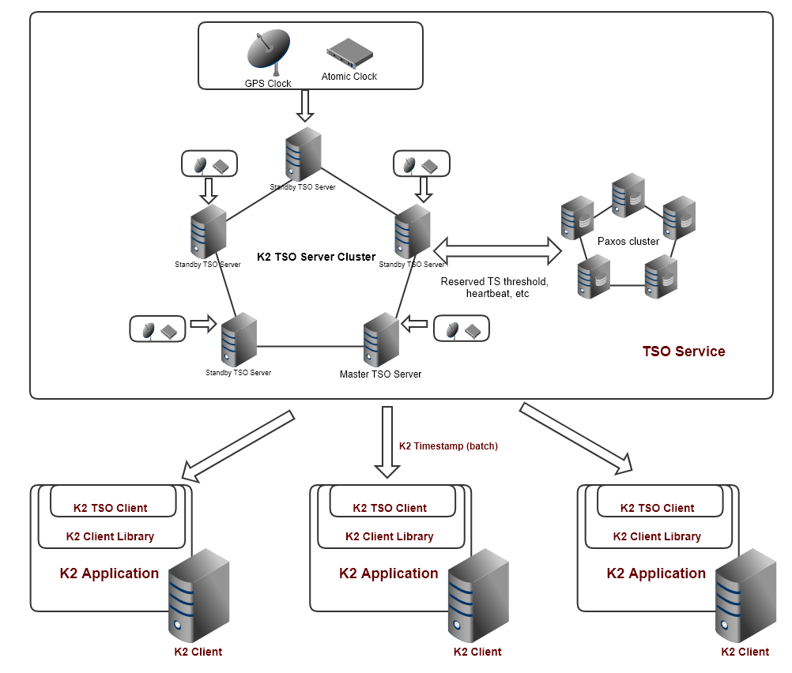

[-UP-](./TXN.md)

# K2 TimeStamp and TSO 
## 1.  Design goals
K2 TimeStamp is a specific designed data structure for timeStamp used for marking transactions' time in order to provide transaction isolation and consistency.  TSO(TimeStampOracle) is a service for providing K2 TimeStamps to K2 client clusters/data servers managing transactions. 

The design goals of K2 TimeStamp and K2 TSO are
- Functionality: support K2 global distributed transaction, Sequencial consistent SSI (3SI), with optimization for within datacenter avg 20 microsecond latency transactions.
- Performance: Issuing of K2 TimeStamp within the same data center should take less than 10 microsecond, ideally avg less than 5 microsecond.
- Scalability: Single TSO service can provide 50-100 million timestamps per second for the system, essentially support 50-100 million transactions per second(roughly 50 -100X current top TPCC record holder at 68 million tpmc).
- Availability: K2 TSO as logical single point of failure, should be designed with high availability >= 99.999%. Designed no down time for software upgrade, no down time for single physical server replacement, minimal unavailable time(ideally <200 millisecond) for server crash recover. 

To support intral and inter data center transaction efficiently respectively, we will deploy a TSO service per data center (can be scale out to one per database if needed when there are more than one database per data center). K2 application always request time stamp within its own data center. Each TSO has a global unique TSO Id. 

To have really small uncertainty window size on the timestamp, we plan to equip each TSO instance with at least two atomic clocks and one or two GPS for reliability redundency.  Mordern rack mountable atomic clock and GPS clock costs a few thousand dollors and can support 10k to a million time requests(MHz). Thus cost should not be a major issue. As one atomic clock is dedicated to one TSO, the tso could check time from atomic clock at millisecond frequency and lower, we expect to have uncertainty window size approaching sub-microsecond level. We will get real value after we get the equipment and software built. For the purpose of this document, we assume the uncertainty window is below 2 microsecond and use this for the rest of the document. 

Transaction latency is one of key goal K2 system try to minimize. But when it is too low, it will impact the consistency correctness and whole system scalability/throughput as explained later in the document. So we should set a artificial lowest latency of a transaction. For easier to understand the document, we for now set it to be 5 microsecond. 

Unless explicitly mentioned, all presumed numbers in this document can be adjusted/configured proportionally in later phase of implementation according to our testing/profiling result. They are set explicitly here just for easier understanding of the document and the design. 

## 2. Design overview
The high level architecture of TSO service in picture is below: 
- K2 TSO service is composed of a cluster of TSO servers, with one being master and actively serving requests from client and rest are standbys. The TSO server cluster is supported by a Paxos group for cluster management. Each TSO server has its own GPS clock and atomic clock(real deployment can share GPS cloc and atomic clock conditionaly).
- There is a cluster of K2 Client, where the K2 Application is running. Each K2 Application contains a K2 Client Libary which delagate all request from K2 Application to the rest of K2 systems. Within K2 Client Libary, K2 TSO Client is the component proxy the tiemStamp request to K2 TSO service.
- There is also a cluster of K2 Servers for transaction operations. K2 Server cluster is ignored in this picture. 


### 2.1 K2 TimeStamp
K2 TimeStamp mainly is composed of two functional components, one is a bounded uncertainty window containing real universal time (which is not exactly known) just like TrueTime in Google's Spanner system; the other is UInt64 SequenceNumber.   

The public interface of K2 TimeStamp contains accessor to these fields:
```
system_clock::time_point TStart()   - startTime of the TrueTime
system_clock::time_point TEnd()     - endTime of TrueTime
unint32_t                TSOId()    - The global unique Id of TSO
```
As well as a comparison api:
```
enumK2TSCompareResult Compare(const K2TimeStamp& other)  -> LT, GT, EQ, UN
```
Compare() API returns THIS value comparsion with OTHER in param, return an enum result of four possible values explained below. If two K2TimeStamps in comparison have same TSOId, we compare only Te, as timestamp(to be more exactly the Te part of timestamp) from the same TSO are conceptually strinctly increasing and unique. If two K2TimeStamps are of different TSOId, The comparison will be apply on the uncertainty window(inclusive both end)
```
LT - this value is less than the other value
     If two K2TimeStamp are of same TSOId,  this.Te < other.Te. If different TSOId, this.Te < other.Te
GT - this value is greater than the other value
     If of same TSOId, this.Te > other.Te. If of different TSOId, this.Ts > other.Te.
EQ - If two value are equal in very perspective, including TSOId. only applicable when TSOId are the same. 
UN - Only applicable when TSOId are different and uncertainty window overlap, 
     i.e. other.Ts <= this.Ts <= other.Te || other.Ts <= this.Te <= other.Te
```        

Internal structure for TimeStamp is
uint64_t _tEndTSECount  - counts of nanoseconds for tEnd's time_since_epoch(), from UTC 1970-01-01:00:00:00
uint16_t TSOId         - TSOId
uint16_t TsDelta  - time difference between Ts and Te, in nanosecond unit

### 2.2 K2 TSO service and servers
K2 TSO normally is deployed one per region, shared by all tenants. In case there are dedicated customer with extreame transaction throughput need, we can depoy dedicated K2 TSO for such customer, i.e. their database only per region. 

In order to guarantee the high availability, TSO is deployed with mulitple instances on top of a Paxos cluster, with one of the instance is master serving the timestamp request from clients. Besides master election, the Paxos cluster is also used for 1)heath/heartbeat/lease monitoring and managment; 2)keep record of reserved time threshold. 1) is typical usage of Paxos group, no more explaination is needed. 2)is to guarantee Timestamp from TSO service is (logically) strictly increasing. When TSO master instance crashes, a different instance need to know what highest timestamp(Te) old master has issued. Due to high TPS of issuing timestamp, a TSO master only periodically reserve a future time threshold and persist it into the Paxos group. The TSO master only issue timestamp within the threshold and as the time approaches the reserved time threshold, new threshold is reserved and recorded. The duration between threshold is related with duration of heartbeat. We expect to set heartbeat frequency to be 10ms, and with lost of 3 heartbeat, we will let Paxos to pick new master. Thus, the threshold duration can be extend per 30 ms for 30 ms more into future. This also fulfill the goal of TSO server availability interruption time less than 200 millisecond when unexpected crash happens.

As we are using Te part of uncertainty window to be the sequenceNumber when comparing between timeStamps from same TSO, the uncertainty window given be K2 TimeStamp is always a larger window including fully the true uncertainty window the TSO has. 

In order to guarantee external causal consistency, we need to set minimal distance between two region/data centers, i.e. two TSO. The time need to traveling between two regions should be bigger than the timestamp uncertainty windows size. The scenario is like this: For an external client, when she issues one transaction T1 on data center A (TSO A) and after it suceeds, she then issues another transaction T2 on data center B (TSO B). Transaction 1 and Transaction 2 has causal relationship but our system is not aware of (thus external causal relationship). In order to preserve such relationship, the timestamp of T2 must be greater than that of T1. As these timestamps are from different TSO, their uncertainty window can't overlap, thus once the distance between two TSO need more time to travel than the uncertainty window size, it is guaranteed that when T2 was getting a timestamp from TSO B, the time has already passed the uncertainty window of timestamp for transaction T1 (as issuing T2 after seeing T1 finish will take the time need travel between TSO A and TSO B). As we expect our uncertainty window size around 2 microsecond, it means 2 *1e-6 * 300k KM = 0.6 KM minimal distance (The speed of light is roughly 300K km/second, or 0.3km/microsecond). Normally distance between data centers of different geo-region is beyond 800 KM to be isolated from earthquke harzard, so such distance request is not an issue.  

### 2.3 K2 TSO Client
K2 TSO Client is the component resides inside K2 Client Library that is responsible to be the agent for K2 Client Libary for requesting K2 TimeStamp from K2 TSO server. 

The interface K2 TSO Client exposed to K2 Client Library can be as simple as following 
```
future<K2TimeStamp> GetTimeStampFromTSO();
```

But our actually implementation has one extra input parameter of local steady time when the request is made, as following:

```
future<K2TimeStamp> GetTimeStampFromTSO(const steady_clock::time_point& requestLocalTime);
```
the requestLocalTime param is the local stead_clock::now() when K2 Client Library start the processing the new request from application upon receive it. K2 Client Library need to keep track of this and K2 TSO Client need to know this as well. This is due to the fact we are using batch request between TSO client and TSO server for timestamps, with details in next section. Even K2 TSO Client could make a call to now(), but we should save this extra call as now() is already called in K2 Client Library.

## 3. Batch K2 TimeStamp request and implementation detail
Without TimeStamp Batch support, a simple design could be that when Application apply a new Timestamp for its new transaction, it simply goes through TSO client and get a K2 TimeStamp (Ts, Te, TSOId) issued by the TSO server. TSO server need to make sure of two things, 1) Te is strictly increasing (with the reserved time threshold logic across master server swith and time smearing logic in case there is time adjustment) 2) the uncertain window size is less than requirement to guarantee external causal consistency, roughly 2.6 milliseconds for two geo regions that are typically 800 km away for each other. 

But such simplified design will not sufficient to our need due to scalability limit, TSO server logically is only single server for all client servers(potentially hundres of thousands) in a data center/region. Detailed analysis and design are below.

### 3.1 The need and benefit to enable batch timestamp request 
Scalability is the key reason that we need to support batch timestamp request. At any time, there is only one TSO physical server which can handle certain amount of request per second(e.g. 1 millioon request per second). Without batching, this limit will be the upper limit of amount of timestamps, also, amount of transactions, a single region database can get. With a batch size of X per request, we can increase timestamp throughput to X times of the request throughput.

Current top TPCC record holder has throughput of 68 million TPmC, or roughly 1 million transaction per second for the whole system. We need to support 50 to 100 times of this throughput level with single TSO physical server. Current test indicates without any logic, each core of the machine in our lab can handle up to 2 million RDMA no-op msg, a back of envolop estimate is that with timestamp generation logic, each core throughput will reduce to 1/10 of simple no-op throughput, i.e. 0.2 million. With more than 20 cores on a server(and our share-no-thing architecture), the TSO throughput is 20*0.2 = 4 million timestamps. So a batch factor(10 - 25) will roughly fulfill the target of 50 to 100 million timestamps per second throughput. 

The benefit for batch includes typical benefit from batching, e.g. reducing the load on client, network and server. One thing worth to explicitly point out is with batching, we can use limited client machines improve the simulation credibility to test out the limit of our TSO server implementation. 

### 3.2 maintain uncertainty window and causal consistency with batch
Once we introduce batch, it means that the K2 TSO Client will have multiple timestamps of the same batch to issue to transactions that follows the first transaction which triggerred the whole batch of timestamps. This means even within single data center (i.e. one TSO scope), concurrently there are multiple K2 TSO client issuing the timestamps from their on-hand batch without talking to TSO Server . This is similar to in mulitple TSO situation, timestamps are issued concurrently by multiple sources. In such case, there two issues that need to be dealt with. One is the TrueTime uncertainty window validness and another is maintaining the causal consistency. Furthermore, the second issue here need to be considered at both intral data center(same TSO) and inter data center(different TSO) level.   

The first issue, TrueTime uncertainty windows validness issue, requires besides the first transaction which triggers the TSO client get a batch of K2 TimeStamps, all the transactions using the timestamps in the batch has correct uncertainty window as if it get the timestamp individually from TSO server directly. In order to achieve this, two conditions need to be met. First, the uncertainty window of timestamps in a batch need to increase (by extending Te) to the degree to cover the time difference between the arrival time of first transaction for the batch and the later spot transaction. Second, the extended uncertainty window set the time limit of the batch can be used. This means, if the batch is returned, within the extended time (of Te), if the Timestamp is not issued due to no enough transaction from TSO client, used timestamp in the batch will be discarded. For example, if the uncertainty windows size on the TSO server is 2 microsecond, assuming we expand Te by 5 microsecond and return a batch of 10 timestamps, upon the batch arrives to the TSO client, this then means the batch can be used for another 5 microsecond before unused timestamps are discarded. Of course, these timestamp of the same batch still should be strictly increasing Te to set the order of transactions. 

The second issue, causal consistency issue, requires any two transactions with causal relationship that happening on different K2 client(TSO client) has correct before-after relationship timestamps. This is to some degree similar to the external causal consistency issue in the multiple TSO situation. In mulitple TSO setup, the (external) causal consistency is guaranteed by making sure the network latency for transaction/request travels between TSO is greater than the max uncertainty windows size each and any TSO can have. Here, we can use similar approach, but instead of using the smaller uncertainty window size on TSO server, we have to use something else to cover the batched timestamp uncertainty window. (BTW, because we increased uncertainty windows size to enable batch, we need to make sure different TSO distance is set accordingly. But this should not be an issue, as per 1 microsecond we need to set the distance to be 0.3km apart. For an increased uncertainty window size of 10 microsecond, e.g., it means two geo-region/dataCenter/TSO should be 3Km apart, which is far smaller than normal 800km distance which is set to be earthquake proof.) This problem can be solved with mulitple different designs, here we provide a relative simple design with the introduction of minimal transaction latency(MinTL). The detailed design is to set (a configurable) minimal transaction latency(MinTL), e.g. 10 microsecond, then we can set increased batch uncertainty window size (batch TimeToLive, TTL) less or eaqual to this MinTL, e.g. 8 microsecond. The batch TTL is the time duration that the batch can be used on TSO client. The MinTL is enforcable programmably. When a (write) transaction completely committed less than this latency, the K2 Client Library, which keeps track of transction start and committ time, can simply force wait out the MinTL in such case. With increased uncertain window size less or equal to MinTL, we can prove easily the causal consitentcy is guaranteed, as once the application sees the commit of first transaction, the timestamp it can get for the second transaction is guranteed to be bigger and non overlapping on uncertainty window for second transaction, even in the batch timstamp mode. The detailed proof is ignored here. (Actually, it worth to mention, due to the same reason, Google Spanner system always wait out uncertainty window. Spanner system has uncertainty window size of up to 7 milliseconds when they published their paper, which is 1000 times more than that of K2 system. Even more, they support "External Consistency" thus they have to wait out uncertainty at end of EACH and EVERY write transaction.) 

To simplify the design for batch with above requirements met, we choose following design: 1) each batch of timestamps has the same base batch uncertainty window start time, say Tbs, and batch window end time, say Tbe, (Tbs, Tbe) is the super set of real uncertainty window on TSO server (Ts, Te) at the moment of issuing. Tbs simply set to be the microsecond level floor value of Ts for all timestamps in the batch, Tbe is set to the microsecond granularity fllor value of Te plus TTL. E.g, if (Ts, Te) is (SS.MS.001.050, SS.MS.003.100) meaning both are on perticular millis second and Ts is at microsecond 1 and nanosecond 50 while Te is at microsecond 3 and nanosecond 100, with assumption of batch TTL 8 micosecond, we will derive base batch uncertainty window (Tbs, Tbe) as (SS.MS.001.000, SS.MS.011.000). With such base uncertainty window and batch size, TSO client coud generate TimeStamp from base batch TimeStamp by manupulate the nano second digits of Tbe. Of course, this is based on design either differnt batch on one client will not have the same base Tbe at microsecond, or using the same range of nanosecond value, to avoid the possible duplicate client side Te generated. 

### 3.3 Batch design at K2 TSO server side
K2 TSO client batch request API to K2 TSO server is following,
```
future<K2TimeStampBatch> GetTimeStampFromTSO(int batchSizeRequested)
```
batchSizeRequested is desired amount of timestamps for TSO server to generate, the server may or may not honor it depends on server side availability. 

The returned batch is following structure:
```
struct K2TimeStampBatch
{
    uint64_t TbeTESBase       - batch uncertain window end time, number of nanosecond ticks from UTC 1970-01-01:00:00:00
    uint16_t TSOId            - TSOId
    uint16_t TsDelta          - time difference between Ts and Te, in nanosecond unit   
    uint16_t TSCount          - number of timestamp can be generated from this batch
    uint8_t  TbeNanoSecStep   - step (number of nanoseconds) to skip between timestamp Te in the batch
    uint8_t  TTLus            - TTL of batch on the client side in microseconds
}
```
E.g. TBeTSEBase is 1576884547194846100 for time point at 2019-12-20:15:29:07, which is set with TSO server time uncertain window ending time plus the TTL, in nanosecond ticks, with some adjustment for base for the batch, which will be explained later. TSOId is ingored to explain here. 
TsDelta could be up to 10000 (10 microsecond)
Let's say TbeNanoSecStep is 20 and TSCount is 10, i.e. this batch contains 10 timestamps, then all 10 time stamp has the same Ts (1576884547194846100 - 10000 = 1576884547194836100). 
For Tb = TbeTESBase + i * TbeNanoSecStep, i = 0, 1, ... TSCount, in this example, they are
1576884547194846100 + i * 20.

The reason that TbeNanoSecStep is not 1 (thus can be ignored) is related with the detailed design on the TSO server side, they are essentially the number of worker core on TSO server taking the requests and issuing batchs. 

K2 TSO server is a K2 server application which is based on SeaStar platform. Each core is dedicated to its own task/role. On TSO Server (master instance), which is a multi core system(we do not need multi-socket system, as cross socket synchronization is too expensive), cores are split into two roles, one is control core, and the rest are worker cores. 

#### worker cores
If current TSO instance is not master, there is nothing much for worker core to do. If it is a master, worker core key responsibility is to
1. handle TSO client request, issuing time stamp (batch). This is a normal priority task.
2. handle config data(TSOWorkerControlInfo below) update task issued from the control core. This is a high priority task.
3. collect and aggregate statistics data of this core for control core to collect. This is a low priority task.

Each worker core has following local config data needed to generate batch, all are set by the control core.
```
struct TSOWorkerControlInfo
{
    bool      IsReadyToIssueTS      - if this core is allowed to issue TS, could be false for various reasons
    uint16_t  TbeNanoSecStep        - step to skip between timestam, actually same as the number of worker cores 
    uint64_t  TbeTESAdjustment      - batch ending time adjustment from current chrono::steady_clock::now();
    uint16_t  TsDelta               - batch starting time adjustment from TbeTSEAdjustment, basically the uncertainty window size
    uint64_t  ReservedTimeShreshold - reservedTimeShreshold upper bound, the generated batch and TS in it can't be bigger than that
    uint8_t  TTLus                  - TTL of batch on the client side in microseconds
}   
```

A worker core doesn't coordinate with other worker core, as cross-core communication is expensive(>0.5 microsecond in SeaStar), so we need to make sure different work core will issue batch of different timestamp (even at the same nano second). Thus, for each work core, it will use its SeaStar core ID as starting base of nano second value in the TbeTSEBase and each timeStamp in the batch will be number of work core, i.e. TbeNanoSecStep away from each other. For example, say we have 20 worker cores and their id are 0, 1, ... 19, then for core 0, the nano second value in the starting batch (of the microsecond) will be 0, 20, 40, ... and core 1 will be 1, 21, 41, ... etc. For each microsecond, each worker core can issue at most 1000/number or work core time stamps.  

To make sure a worker core doesn't issue duplicate timestamp across different client requests within the same microsecond, each worker core keep a local value of microsecondOfLastRequest, timeStampCounterOflastMicrosecond, which are initialized to 0 both, so that we can avoid this issue. 

The detail of steps of a worker core processing the cleint request is following:
```
1. Upon request arrival, check okToIssueTS, if false, return ServerNotReady error (should have different error code if current server is not TSO master instance).
2. get tNow = system_clock::now(); calculate intended TbeTESBase = tNow(set last three digits of nano second to 0) + coreId; 
3. if TbeTESBase != microsecondOfLastRequest, 
     then 
     {      set timeStampCounterOflastMicrosecond = 0, 
            and set return value TSCount = min (1000/TbeNanoSecStep, batchSizeRequested) as the max amount of timestamp in a batch is 1000/TbeNanoSecStep;
     }
     else 
     {
         if (1000/TbeNanoSecStep - microsecondOfLastRequest) < batchSizeRequested
         then
         {
             busy wait till next microsecond (or schedule this task to the end of client request scheduling group and redo from begining)
             // after wait with new(next) microsecond TbeTESBase
             set return value TSCount = min (1000/TbeNanoSecStep, batchSizeRequested)
         }
         else
         {
             set TbeTESBase += timeStampCounterOflastMicrosecond *  TbeNanoSecStep;
         }
     }
4. check updated possible last timestmap in the batch is before reservedTimeShreshold, i.e.
         if  (TbeTESBase + (batchSizeRequested -1) * TbeNanoSecStep) > reservedTimeShreshold, 
         return ServerNotReady error;
5. generating the return batch with update TbeTESBase, batchSizeRequested, TbeNanoSecStep, TsDelta, TSOId and return to client; 
   update microsecondOfLastRequest and timeStampCounterOflastMicrosecond
```

#### Control Core
Control core key responsibility is to 
1. Upon instance started up, join the TSO server cluster and figure out which instance is the master(if needed, participate master selection). Also collect info about its own worker cores. So, upon call of GetTSOServerInfo from client, it can tell the client who the TSO Server master instance is, and itself is the master, the readyness of itself and RDMA address of its workers, etc. 
2. If current instance is master, periodically sync up with atomic clock/GPS clock for real time. (Depends on the atomic clock device we finally purchase and deploy, we will set the frequency of sync up, but now we expect it at least once per 10 millisecond). Base on the updated real time and current TSOWorkerControlInfo, if necessary, make modification to TSOWorkerControlInfo and send tasks to all worker cores to update their own. Essentially, this is to control all workers on the timestamps(batch) they can issue. We call this perioadical task TimeSyncTask at control core. 
3. If current instance is master, periodically send heartbeat to paxos, which including renew lease and reserve the new future threshold, reservedTimeShreshold, that worker core can give out timestamp. As reservedTimeShreshold is a member of TSOWorkerControlInfo, so each time this timed task is done, it propagates updated TSOWorkerControlInfo to all workders. We can this peroadical task TimethresholdReservation task at control core.
4. If current instance is master, Periodically aggregate the statistics data for all worker cores for metrics reporting. Basically, low priority lamda tasks from the work cores with each worker core's statistics need to be aggregated and if necessary reported.  

For a master, at each heartbeat(say each 10 ms), it will extend its lease to indicates its master status. In normal situation, the reservedTimeShreshold is the same value and extended same time together with the lease. Currently both are set to be current time plus 3 times of heartbeat interval(e.g. 30 ms). Controle core will kept a copy of renewed lease and at each heart beat will check the lease, it find out it already lost lease(due to prevous heartbeat failure for 3 times), it will suicide immediately. When a master is asked to shut down gracefully, it could adjust the reservedTimeShreshold back(bigger than any issued out timestamp) so that other future master can resume service earlier instead of waiting full 30 ms. At the end of heartbeat, the control core will send message(i.e. SeaStar crosscore Lamda) to all worker cores to update TSOWorkerControlInfo for updated reservedTimeShreshold. 

When a master instance of TSO server starts up, it looks for reservedTimeShreshold from the paxos cluster. It not find (in the first bootstrap case) it write a new reservedTimeShreshold into Paxos. If it found one, it will make sure, through waiting if need, that the real time of this master instance server is greater than the value to skip the time that already reserved by previous master instance to make sure the timestamp issued has strictly increasing ending time of uncertainty window, which is used as sequence number of the timestamp.

TimeSyncTask handling is responsible to check current machine clock is drift off from Atomic/GPS clock. If it is drift large enough, it will adjust TbeTESAdjustment in TSOWorkerControlInfo and which will be sent to all the worker cores in following heartbeat. 

```
struct TSOWorkerControlInfo
{
    bool      okToIssueTS           - flag indicating if this core is ok to issue TS, could be false when shutdow is signaled
    uint16_t  TbeNanoSecStep        - step to skip between timestam, actually same as the number of worker cores 
    uint64_t  TbeTESAdjustment      - batch ending time adjustment from current chrono::steady_clock::now();
    uint16_t  TsDelta               - batch starting time adjustment from TbeTSEAdjustment, basically the uncertainty window size
    uint64_t  reservedTimeShreshold - reservedTimeShreshold upper bound, the generated batch and TS in it can't be bigger than that
}   
```
TimeSyncTask after get new real time from atomic/GPS clock, it will essentially decide if the timestamp uncertain window for a timestamp batch need to be adjust or not, i.e. if  TbeTESAdjustment and TsDelta need to be updated. 

Change on TsDelTa is relatively simple, once TbeTESAdjustment's update is set. Basically, it will be adjusted so that derived Ts is the true time Ts at the moment of update. The tricky issue is updating of TbeTESAdjustment.

TbeTESAdjustment is the adjustment to be done to current system_clock::Now().time_since_epoch().count() to generate TBeTESBase, the base end time for the timestamp batch to be issued. There are two reasons to have this adjustment. 
1. The system time of the master instance of TSO server has a time difference to the time given bye atomic/GPS clock, which is the simple delta between machine system time and atomic/GPS clock
2. After some duration of time, When the time drift sufficient large between master instance of TSO server and the atomic/GPS clock, we need to adjust the simple delta.

When we update the TbeTESAdjustment, forward updating is not issue, but for backward updating, TSO server need to do the smearing of the time to make sure the ending time of timestamp is not going backwards. This is done both at the control core and worker core. When the value need to be updated is large, large than 1 microsecond, the control core smearing it to 1 microsecond per X microsecond. X can be set fixed, e.g. at 10 microsecond, or depends on the value of adjusment we need to do, the bigger it is, the smaller X to be set to reduce the total time duration for the smearing. Also on the worker core side, when smearing backward happens(i.e. new TbeTESAdjustment is smaller by 1), work core need to make sure to wait at least one full microsecond after microsecondOfLastRequest before it can issue new timestamp batch so that the timestamp never has smaller Te in the timestamp batch. 

Since worker core is using system clock and TbeTESAdjustment to have accurate time stamp batch, when a master instance of TSO server is on service, we do not allow system clock change. It can be changed when the instance is on standby mode. This way, we can simplify the implementation of TimeSyncTask handling. When master instance of TSO server starts up (transitioned from standby mode), it could adjust machine system clock after get the real time from atomic/GPS clock, as well as other parameters in TSOWorkerControlInfo, before seting up worker cores.

Some more note of the design of TSO server
- TSO server actually can be deployed with the Paxos cluster node supporting it. We could dedicate other cores or socket(if it is multi-socket server) to Paxos process. 
- Control core is multi-tasking with a few period tasks, though due to the low freqency of these tasks we do not expect any perf issues, but if after implemenation/test we found there is performance issue, we may split there task into more control cores, each is dedicate to some of the control tasks (detail design can be delayed).
- Server side, between worker cores, there is no load balance to minimize the latency and server cost and the load balance is done at K2 TSO Client side. A simple random or round Robin load balance on the client side should be sufficient.


### 3.4 Batch design at K2 TSO Client side
Batch complexity is transparent to the application completely and essentially the K2 Client Library as well. As K2 Client Library need to enforce MinTL, it need to keep record of a transaction request arrival time from the application(requestLocalTime). This requestLocalTime is needed for K2 TSO client to check if it can use on hand timestamp from existing batch. (K2 TSO client could call steady_clock::now() internally and thus totally decouple from K2 Client Library, but we want to save this otherwise redundant call which costs 40 NanoSeconds in our test). The API between K2 Client Library and K2 TSO client as mentioned above already, is.
```
future<K2TimeStamp> GetTimeStampFromTSO(const steady_clock::time_point& requestLocalTime);
```
Inside K2 TSO Client, (i.e. the implementation for above API), it manages a possible existing batch of timestamps from latest call into TSO server. If there is no batch of timestamps or all timestamps in the batch are used up, K2 TSO client issues a new call to TSO server to get a new batch of timestamps, K2TimeStampBatch as mentioned before 
```
struct K2TimeStampBatch
{
    uint64_t TbeTESBase       - batch uncertain window end time, number of nanosecond ticks from UTC 1970-01-01:00:00:00
    uint16_t TSOId            - TSOId
    uint16_t TsDelta          - time difference between Ts and Te, in nanosecond unit   
    uint16_t TSCount          - number of timestamp can be generated from this batch
    uint8_t  TbeNanoSecStep   - step (number of nanoseconds) to skip between timestamp Te in the batch
    uint8_t  TTLus            - TTL of batch on the client side in microseconds
}
```
Together with a batch/K2TimeStampBatch, K2 TSO client keeps a pair of local parameters for the batch
```
steady_clock::time_point  firstRequestLocalTimeOfBatch
uint16_t                  usedCountOfBatch
```
firstRequestLocalTimeOfBatch is set to the requestLocalTime of the first client request of timestamp which triggered the call into TSO server and get the batch. Together with TTLus in the batch, latter requests from K2 client for timestamp, if the requestLocalTime within the firstRequestLocalTimeOfBatch + TTLus, it could used the timestamp from the batch if the batch is not used up. usedCountOfBatch is initialized to 0 and incremented after each time stamp is used from the batch. 

When the request is within TTL of the batch, a timestamp is generated from the batch with TeTSE set to TbeTESBase +  TbeNanoSecStep * usedCountOfBatch, TSOId and TsDelta are trivially set to the same value from K2TimeStampBatch. 

## 4 Design alternatives and reasoning
### 4.1 Conditions that guarantees casual consistency and potential to expand mulitple TSO within same data center if needed


### 4.2 Impact consideration of between different STO clients there can be significant different network latencies to the TSO server 