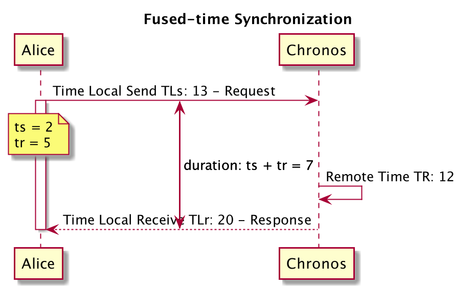

[-UP-](./TXN.md)

# K2 Chronos Design
Chronos is a service for providing timestamps to K2 clusters for transactional operations.

## Fused Time
Performing a service call for every timestamp does not scale very well. To minimize the number of calls to the K2-Chronos service, a combination of remote time and local time can be used. We call this *fused time*.

The remote service is invoked every interval *t*, let's say *t=100ms*. Between *t1* and *t2*, the local time is used to generate timestamps. The clocks will eventually drift, however the drift is only for the duration of refresh interval *t* since in the next invocation the times will sync and any drift will be corrected.

To perform this correction, we will measure the clock drifts and clock skews *e* between each *t* interval:



```
TLs: local time when the message is send
TLr: local time when the message is received
TR: remote time when the message is received by the Chronos service
ts: send latency; duration from sender to Chronos service
tr: receive latency; duration from Chronos service to recipient
```

We derive thefollowing formulas, where e0 is the initial value of the clock skew and drift:
```
TLs + e0 + ts = TR + e1
TLr + e0 = TR + e1 + tr
```
> e1 = e0 - TR + 0.5 [ (TLs + TLr) + (ts - tr) ]

The formula above describes the time drift and time skew of  between the local time and the remote time *e* between each interval *t*. Initially we can assume that *e0 = 0* and *ts = tr*

> e0 = 0.5 (TLs + TLr) - TR


To calculate ts and tr, we can use the difference between local time and remote time:

> ts = TR - TLs + (e1 - e0)

> tr = TLr - TR + (e0 - e1)

> ts + tr = TLr  - TLs

Messages at times can be lost or delayed. To weed out outliers we can keep a window of message latencies in either direction and read the median value.
We can also get more accurate *ts* and *tr* if we measure the time directly from the transport layer. This however, will require that the time synchronization happen over unreliable channels.

### Drift
To monitor and correct any potential drift, the Chronos service will keep track of the max *de* across all the nodes. At every time sync request, the Chronos service will also provide the de for that particular client. Where emax is the maximum value of e and ei is the reported

> de = demax - e2 - e1

The client will adjust it's e with the de value provided.

> `e2 = e2 + de

To make sure that we can keep read your writes property across the cluster, we have to guarantee that the de is smaller than ts

> ts > de

In the case that the above property is violated, the client can wait for `de - ts` before executing a transaction.

## Failover
### Client
To prevent the client's timestamp from going backwards, we will wait until the refresh period *t* has elapsed. This can be efficiently done my measuring CPU cycles. As soon as we are outside of that window, it should be safe to start generating timestamps.

### Chronos
To prevent the service timestamp from going backwards, we can periodically persist the latest time to etcd/zookeeper. In the case that our time has moved forward, that should not be an issue. If we have moved backwards, we can slowly increment the time until it catches up with the latest persisted time.

<!---
## Timestamp Sequence

### Data Model
There are couple of approaches here:

1. Monotonically increasing sequence number.
2. Composite timestamp of millisecond resolution wall time combined with a sequence number.

To allow for alternatives to the approaches above such as Marzullo time derivatives, the timestamps will be provided as tuples:

`(T, E)`

Where T is the time and E the maximum timestamp error. In our cases above, E = 0.

### Architecture
The K2-TSO service will be built over the K2 transport. A membership group will be formed for availability.
The membership recipe can be implemented over Zookeeper or etcd store.
- Implemented as a service over the K2 transport.
- Multiple replicas for availability.
- Zookeeper/etcd to provide group membership and leader election.

### Timestamp Vending
A new timestamp will be generated on every request based on a starting time Tstart up to Tend.
A cursor will keep track of the last generated time.
A background task will periodically extend Tend when the cursor exceeds:

```(Tend - Tstart) / 2```
- Generated on every request.
- A cursor keeps track of the last time.

### Persistence
Every time Tend is extended, it will first be persisted into Zookeeper/etcd. This is not going to be an issue since we do not expect the
same call volume as service requests. However, this is highly dependent on ```Tstart - Tend```. To adjust for increasing
traffic, Tend can be further pushed into the future.

* Periodically persisted into Zookeeper/etcd.

### Failover
When the leader dies, another node will become the leader and resume with ```Tstart = Tpersisted```. Before serving traffic a new Tend
will be generated and persisted.

* New leader resumes from Tpersisted.
* A new Tend will be persisted before serving requests.
-->
