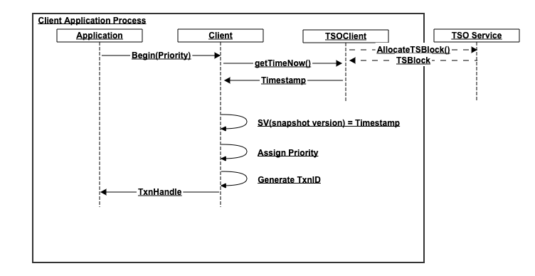
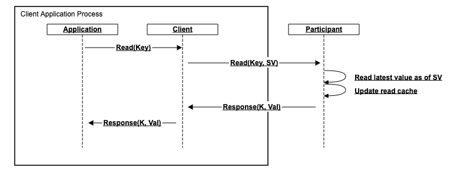
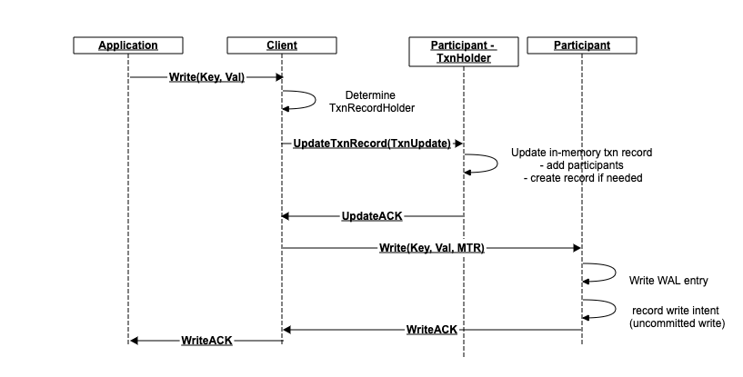

[-UP-](./README.md)

[TOC]

# Goals
- based on YCSB+T (later TPC-C) benchmark
- Latency: 20us avg
- Throughput: 100K/sec per CPU
- Support serializable isolation level. Ideally, support DB-level isolation levels of SnapshotIsolation or Serializable

# Definitions
## ACID
- Atomicity: multiple keys either all get updated or none (2PC with logging)
- Consistency: (data consistency, e.g. conform to schema, or uniqueness restriction)
- Isolation: e.g. MVCC allows snapshot isolation
- Durability: (handle failures)

## Isolation levels:
- ReadUncommitted: a read may see value currently part of an open transaction. The value may actually be rolled back
- ReadCommitted: a read will only see values committed by other transactions. It may be possible to see different values in your own txn if another txn commits.
- ReadRepeatable: all reads during a txn will return the same value even if there are other commits.
- Serializable: all transactions are ordered and will never be observed in different order by different users. The order however may be observed to be different compared to the actual order in which the txns executed, provided the end result is the same (e.g. -$50 followed by +$100)
- Externally Serializable: all txns are observed in the order they were executed by all observers

# Outline of approach
We've chosen a modified Serializable Snapshot Isolation approach. Roughly, we use MVCC to achieve snapshot isolation, and we enhance the server-side handling and book-keeping to make it serializable, as described in the paper  [Serializable Isolation for Snapshot Databases](./SerializableSnapshotIsolation-fekete-sigmod2008.pdf). Here is the outline

## Starting a transaction

The application initiates a transaction by calling the begin() client library API. In this call
1. Obtain a transaction timestamp from the TSO(TimeStampOracle) service.
    - This is done asynchronously - we issue the request here but continue and return a transaction handle before we receive the response.
    - The timestamp is a tuple (TimestampEarliest, TimestampLatest), and is interpreted as in [Spanner's TrueTime](https://cloud.google.com/spanner/docs/true-time-external-consistency). With TSO, the interval will be with E=0. But the API will allow us to plug-in global clocks with varying level of consistency confidence such as described in TrueTime.
    - It is used to stamp the entire transaction. That is, the commit time for all writes in this transaction will be recorded to occur at this timestamp
    - It is used to perform snapshot/MVCC reads.
1. Generate a transaction ID in the CL. This is generally a short ID (e.g. (IP + random)) used to distinguish transactions in the live system as well as at recovery time
1. Assign a priority to the transaction based on either priority class (LOW/MED/HIGH), or particular priority within the class. The priority is used to deterministicaly pick winner in transaction conflict cases.
1. Further operations, including commit/abort have to be issued using the returned transaction handle

## Operations
Operations are executed in the context of a transaction. The operations are generally reads or writes, which can be extended to allow more advanced operations such as atomic(e.g. CAS) or even stored procedures for custom, single-node operations.

- Each operation must specify an MTR(Minimum Transaction Record) tuple. This tuple conveys (TxnID, Timestamp, Priority)
- A TransactionRecordHolder is designated by the CL. The TRH is is one of the write participants in the transaction. We pick the first such writer for most transactions, but it is possible to pick a more optimal TRH for certain workloads. The assignment is done lazily when the first write is encountered, and the assignment message is piggy-backed onto that first write.

### Reads

The reads are decorated with the snapshot version (timestamp obtained when txn was started). The reads are standard MVCC reads i.e. the returned value is the latest value such that `result.ts <= request.SV`.

#### Read Cache
In order to achieve SerializableSI, we also maintain a read key cache. The read key cache is an interval tree which stores the latest SV at which a key(or range of keys) was read. The cache is consulted at write time to determine if a write should be aborted: if we try to write an item with timestamp <= lastSVTimeTheKeyWasRead, then we are breaking a promise to whoever read the item - they saw some item version when they read at their snapshot time, and now we're trying to insert a newer version into their snapshot. This write should therefore be aborted.
Entries are removed from the cache in an LRU fashion, and we maintain a minSVTimestamp watermark for the cache, which tells us how old is the oldest entry in the cache. Any write before this timestamp (for any key) is aborted as we assume there may have been a read for it.

###### WriteIntent
It is possible that a read encounters a write intent. That is a potentially committed write. <mark>TODO describe handling</mark>

### Writes

#### Participant
A write executed in a transaction is sent directly to the participant who owns the data. When the participant gets the write, it checks to make sure it doesn't conflict with its read cache, and insertes a WriteIntent entry into its data set.
The WriteIntent can tell us the MTR for the transaction which is executing.

<mark>TODO describe write intent conflict (PUSH)</mark>

#### TRH
The client libary designates one of the participants on which we do writes as the TRH. In effect, this participant becomes the coordinator for the transaction. It may be contacted during a transaction (PUSH) and asked to abort, or it may be told to commit/abort by the client.

The client lazily determines the TRH based on the writes it sees. Normally, the first write determines who the TRH will be, and we piggy-back a TRH creation request along with the write we're sending to that participant. All writes are marked with an MTR(minimum txn record), which contains the address of the TRH, the TXN id, and the txn timestamp.

## Commit

## Optimizations
Some ideas for optimization

- Transaction execution time will be goverened by network latency. It may be helpful to allow appications to execute operations in batches so that we can:
    - group operations to the same node into single message
    - execute operations to different nodes in parallel
    We can potentially collapse transactions into 2 total round trips if transaction is executed on single partition
        1. obtain timestamp
        1. execute operations and commit in one shot

## Other Notes
- all write intents contain MTR
- each partition needs index of MTR-> write intents
- Consider using separate wal for intents. Potentially cheaper to GC. May cause write amplification
- Upon conflict of pending txns, resolve
    - Priority
    - timestamp
    - pusher
- integration with module interface
- recovery process
- gc process
- WAL interaction
- upon abort, respond with priority value for winner. Upon retry, use the winner's priority

# Detailed component design
## [TimeStamp Oracle](./TSO.md)
## [Transaction Client](./TXN_CLIENT.md)
## [Benchmark](./TXN_BENCHMARK.md)
## [Transaction Manager](./TXN_MANAGER.md)

# Benchmark
- [UW YCSB-T repo - requires account](https://syslab.cs.washington.edu/research/transtorm/)
- [UW YCSB-T paper](./YCSB+T.pdf)

# Transaction solutions
[Serializable SI - CockroachDB](https://www.cockroachlabs.com/blog/serializable-lockless-distributed-isolation-cockroachdb/)

## SnapshotSerializable
- any cycle produced by SI has 2 rw(T1 reads -> T2 writes same key) dependency edges, which occur consecutively
- Dangerous: there is a cycle and we have consecutive RW edges
- Every non-serializable execution contains a dangerous structure.

similar properties to Snapshot Isolation, but fix concurrency issues at runtime by aborting conflicting transactions via cycle detection
- serializable: the DB state is equivalent to some serial txn execution
- recoverable: partially committed transactions still appear ACID. Abandoned/aborted transactions have no effect
- lockless: Operations done without taking locks
- Distributed: no central oracle
- Every transaction is assigned a timestamp (from the node on which it starts) when it begins. All operations in that transaction take place at this same timestamp, for the duration of the transactions
    - ?? are there issues with using local timestamps for transactions?
    - ?? Does this happen at every participant? Do we use the first such timestamp?
- Individual operations can locally determine when they conflict with another operation, and what the transaction timestamp of the conflicted operation is.
- Operations are only allowed to conflict with earlier timestamps; a transaction is not allowed to commit if doing so would create a conflict with a later timestamp.
- LRU interval cache is used for locking. The timestamp cache is a size-limited, in-memory LRU (least recently used) data structure, with the oldest timestamps being evicted when the size limit is reached. To deal with keys not in the cache, we also maintain a “low water mark”, which is equivalent to the earliest read timestamp of any key that is present in the cache. If a write operation writes to a key not present in the cache, the “low water mark” is returned instead.
    - ?? How is this setup on cold start?
    - ?? not persisted. What if there were a bunch of reads, the node restarts, and an older write comes in?
- two uncommitted transactions: consider two transactions [T1, T2], where timestamp(T1) < timestamp(T2). T1 writes to a key ‘A’. Later, T2 reads from key ‘A’, before T1 has committed.
    - can't give neither committed(T1 may commit) nor uncommitted(T1 may abort) value to T2
    - ?? Doesn't this mean that we can never allow concurrent reads since we don't know if the oldest TXN may attempt a write?
    - intents are kept with uncommitted writes
    - ?? How are they cleaned up?
    - solutions
        - If the second transaction has a higher timestamp, it can wait for the first transaction to commit or abort before completing the operation.
        - One of the two transactions can be aborted.
        - The second transaction (which is encountering an intent) looks up the first transaction’s transaction record, the location of which is present in the intent.
        - The transaction performs a “push” on the discovered transaction record. The push operation is as follows:
            - If the first transaction is already committed (the intent was not yet cleaned up), then the second transaction can clean up the intent and proceed as if the intent were a normal value.
            - Likewise, if the other transaction already aborted, the intent can be removed and the second transaction can proceed as if the intent were not present.
            - Otherwise, the surviving transaction is deterministic according to priority.
            - It is not optimal to always abort either the pusher or pushee; there are cases where both transactions will attempt to push the other, so “victory” must be deterministic between any transaction pair.
            - Each transaction record is thus assigned a priority; priority is an integer number. In a push operation, the transaction with the lowest priority is always aborted (if priority is equal, the transaction with the higher timestamp is aborted. In the extremely rare case where both are equal, the pushing transaction is aborted).
            - New transactions have a random priority. If a transaction is aborted by a push operation and is restarted, its new priority is max(randomInt(), [priority of transaction that caused the restart] - 1]); this has the effect of probabilistically ratcheting up a transaction’s priority if it is restarted multiple times.
        - However, we additionally add a heartbeat timestamp to every transaction. While in progress, an active transaction is responsible for periodically updating the heartbeat timestamp on its central transaction record; if a push operation encounters a transaction with an expired heartbeat timestamp, then it is considered abandoned and can be aborted regardless of priority.
            - ?? Does that mean we need to heartbeat to every node which we touch (R/W) ?

## Warp
- The key insight of the acyclic transactions protocol is to arrange the servers for a transaction into a chain, and to validate and order transactions using a dynamically- determined number of passes through this chain
- vservers: Warp uses a system of virtual servers to map multiple partitions of the mapping to a single server. Clients con- struct their acyclic transaction chains by constructing a chain through the virtual servers, and then mapping these virtual servers to their respective servers. A server that maps to multiple virtual servers in a chain will appear at multiple places in the chain, where it acts as each of its virtual servers independently. Within each physical server, state is partitioned by virtual server, so that each virtual server functions as if it were independent. Vir- tual servers enable the system to perform dynamic load balancing more efficiently.

## Sinfonia
- mini-T are conditional
- data located with (mnode_id, address). This allows data locality

### features:
- batched updates
- txn across nodes
- 2 round trips to start, execute, and commit

### acid features:
- atomicity: mini-t execute completely or none at all
- consistency: data remains consistent
- isolation (serializable)
- durability (commited txns are not lost in failure scenarios)

### txn details:
- piggy-back the last txn action onto the prepare msg if it doesn't affect coordinator decision (abt/com), e.g. data update
- piggy-back some other requests to prepare msg if participant can decide inline (e.g. read==NIL)

mini_t:
    - compare items
    - read items
    - write items

higher-level primitives:
  swap
  cas
  atomic_read_many
  acquire_lease
  acquire_lease_many
  update_if_lease_held

if mediator token is < previous token, send back for retry through the chain to the head. How does retry help?

MVCC allows snapshot isolation (i.e. txns observe a full frozen copy of the database). Can provide up-to ReadRepeatable
2PC gives atomicity for entire transaction
MVCC-Repeatable + 2PC gives Serializable
Externally serializable needs global clock (e.g. TrueTime)
