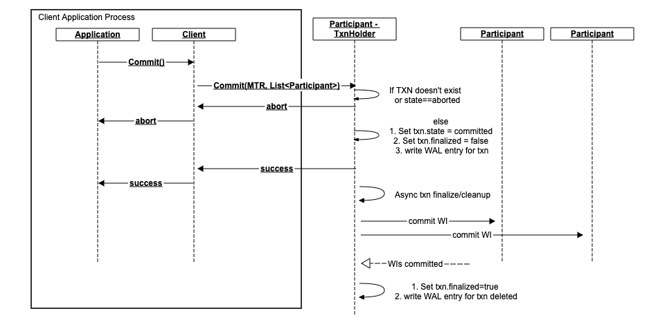

[-UP-](./README.md)

[TOC]

# Goals
- benchmark based on YCSB+T (later TPC-C)
- Latency: 20us avg
- Throughput: 100K/sec per CPU core
- Support serializable isolation level. Ideally, support DB-level isolation levels of SnapshotIsolation or Serializable

# Assumptions
- Single-datacenter applications
- Availability of high-bandwidth (>40gbit) RDMA/RoCEv2 compatible network
- We are using a single-threaded, concurrent architecture. This allows us not to worry about multi-threaded side-effects during tight sequence of operations on any node.

# Definitions
### ACID
- Atomicity: multiple keys either all get updated or none (2PC with logging)
- Consistency: (data consistency, e.g. conform to schema, or uniqueness restriction)
- Isolation: e.g. MVCC allows snapshot isolation
- Durability: (handle failures)

### Isolation levels:
- ReadUncommitted: a read may see value currently part of an open transaction. The value may actually be rolled back
- ReadCommitted: a read will only see values committed by other transactions. It may be possible to see different values in your own txn if another txn commits.
- ReadRepeatable: all reads during a txn will return the same value even if there are other commits.
- Serializable: all transactions are ordered and will never be observed in different order by different users. The order however may be observed to be different compared to the actual order in which the txns executed, provided the end result is the same (e.g. `-$50` followed by `+$100`)
- Externally Serializable: all txns are observed in the order they were executed by all observers

### Snapshot Isolation
Snapshot isolation is a mechanism for providing ReadRepeatable isolation level. It provides an immutable snapshot-in-time view of the entire database. The database guarantees that reads against this snapshot will always return the same values. SI by itself does not provide any form of serialization among transactions. As we will discuss further in this document, we are providing a solution to achieve serializable SI.

### Operation
Operations are executed in the context of a transaction (using the TxnHandle returned by begin()). The operations are generally either constant(e.g. read-only) or mutating(e.g. writes). The operations are not limited to simple KV read/write and can be extended to allow any advanced single-node operations such as atomic ops(e.g. CAS) or even stored procedures. For simplified explanations, we use constant<->read and mutating<->write interchangeably in this document.

### Minimum Transaction Record (MTR)
This is a small tuple of metadata which must be specified with every operation issued by the client. This tuple conveys `(TxnID, Timestamp, Priority)`, and we use this to perform snapshot reads, associate writes with transactions, and conflict resolution.

### Transaction Record Holder (TRH)
Any transaction which performs a write requires a central coordinator for the transaction. The coordinator is just one of the write participants in the transaction. We call this coordinator the Transaction Record Holder (TRH). We'll explain how the TRH is used in each individual operation further in the document. The Client decides who the TRH will be for a given transaction, and sends a message to it to let it know that it is responsible for the coordination tasks. For performance reasons, the client lazily waits for its first write, and piggy-backs the TRH-assignment message onto this first write.

### Write Intent (WI)
In order to detect potential conflicts, we use Write Intents(WI). WIs are the same as any other record in the system. They correspond to a version for some key, and are our way of keeping track of uncommitted writes.
In other words, we call a standard record which has the "uncommitted" flag to ON a "Write Intent". When the commit phase of a mutable transaction goes through, the flag is cleared (set to false) making the record a committed value.
In the WI we also rembember the MTR and TRH for the transaction which created the intent in the node. So given a WI, we can find out the MTR(transaction ID, timestamp, priority), as well as the TRH(the participant which is responsible for maintaining the TXN state)

### TSO (TimeStampOracle)
TSO is a separate service whose job is to provide a global clock. The design and scalability of this component is addressed in a [separate document](./TSO.md). For the purposes of this document it is sufficient to understand that the TSO service allows each client to locally produce globally-unique timestamps which are agreed upon by all clients and nodes of a given K2 cluster.

# Outline of approach
We've chosen a modified Serializable Snapshot Isolation approach. Roughly, we use MVCC to achieve snapshot isolation, and we enhance the server-side handling and book-keeping to make it serializable, as described in the paper  [Serializable Isolation for Snapshot Databases](./SerializableSnapshotIsolation-fekete-sigmod2008.pdf). Here is the outline:

## Starting a transaction


The application initiates a transaction by calling the begin() client library API. In this call:
1. Obtain a globally unique transaction timestamp from the centralized TSO(TimeStampOracle) service.
    - Even though this requires synchronization with a global TSO, our approach to timestamp generation allows us to achieve zero-overhead cost. The timestamps are pre-allocated from the TSO in blocks asynchronously and the actual timestamp generation always happens locally in the client memory thus we do not require a network trip for this step. See [TSO Design](./TSO.md) for further details.
    - The timestamp is a tuple (TimestampEarliest, TimestampLatest) and is interpreted as in [Spanner's TrueTime](https://cloud.google.com/spanner/docs/true-time-external-consistency). With TSO, the interval will be with E=0. But the API will allow us to plug-in global clocks with varying level of error confidence such as described in TrueTime.
    - This timestamp is used to stamp the entire transaction. That is, the commit time for all writes in this transaction will be recorded to occur at this timestamp, and all MVCC snapshot reads will be attempted at this timestamp.
1. Generate a transaction ID in the CL. This is generally a short ID (e.g. (IP + random)) used to distinguish transactions in the live system as well as at recovery time
1. Assign a priority to the transaction based on either priority class (LOW/MED/HIGH), or particular priority within the class. Priority classes map to particular priorities (e.g. Low=10, Med=20, High=30). When a transaction is started is usually picks a class. In cases when transactions are aborted due to conflicts, they get to inherit the higher priority and so when retried, they can specify a particular priority value. The priority is used server side to deterministicaly pick a winner in transaction conflict cases.

Further operations, including commit/abort have to be issued using the returned transaction handle. The Client Library keeps track of the MTR, TRH, and every write participant, along with every write key.

## Execution
- Each operation must specify an MTR(Minimum Transaction Record) tuple.
- A TransactionRecordHolder (TRH) is designated by the CL for mutating transactions. The TRH is is one of the write participants in the transaction. We pick the first such writer for most transactions, but it is possible to pick a more optimal TRH for certain workloads. The assignment is done lazily when the first write is encountered, and the assignment message is piggy-backed onto that first write.
- All write operations specify a TRH in addition to the MTR.

### Reads

The read operations are annotated with an MTR. The timestamp in this MTR is used as the snapshot version(SV) for MVCC snapshot read purposes. The reads are standard MVCC reads i.e. the returned value is the latest value such that `result.ts <= request.MTR.TimeStamp`.

#### Read Cache
In order to achieve SerializableSI, we maintain a read key cache. This cache is maintained locally at each node/partition. When we receive a read request, we call the cache PUT(K, SV) api to remember that key K was read at snapshot version SV.
- The implementation of the read key cache is an interval tree. We require an interval tree to also remember key range reads.
- The cache is consulted at write time to determine if a write should be aborted. The reason we need to do this is that if we try to write an item with timestamp <= lastSVTimeTheKeyWasRead, then we are breaking a promise to whoever read the item - they saw some item version when they read at their snapshot time, and now we're trying to insert a newer version into their snapshot. This write should therefore be aborted.
- Entries are removed from the cache in an LRU fashion. We maintain a minSVTimestamp watermark for the cache, which tells us how old is the oldest entry in the cache. Any write before this timestamp (for any key) is aborted as we assume there may have been a read for it.
- Note that even though we call this data structure a cache, it is critical to keep in mind that it is a sliding window. We cannot afford to miss any reads that happen in this window - all reads MUST be recorded in the window. We can only afford to shrink this window as needed for performance reasons.

#### Read conflict potential
In the path of a read request, the only situation which may cause a conflict is when a read encounters a write intent. Reads do not conflict with each other. The situation happens when the latest version in the database before read.timestamp is a WI from a different transaction. If the intent is from the same transaction, we can return it as the current value. As we don't know yet if this write intent will be committed, we cannot return any value to the client - if we return the WI as the value, it is possible that the WI may be aborted, and so we would've lied to the client and potential future reads will see a previous version. On the other hand if we return the version before the WI, we break our promise to the client that their snapshot is immutable since the commit of the WI is equivalent to inserting a new record version into this snapshot.

To resolve this conflict situation, we perform a PUSH operation:

#### PUSH Operation (conflict resolution)
To resolve the conflict of `R`ead transaction encountering a `W`rite intent (`R->W`), we perform a PUSH operation. We use the same mechanism during `W->W` conflicts, but we'll expand on these in the write operation section further in the document


- Note that if we try to perform a PUSH it is possible to encounter no record at the TRH (e.g. due to network message delay). In that situation, we assume the transaction in question has been aborted, and we generate a WAL entry with status=ABORTED for the transaction thus effectively aborting the transaction which failed to create its TRH in time

At the core, the resolution algorithm is as follows:

```python
# at participant which receives the read
def Read(key, MTR):
    readCache.registerRead(key, MTR.Timestamp)

    version = cache.getVersion(key, MTR.Timestamp)
    if version.isCommitted:
        return version

    response = version.TRH.Push(MTR)
    if response.isWriteTxnAborted: # case1
        cache.removeVersion(key, version) # remove write intent
        return Read(key, MTR) # read again
    if response.isWriteCommitted: # case2
        version.commit()
        cache.updateVersion(key, version)
        return version
    return abort # case3


# at TRH participant, resolving a PUSH (could be either a R-W push or W-W push)
def Push(targetMTR, candidateMTR):
    # NB: A lookup for a txn we do not have a status for results in a WAL write for an Abort for this transaction.
    txnStatus = lookupTxnStatus(targetMTR)

    if txnStatus.isCommitted: # case 1 (target TXN already committed)
        return TxnCommitMessage(targetMTR)
    elif txnStatus.isAborted: # case 2 (target TXN already aborted)
        return TxnAbortMessage(targetMTR)

    # TargetTXN is in progress. Must abort one of the transactions
    if targetMTR.Priority > candidateMTR.Priority: # case 3 (abort candidate TXN)
        return TxnAbortMessage(candidateMTR)
    elif targetMTR.Priority < candidateMTR.Priority: # same as in case 2
        abortTransaction(targetMTR)
        return TxnAbortMessage(targetMTR)

    # priorities match. Abort based on configurable, DB-level policy
    # example policy 1: abort the older TXN
    # example policy 2: abort lower TxnID to achieve deterministic but randomized abortion thus preventing starvation
    loserMTR = TxnAbortDBConflictPolicy.pickLoser(targetMTR, candidateMTR)
    abortTransaction(loserMTR)
    return TxnAbortMessage(loserMTR)
```

### Writes
Writes are messages which want to mutate some data in the cluster. The messages are sent directly to the participant which owns the data. Note that we also lazily assign the TRH with the first write we see in a transaction (see [trh](#transaction-record-holder-(trh)) above). There is no need to communicate with any other participant during a write operation in the happy case.


#### Participant execution logic
A write executed in a transaction is sent directly to the participant who owns the data. When the participant gets the write, it:
- checks to make sure it doesn't conflict with its read cache. That is, check if the key we're about to write was read such that `write.Timestamp <= read.SV`. This is a read conflict and is covered in the next section.
- checks to make sure it doesn't conflict with any ongoing writes (data store). Since our data store maintains multiple versions, we check to see if the latest version present in the data store for this key is a WriteIntent. If it is, we have a write conflict (covered in a further section below)
- inserts a WriteIntent entry into its data store.

#### Read conflict potential
If the incoming write for a given key discovers that the read cache contains an entry for this key such that `write.TS <= entry.TS`, we have detected a `W->R` conflict. The write is rejected and we send a message to the client to abort. This is the only choice here since we've already promised a snapshot view to some client as of time entry.TS and we cannot insert new versions into that history.

#### Write conflict potential
To determine if there is such a conflict, we look at the history of the key. If the latest version in the history is a committed value and `commit.TS >= write.TS` then we have no other choice but immediately abort the incoming write.

if the latest version in the history is a WI, then we have to perform a PUSH operation as we described in the `R->W` conflict resolution.

By construction then, there can only be one WI present in the version history and it has to be the latest version we have. It is not possible to commit while there is a WI in the record history and so we have to abort one of the transactions if they are both still in progress.

- NB: When selecting a victim transaction, any independent observer must deterministically arrive to the same conclusion in order to avoid starvation issues.


The algorithm is identical to performing a `R->W` PUSH, where the existing WI corresponds to the `Write`, and the incoming write corresponds to the `Read`.

## Commit
The commit step is rather simple once we realize that if the client application has successfully performed all of its operations thus far, then it can just tell the TRH to finalize the transaction. There is a potential for discovering that the state of the transaction at the TRH is `Aborted`, in which case the application simply has to retry the transaction.



## Abort
Abort is performed identically to the commit - we send a message to the TRH, setting the state of the transaction to `Aborted`. The TRH then has to go and perform asynchronous cleanup of write intents (if any) at the transaction participants

## Transaction Heartbeat
There is a server-side timeout of 10ms per transaction, maintained at the TRH. The client is required to emit a heartbeat to the TRH to make sure the transaction is not marked as abandoned and thus aborted by the server automatically.

## Optimizations
Some ideas for optimization

- Transaction execution time will be goverened by network latency. It may be helpful to allow appications to execute operations in batches so that we can:
    - group operations to the same node into single message
    - execute operations to different nodes in parallel
    We can potentially collapse transactions into 2 total round trips if transaction is executed on single partition
        1. obtain timestamp
        1. execute operations and commit in one shot

## Other Notes
- all write intents contain MTR
- each partition needs index of MTR-> write intents
- Consider using separate wal for intents. Potentially cheaper to GC. May cause write amplification
- Upon conflict of pending txns, resolve
    - Priority
    - timestamp
    - pusher
- integration with module interface
- recovery process
- gc process
- WAL interaction
- upon abort, respond with priority value for winner. Upon retry, use the winner's priority

# Detailed component design
## [TimeStamp Oracle](./TSO.md)
## [Transaction Client](./TXN_CLIENT.md)
## [Benchmark](./TXN_BENCHMARK.md)
## [Transaction Manager](./TXN_MANAGER.md)

# Benchmark
- [UW YCSB-T repo - requires account](https://syslab.cs.washington.edu/research/transtorm/)
- [UW YCSB-T paper](./YCSB+T.pdf)

# Transaction solutions
[Serializable SI - CockroachDB](https://www.cockroachlabs.com/blog/serializable-lockless-distributed-isolation-cockroachdb/)

## SnapshotSerializable
- any cycle produced by SI has 2 rw(T1 reads -> T2 writes same key) dependency edges, which occur consecutively
- Dangerous: there is a cycle and we have consecutive RW edges
- Every non-serializable execution contains a dangerous structure.

similar properties to Snapshot Isolation, but fix concurrency issues at runtime by aborting conflicting transactions via cycle detection
- serializable: the DB state is equivalent to some serial txn execution
- recoverable: partially committed transactions still appear ACID. Abandoned/aborted transactions have no effect
- lockless: Operations done without taking locks
- Distributed: no central oracle
- Every transaction is assigned a timestamp (from the node on which it starts) when it begins. All operations in that transaction take place at this same timestamp, for the duration of the transactions
    - ?? are there issues with using local timestamps for transactions?
    - ?? Does this happen at every participant? Do we use the first such timestamp?
- Individual operations can locally determine when they conflict with another operation, and what the transaction timestamp of the conflicted operation is.
- Operations are only allowed to conflict with earlier timestamps; a transaction is not allowed to commit if doing so would create a conflict with a later timestamp.
- LRU interval cache is used for locking. The timestamp cache is a size-limited, in-memory LRU (least recently used) data structure, with the oldest timestamps being evicted when the size limit is reached. To deal with keys not in the cache, we also maintain a “low water mark”, which is equivalent to the earliest read timestamp of any key that is present in the cache. If a write operation writes to a key not present in the cache, the “low water mark” is returned instead.
    - ?? How is this setup on cold start?
    - ?? not persisted. What if there were a bunch of reads, the node restarts, and an older write comes in?
- two uncommitted transactions: consider two transactions [T1, T2], where timestamp(T1) < timestamp(T2). T1 writes to a key ‘A’. Later, T2 reads from key ‘A’, before T1 has committed.
    - can't give neither committed(T1 may commit) nor uncommitted(T1 may abort) value to T2
    - ?? Doesn't this mean that we can never allow concurrent reads since we don't know if the oldest TXN may attempt a write?
    - intents are kept with uncommitted writes
    - ?? How are they cleaned up?
    - solutions
        - If the second transaction has a higher timestamp, it can wait for the first transaction to commit or abort before completing the operation.
        - One of the two transactions can be aborted.
        - The second transaction (which is encountering an intent) looks up the first transaction’s transaction record, the location of which is present in the intent.
        - The transaction performs a “push” on the discovered transaction record. The push operation is as follows:
            - If the first transaction is already committed (the intent was not yet cleaned up), then the second transaction can clean up the intent and proceed as if the intent were a normal value.
            - Likewise, if the other transaction already aborted, the intent can be removed and the second transaction can proceed as if the intent were not present.
            - Otherwise, the surviving transaction is deterministic according to priority.
            - It is not optimal to always abort either the pusher or pushee; there are cases where both transactions will attempt to push the other, so “victory” must be deterministic between any transaction pair.
            - Each transaction record is thus assigned a priority; priority is an integer number. In a push operation, the transaction with the lowest priority is always aborted (if priority is equal, the transaction with the higher timestamp is aborted. In the extremely rare case where both are equal, the pushing transaction is aborted).
            - New transactions have a random priority. If a transaction is aborted by a push operation and is restarted, its new priority is max(randomInt(), [priority of transaction that caused the restart] - 1]); this has the effect of probabilistically ratcheting up a transaction’s priority if it is restarted multiple times.
        - However, we additionally add a heartbeat timestamp to every transaction. While in progress, an active transaction is responsible for periodically updating the heartbeat timestamp on its central transaction record; if a push operation encounters a transaction with an expired heartbeat timestamp, then it is considered abandoned and can be aborted regardless of priority.
            - ?? Does that mean we need to heartbeat to every node which we touch (R/W) ?

## Warp
- The key insight of the acyclic transactions protocol is to arrange the servers for a transaction into a chain, and to validate and order transactions using a dynamically- determined number of passes through this chain
- vservers: Warp uses a system of virtual servers to map multiple partitions of the mapping to a single server. Clients con- struct their acyclic transaction chains by constructing a chain through the virtual servers, and then mapping these virtual servers to their respective servers. A server that maps to multiple virtual servers in a chain will appear at multiple places in the chain, where it acts as each of its virtual servers independently. Within each physical server, state is partitioned by virtual server, so that each virtual server functions as if it were independent. Vir- tual servers enable the system to perform dynamic load balancing more efficiently.

## Sinfonia
- mini-T are conditional
- data located with (mnode_id, address). This allows data locality

### features:
- batched updates
- txn across nodes
- 2 round trips to start, execute, and commit

### acid features:
- atomicity: mini-t execute completely or none at all
- consistency: data remains consistent
- isolation (serializable)
- durability (commited txns are not lost in failure scenarios)

### txn details:
- piggy-back the last txn action onto the prepare msg if it doesn't affect coordinator decision (abt/com), e.g. data update
- piggy-back some other requests to prepare msg if participant can decide inline (e.g. read==NIL)

mini_t:
    - compare items
    - read items
    - write items

higher-level primitives:
  swap
  cas
  atomic_read_many
  acquire_lease
  acquire_lease_many
  update_if_lease_held

if mediator token is < previous token, send back for retry through the chain to the head. How does retry help?


MVCC allows snapshot isolation (i.e. txns observe a full frozen copy of the database). Can provide up-to ReadRepeatable
2PC gives atomicity for entire transaction
MVCC-Repeatable + 2PC gives Serializable
Externally serializable needs global clock (e.g. TrueTime)
