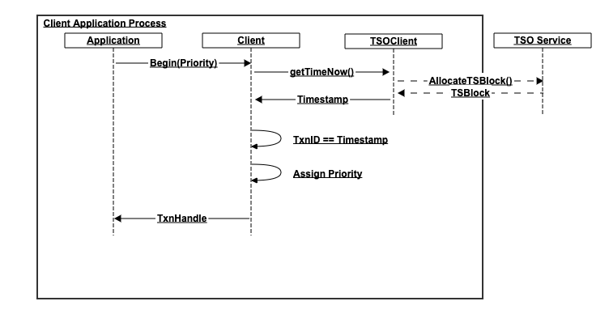
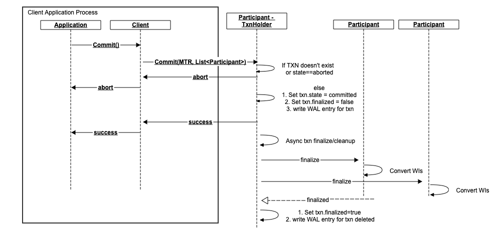

[-UP-](./README.md)

# Goals
- Benchmark based on YCSB+T and [Harding's](./papers/harding.pdf) TPCC 80% coverage.
- Support serializable isolation level
- Support sequential consistency level
- Support global transactions - transactions spanning multiple geographical regions
- Support single-master architecture. We may have standby replicas for recovery optimization but transaction execution can only occur at the data masters.

#### DC-local datasets
- Latency: 20us avg
- Throughput: 100K/sec per CPU core

#### mixed DC-local/global datasets
- Latency: ~ order of cross-dc ping(could be 100s ms)
- Throughput: ?? We think we should be able to achieve similar throughput as in DC-local datasets. Potential issue here is increased conflict probability due to increased transaction latency which may reduce the throughput depending on how contentious is the traffic.

# Targeted assumptions
These are not limits of the system, but we design the system to operate under these conditions:
- Availability of high-bandwidth (>40gbit) RDMA/RoCEv2 compatible network for in-datacenter communication
- We prioritize performance for DC-local operations but remain correct in mixed usage
- Single-threaded, concurrent architecture. This allows us not to worry about multi-threaded side-effects during tight sequence of operations on any node.

# High-level overiew
## Architecture


## Transaction flow


Our transaction flow is pretty standard from high-level. Users begin() a transaction, and then commit() after some number of read() and write() operations. Note how we obtain a timestamp for the transaction only once since all operations will be recorded to have occurred at that time.

# Definitions

### Isolation levels:
- ReadUncommitted: a read may see value currently part of an open transaction. The value may actually be rolled back
- ReadCommitted: a read will only see values committed by other transactions. It may be possible to see different values in your own txn if another txn commits.
- ReadRepeatable: all reads during a txn will return the same value even if there are other commits.
- SnapshotIsolation: Snapshot isolation is a mechanism for providing ReadRepeatable isolation level. It provides an immutable snapshot-in-time view of the entire database. The database guarantees that reads against this snapshot will always return the same values. SI by itself does not provide any form of serialization among transactions. As we will discuss further in this document, we are providing a solution to achieve serializable SI. Susceptible to write skew anomaly
- Serializable: all transactions are ordered and will never be observed in different order by different users. The order however may be observed to be different compared to the actual order in which the txns executed, provided the end result(consistency!) is the same. E.g. `-$50` followed by `+$100`
- Externally Serializable(serializable + linearizable): all txns are observed in the real-time order they were executed by all observers.

### Consistency levels
- Internally Causal: Transactions are ordered in the system so that if `e->f`, then `e` is before `f`. If we have another transaction `g` with also `e->g`, there are no guarantees on `f` and `g` ordering, not even the order in which multiple observers see `f` and `g`.
- Convergent/Sequential Causal: `f` and `g` are placed in some order and everyone observes this order. (essentially serializable causal). Neither causal, nor sequential consistency talk about the time at which transactions are recorded in the system. The system is free to choose any timestamp for these transactions, as long as it maintains the causal/sequential property.
- Linearizable: all events are ordered based on the real-time at which they occurred.

### Time

##### TimeValue
Time value is a single 64-bit number with sufficient resolution(e.g. pico-seconds) which represents time since epoch

##### UniversalTime
This is the TimeValue which is universally accepted to be the correct time. In our desired deployment, the source for UT is an atomic clock hardware present near the timestamp generator and exposed over NTP interface.

##### Timestamp
In this document, a Timestamp is a window of time with some bounded uncertainty from UniversalTime. This is equivalent to TrueTime in [Spanner's TrueTime](https://cloud.google.com/spanner/docs/true-time-external-consistency). For optimization purposes, a Timestamp also communicates the identity of the TSO which issued it. The information conveyed can be thought of as the tuple `(int64 start, int64 end, int64 tsoid)`, where `end` is a strictly-increasing number and the window `[start:end]` represents the 100% confidence interval of the TSO wrt UT.
Timestamps are compared as in Spanner by `CompareResult compare(t1, t2)` method which returns
>`CompareResult.LT` if t1 is guaranteed to be before t2
>`CompareResult.GT` if t2 is guaranteed to be before t1
>`CompareResult.UC` if the comparison is uncertain and we cannot determine which timestamp came first
>`CompareResult.EQ` if the two timestamps are the same

Other timestamp API:
>int64 startTime(); // the start TimeValue of the timestamp window
>int64 endTime(): // strictly-increasing TimeValue - the end time of the timestamp window
>int64 tsoid(); // identity of the TSO service

##### TSO (TimeStampOracle)
TSO is a separate service whose job is to provide a global clock. The design and scalability of this component is addressed in a [separate document](./TSO.md). For the purposes of this document it is sufficient to understand that the TSO service:
- syncs itself to UniversalTime and can emit Timestamps as described above
- guarantees strictly increasing endTime in timestamps, which is important to efficiently sequence TSO-local events (that is events which use the same TSO to produce timestamps)
- Can provide throughput of 20MM ts/sec, with latency of 10usec.

In our architecture we support multiple configurations, but our reference architecture has one TSO per region, where DC-local operations always use their DC-local TSO.

- Additional requirement:
    In order to satisfy some use cases (e.g guaranteed read-only snapshot reads in the past), we require that if a cluster mixes multiple TSOs, then the TSOs are sufficiently far from each other so that the time of flight of a message from TSO1 to TSO2 is greater than any possible error either of the TSOs can observe from its true source.
    A bit more formally, this restriction guarantees that if there is a causal relationship between two transactions T1,T2, then `T2 is a causal successor of T1` implies that `T2.timestamp is strictly greater than T1.timestamp`. As a shorthand: `T1<-T2 ==> T1.ts < T2.ts`.
    This is trivially true if T1 and T2 come through the same TSO. if T1 and T2 come via different TSOs though, we need the guarantee that if T2 is a successor (i.e. it observed the effect of T1), then T2's timestamp is strictly ordered after T1's timestamp. If time-of-flight between the TSOs is greater than the error in the timestamp, then we know that by the time T2 wants to generate a timestamp for its transaction the time at T2's TSO has advanced past the error window in T1's timestamp and therefore T2's timestamp will be greater than T1's timestamp.

This requirement combined with physical limit of speed of electricity over copper puts the minimum distance between geo-TSOs to .6KM for each 1usec of clock error. Correspondingly, the max limit is that if you have a clock source which cannot guarantee error of 65ms or less, then we cannot support global transactions.

Commercially available atomic clocks (rack-mountable; ~$7000) can allow our TSO to produce timestamps with interval of 3usecs (limited by the sample rate of 0.75MHz). This makes the global-TSO deployment restriction be ~2KM physical distance between TSOs.

As an example, if we have one AZ on US east coast, and another in Ireland, (5000KM distance), the TSOs need to guarantee 8ms error.

Our [reference deployment architecture](#reference-architecture) uses geo-local TSO with atomic clock access and synchronous timestamp generation over fast RDMA network.


### Operations
Operations are executed in the context of a transaction (using the TxnHandle returned by begin()). The operations are generally either constant(e.g. read-only) or mutating(e.g. writes). The operations are not limited to simple KV read/write and can be extended to allow any advanced single-node operations such as atomic ops(e.g. CAS) or even stored procedures. For simplified explanations, we use constant<->read and mutating<->write interchangeably in this document.

### Minimum Transaction Record (MTR)
This is a small tuple of metadata which must be specified with every operation issued by the client. This tuple conveys `(TxnID, Timestamp, Priority)`, and we use this to perform snapshot reads, associate writes with transactions, and resolve conflicts.

### Transaction Record Holder (TRH)
Any transaction which performs a write requires a central coordinator for the transaction. This coordinator is just one of the write participants in the transaction and it maintains a Transaction Record for each transaction that designated it to be the coordinator. We call this coordinator the Transaction Record Holder (TRH). Note that we do not require central transaction knowledge across different transactions and so the transaction records in the system are uniformly distributed across the entire cluster.
The Client decides who the TRH will be for a given transaction, and sends a message to it to let it know that it is responsible for the coordination tasks. For performance reasons, the client lazily waits for its first write, and piggy-backs the TRH-assignment message onto this first write. Read-only transactions do not create a transaction record as it is not needed. We'll provide more details on how the TRH is used in each individual operation further in the document.

The TRH maintains a record for each transaction which it tracks. The record is stored in mapping `{txnId -> TxnRecord}`. The transaction record contains metadata about the transaction which we need to resolve PUSH operations, as well as detect abandoned transactions:
- priority
- timestamp
- state (COMMITTED|ABORTED|IN_PROGRESS)
- last_heartbeat_time
- txn_id
- client_address

### Write Intent (WI)
In order to detect potential conflicts, we use Write Intents(WI). WIs are the same as any other record in the system. They correspond to a version for some key, and are our way of keeping track of uncommitted writes. In other words, we call a standard record which has the "uncommitted" flag to ON a "Write Intent".
When the post-commit(i.e. finalize) phase of a mutating transaction goes through, the flag is cleared (set to false) making the record a committed value.
In the WI we also remember the MTR and TRH for the transaction which created the intent in the node. So given a WI, we can find out the MTR(transaction ID, timestamp, priority), as well as the TRH(the participant which is responsible for maintaining the TXN state)

# Outline of approach
We've chosen a modified Serializable Snapshot Isolation approach, modified to execute in a NO-WAIT fashion - that is, we abort transactions as soon as possible in cases of potential conflict. Roughly, we use MVCC to achieve snapshot isolation, and we enhance the server-side handling and book-keeping to make it serializable, as described in the paper by [Serializable SI - CockroachDB](https://www.cockroachlabs.com/blog/serializable-lockless-distributed-isolation-cockroachdb/) and  [Serializable Isolation for Snapshot Databases](./papers/SerializableSnapshotIsolation-fekete-sigmod2008.pdf). Causality is guaranteed by our approach to timestamp generation (see TSO above). The following sections dive in each aspect of performing transactions.

## Reference Architecture
The reference architecture is designed so that we can take advantage of fast RDMA communication in datacenters, making a synchronous DC-local TSO a viable option. This allows TSO-local transactions to execute sequentially, without risk of serialization violations due to time uncertainty. Cross-datacenter (or global) operations are not necessarily handled with uncertainty either. It is possible for a client from TSO1 to issue writes into a datacenter serviced by TSO2. Further reads/writes originating from TSO1 are resolved with no uncertainty checks since TSO1-timestamps are guaranteed to be always orderable in a strictly-increasing fashion. Only when we detect that data contention occurs among participants who originate from different TSOs, then we determine the outcome of the contention by considering the uncertainty window.


## Starting a transaction


The application initiates a transaction by calling the begin() client library API. In this call:
1. Obtain a timestamp from the TSO service.
    - this is a crucial step since proper timestamp generation is what guarantees serializability of the transactions in the system.
    - Timestamps are tuples (start, end, tso_id), which express an uncertainty window. That is, the TSO produces timestamps that cover the potential error of time between the TSO and UniversalTime.
    - This timestamp is used to stamp the entire transaction. That is, the commit time for all writes in this transaction will be recorded to occur at this timestamp, and all MVCC snapshot reads will be attempted at this timestamp.
1. Generate a transaction ID in the CL. This is generally a short ID (e.g. (IP + random)) used to distinguish transactions in the live system as well as at recovery time
1. Assign a priority to the transaction based on either priority class (LOW/MED/HIGH), or particular priority within the class. Priority classes map to particular priorities (e.g. Low=10, Med=20, High=30). When a transaction is started is usually picks a class. In cases when transactions are aborted due to conflicts, they get to inherit the higher priority and so when retried, they can specify a particular priority value. The priority is used server side to deterministicaly pick a winner in transaction conflict cases.

Further operations, including commit/abort have to be issued using the returned transaction handle. The Client Library keeps track of the MTR, TRH, and every write participant.

## Execution
- Each operation must specify an MTR(Minimum Transaction Record) tuple.
- A TransactionRecordHolder (TRH) is designated by the CL for mutating transactions. Read-only transactions do not create such transaction record as it is not needed. The TRH is is one of the write participants in the transaction. We pick the first such writer for most transactions, but it is possible to pick a more optimal TRH for certain workloads. The assignment is done lazily when the first write is encountered, and the assignment message is piggy-backed onto that first write.
- All write operations specify a TRH in addition to the MTR.
- each participant maintains an index of `MTR->WI` so that it can cleanup write intents when the TRH comes to finalize a transaction (i.e. after the application commits/aborts). There is also an LRU list on this index so that the participant can discover potentially abandoned or long-running WIs and communicate with the TRH to finalize them.
>*NOTE:* All timestamp comparisons(applies to all cases where we talk about *earlier/later/before/after*) are performed based on `timestamp.end` field. This is the field which guarantees strictly-increasing sequence for all causally-related transactions, even across global TSOs. In cases where we have potentially overlapping timestamps due to uncertainty, we can safely order them based on `timestamp.end` as these timestamps can only be from parallel transactions - the timestamp/TSO restrictions guarantee that causal transactions necessarily have strictly-increasing timestamps even when allowing for uncertainty.

### Reads

The read operations are straight-forward. The client has to find out where to send the request, based on the current partition map (not shown here since it isn't relevant to the txn algorithm). The request is then sent to the owner of the data, who records the data access in its read cache and responds to client with success/failure.
The read operations are annotated with an MTR. The timestamp in this MTR is used as the snapshot version(SV) for MVCC snapshot read purposes. The reads are standard MVCC reads i.e. the returned value is the latest value such that `result.ts <= request.MTR.Timestamp`.

##### Read Cache
In order to prevent various anomalies and achieve SerializableSI, we maintain a read key cache. The purpose of the cache is to remember the latest observed version for every key in the system so that no-one will be allowed to modify the observed state of the system. This cache is maintained in memory at each node/partition.
- When a read is received for a transaction with timestamp T, we remember that the given key was observed at timestamp `T.timestamp` by transaction `T.MTR`. If we've previously observed a read for the same key, we update the cache to reflect the max such value and the latest transaction to observe it.
- The implementation of the read key cache is an interval tree. We require an interval tree to also remember key range reads.
- The cache is consulted at write time to determine if a write should be aborted. The reason we need to do this is that if we try to write an item with timestamp <= lastSVTimeTheKeyWasRead, then we are breaking a promise to whoever read the item - they saw some item version when they read at their snapshot time, and now we're trying to insert a newer version into their snapshot. This write should therefore be aborted.
- Entries are removed from the cache in an LRU fashion. We maintain a minSVTimestamp watermark for the cache, which tells us how old is the oldest entry in the cache. Any write before this timestamp (for any key) is aborted as we assume there may have been a read for it.
- Note that even though we call this data structure a cache, it is critical to keep in mind that it is a sliding window. We cannot afford to miss any reads that happen in this window - all reads MUST be recorded in the window. We can only afford to shrink this window as needed for performance reasons.
- We do not require persistence for this data. Upon failure, we assume time.now() as the watermark and thus fail any in-progress writes which may want to modify data on the failed node.

##### Read conflict potential
In the path of a read request, we can run into situations which create potential for conflict which can result in an isolation/consistency violation.
1. Read over WI. The situation happens when the latest version in the database before read.timestamp is a WI from a different transaction. If the intent is from the same transaction, we return the intent as the read value. Otherwise, as we don't know yet if this write intent will be committed, we cannot return any value to the client - if we return the WI as the value, it is possible that the WI may be aborted, and so we would've lied to the client and potential future reads will see a previous version. On the other hand if we return the version before the WI, we break our promise to the client that their snapshot is immutable since the commit of the WI is equivalent to inserting a new record version into this snapshot. To resolve this conflict situation, we perform a PUSH operation(see below)

##### PUSH Operation
To resolve the conflict of `R`ead transaction encountering a `W`rite intent (`R->W`), we perform a PUSH operation. We use the exact same mechanism during `W->W` conflicts, but we'll expand on these in the write operation section further in the document


- Note that if we try to perform a PUSH it is possible to encounter no record at the TRH (e.g. if due to network delay the message to the TRH hasn't arrived yet). In that situation, we assume the transaction in question has been aborted, and we generate a WAL entry with status=ABORTED for the transaction thus effectively aborting the transaction which failed to create its TRH in time

At the core, the resolution algorithm is as follows:

```python
# at participant which receives the read
def Read(key, MTR):
    readCache.registerRead(key, MTR.Timestamp)

    version = cache.getVersion(key, MTR.Timestamp)
    if version.isCommitted:
        return version

    response = version.TRH.Push(MTR)
    if response.isWriteTxnAborted: # case1
        cache.removeVersion(key, version) # remove write intent
        return Read(key, MTR) # read again
    if response.isWriteCommitted: # case2
        version.commit()
        cache.updateVersion(key, version)
        return version
    return abort # case3

def lookupTxnStatus(mtrRecord):
    # NB: A lookup for a txn we do not have a status for is resolved based on targetMTR.timestamp
    # if timestamp is within the txn liveliness window, it results in a WAL write for a Pending TR for this transaction.
    # else it results in a WAL write for an Abort TR for this transaction
    # at TRH participant, resolving a PUSH (could be either a R-W push or W-W push)
    if mtrRecord in txnsMap:
        return txnsMap[mtrRecord]
    else:
        if abs(time.NOW - mtrRecord.ts) < livelinessThreshold:
            txnRecord = newPendingRecord(mtrRecord)
        else:
            txnRecord = newAbortedRecord(mtrRecord)

        txnsMap.insert(txnRecord)
        return txnRecord

def Push(targetMTR, candidateMTR):
    txnStatus = lookupTxnStatus(targetMTR)

    if txnStatus.isCommitted: # case 1 (target TXN already committed)
        return TxnCommitMessage(targetMTR)
    elif txnStatus.isAborted: # case 2 (target TXN already aborted)
        return TxnAbortMessage(targetMTR)

    # TargetTXN is in progress. Must abort one of the transactions
    if targetMTR.Priority > candidateMTR.Priority: # case 3 (abort candidate TXN)
        return TxnAbortMessage(candidateMTR)
    elif targetMTR.Priority < candidateMTR.Priority: # same as in case 2
        abortTransaction(targetMTR)
        return TxnAbortMessage(targetMTR)

    # priorities match. Abort based on configurable, DB-level policy
    # example policy 1: abort the older TXN
    # example policy 2: abort lower TxnID to achieve deterministic but randomized abortion thus preventing starvation
    # in cases where there is no other distinguishing mechanism, the policy can pick the candidate(pusher) to abort
    loserMTR = TxnAbortDBConflictPolicy.pickLoser(targetMTR, candidateMTR)
    abortTransaction(loserMTR)
    return TxnAbortMessage(loserMTR)
```

### Writes
Writes are messages which want to mutate some data in the cluster. The messages are sent directly to the participant which owns the data. Note that we also lazily assign the TRH with the first write we see in a transaction (see [trh](#transaction-record-holder-(trh)) above). There is no need to communicate with any other participant during a write operation in the happy case.


##### Participant execution logic
A write executed in a transaction is sent directly to the participant who owns the data. When the participant gets the write, it:
- checks to make sure it doesn't conflict with its read cache. That is, check if the key we're about to write was read such that `write.Timestamp <= read.timestamp`. This is a `W->R` conflict and is covered in the Read conflict potential section.
- checks to make sure it doesn't conflict with any ongoing writes (data store). Since our data store maintains multiple versions, we check to see if the latest version present in the data store for this key is a WriteIntent. If it is, we have a `W->W` conflict (covered in the Write conflict potential section)
- inserts a WriteIntent entry into its data store.

##### Read conflict potential
If the incoming write for a given key discovers that the read cache contains an entry for this key such that `write.TS <= entry.TS`, we have detected a `W->R` conflict. The write is rejected and we send a message to the client to abort. This is the only choice here since we've already promised a snapshot view to some client as of time `entry.TS` and we cannot insert new versions into that history. The client has to abort and start a new transaction(with new timestamp)

##### Write conflict potential
To determine if there is such a conflict, we look at the history of the key in the data store. If the latest version in the history is a committed value and `commit.TS >= write.TS` then we have no other choice but immediately abort the incoming write - this is a write in the past.
If the latest version in the history is a WI, then we have to perform a [PUSH operation](#push-operation) as we described in the `R->W` conflict resolution. It is possible that the outcome after this `PUSH` is that we abort one of the transactions, or we abort none(if the existing WI has already committed)

By construction then, there can only be one WI present in the version history and it has to be the latest version we have. It is not possible to commit while there is a WI in the record history and so we have to abort one of the transactions if they are both still in progress.

- NB: When selecting a victim transaction, our push resolution algorithm ensures that any independent observer will deterministically pick the same victim in order to avoid starvation issues.


The algorithm is identical to performing a `R->W` [PUSH operation](#push-operation), where the existing WI corresponds to the `Write`, and the incoming write corresponds to the `Read`.

## Commit
The commit step is rather simple once we realize that if the client application has successfully performed all of its operations thus far, then it can just tell the TRH to finalize the transaction. There is a potential for discovering that the state of the transaction at the TRH is `Aborted`, in which case the application simply has to retry the transaction.



## Abort
Abort is performed identically to the commit - we send a message to the TRH, setting the state of the transaction to `Aborted`. The TRH then has to go and perform asynchronous cleanup of write intents (if any) at the transaction participants

## Transaction Heartbeat
There is a server-side timeout of 100ms per transaction, maintained at the TRH. The client is required to emit a heartbeat to the TRH to make sure the transaction is not marked as abandoned and thus aborted by the server automatically.
This heartbeat is also used by all of the participants in the transaction. They periodically check with the TRH to make sure the txn is still alive

## Transaction Finalization
This is an asynchronous process which is driven by the TRH to handle the transaction state in the entire system after the transaction is committed/aborted. This process involves communicating with all transaction write participants in order to commit/abort the WIs present in these participants.
The process is always driven by the client application since without a commit/abort message from the client, the TRH does not know what are all of the write participants - this information is sent to the TRH in the commit/abort message from the application.
For internally-driven abort (e.g. as a result of a PUSH), we simply mark the TRH state as aborted but we still do not kickoff the finalization process. We initiate the process when the client comes to commit/abort.
In the case when the client abandons a transaction, the heartbeat to the TRH will cease and the TRH will self-mark the transaction as aborted. Each participant independently will discover that it has WIs which are too old (>heartbeat_interval), and will contact the TRH to make sure the TXN is alive. They will discover that the transaction has been aborted due to the missing heartbeat and will cleanup their write intents. A good place to maintain this information at each participant is the `MTR->[WI]` cache as an LRU list.

## Recovery process
<mark>TODO</mark> describe handling of failures of TRH, Read participant, Write participant

## Integration with K2 Module Interface
<mark>TODO</mark> give details on implementation on top of K2 Module Interface

## GC process
<mark>TODO</mark> give details on GC for WALs

## Other ideas
- It may be helpful to allow appications to execute operations in batches so that we can group operations to the same node into single message
- Allow WI to be placed at any point in the history as long as they don't conflict with the read cache.
- Consider using separate WAL for intents. Potentially cheaper to GC since we can just maintain a watermarm and drop the tail past the watermark once WIs are finalized. May cause write amplification though
- provide atomic higher-level operations (sinfonia style):
    - swap
    - cas
    - atomic_read_many
    - acquire_lease
    - acquire_lease_many
    - update_if_lease_held
- We might achieve better throughput under standard benchmark if we consider allowing for a HOLD in cases of conflict resolution(PUSH operation). If we have a Candidate/Pusher which we think will succeed if we knew the outcome of an intent, we can hold onto the candidate operation for short period of time to allow for the intent to commit. For a better implementation, it maybe best to implement a solution which does a transparent hold - a hold that doesn't require special handling at the client (e.g. additional notification and heartbeating). THis could be achieved simply by re-queueing an incoming task once with a delay of potential 999 network round-trip latency (e.g. 10-20usecs).

### Pipelined operations
It is possible to reduce total transaction execution time by as much as 50% in cases where transactions execute non-sequential operations (e.g. batched writes). The reduction is achieved by sending all operations and the commit to their participants in parallel. The writers send confirmations to the TRH when the writes are durable (i.e. written in the WAL), and the TRH responds to client to ACK the commit. There are a few implications to this approach which make the protocol more complex:
1. For the duration of time where there are in-progress writes and a pending commit, the state of the transaction at TRH is state=PENDING. This is a new state
1. A transaction is now considered committed if all of the writers successfully record the operations in their WAL. Previously, a txn is committed only if the TRH record has state = COMMITTED.
1. A txn record which is in state PENDING, must have a list of all participants in the transaction. Previously, we did not require this list until the state was to be flipped to COMMITTED
1. When performing a PUSH, we can encounter a transaction in PENDING state. When we encounter this state, it is possible that the transaction is either in progress, or there was some message timeout/failure. If the txn is still live (within heartbeat window), it may be best to just wait for the TXN to move to COMMITTED state and thus hold the PUSH operation. Otherwise, we now have to go to all of the participants in the transaction and validate the writes. If all writes succeeded, then the TXN can be moved to COMMITTED and the PUSH can be resolved. If any writer failed, then the TXN is aborted and the PUSH can be resolved.
1. Similarly, when recovering a node, if we recover a txn record in state PENDING, we must go to each participant and verify if all writes succeeded or not, converting the TXN to either COMMITTED or ABORTED respectively.

# Detailed component design
## [TimeStamp Oracle](./TSO.md)
## [Transaction Client](./TXN_CLIENT.md)
## [Benchmark](./TXN_BENCHMARK.md)

# Benchmark
- [UW YCSB-T repo - requires account](https://syslab.cs.washington.edu/research/transtorm/)
- [UW YCSB-T paper](./papers/YCSB+T.pdf)
