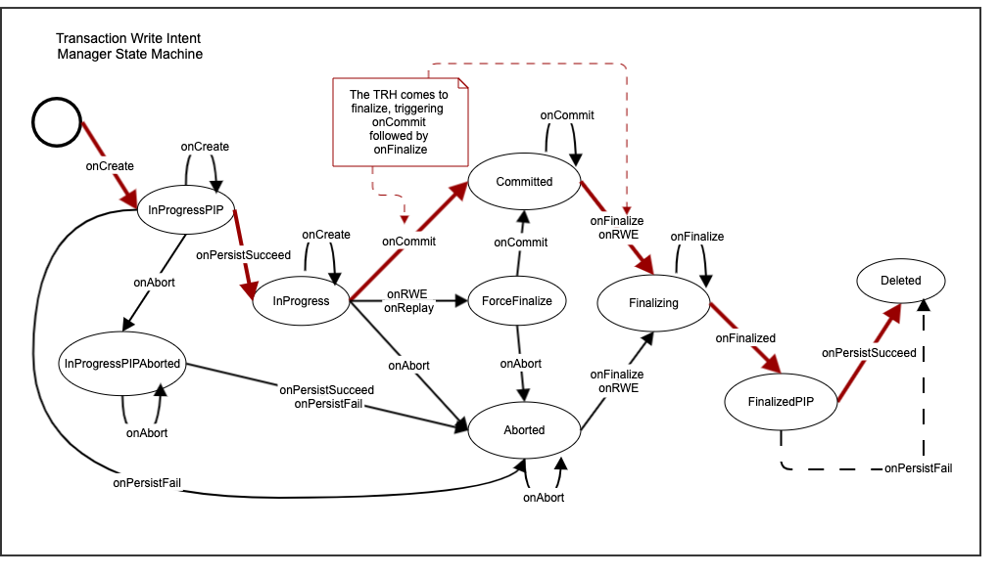
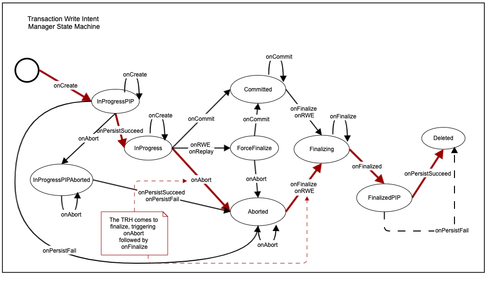
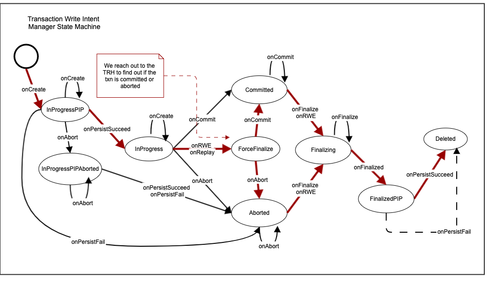

# Introduction
This document describes the K23SI transaction protocol and implementation. It also covers some necessary background like overall K2 architecture and other components (e.g. CPO, TSO), but details for these are provided in other documents

## Guiding design assumptions
These are not limits of the system, but we design the system to operate under these conditions:
- High-throughput/low-latency networks are becoming widely available while their costs are going down. Availability of a 40Gbit or better, RDMA/RoCEv2 compatible network for in-datacenter communication is a reasonable assumption
- The system we are designing should be usable for both direct end-users, but more importantly as a storage platform for higher-order systems
- Highly consistent systems are much preferrable to work with. There is no customer who would pick a less-consistent system if the performance(latency/throughput/cost) is good enough. We think a system is consistent-enough if it does not require its users to write code(or business practices) in order to deal with possible inconsistencies
- We would like to gear the usage of the system to use cases which can benefit from local data placement (within same DC). This allows for extreme levels of performance. we would still like to be able to take advantage of multi-AZ(cross-geo) deployments. We prioritize performance for DC-local operations but remain correct in mixed usage
- Single-threaded, concurrent architecture allows us not to worry about multi-threaded side-effects during tight sequence of operations on any node
- Modern storage systems should be able to scale at cloud levels. That is, they should be able to infinitely scale up due to increase in data size, number of users, or request volume.
- RAM prices are falling and maintaining large datasets in memory is feasible for latency-critical applications. In the best-case scenario, the latency of data access is bounded by network call costs

## Goals
- Minimize network traffic as this directly impacts request latency
- Support serializable isolation level
- Support sequential consistency level
- Support global transactions - transactions spanning multiple geographical regions
- Support Multi-writer, Multi-reader architecture with single hot replicas(single master). Warm standby replicas for recovery optimization but transaction execution can only occur at the data masters

# High-level overview
## Architecture


## Transaction flow


Our transaction flow is pretty standard at a high-level. Users `begin()` a transaction, and then `commit()` after some number of `read()` and `write()` operations. Note how we obtain a timestamp for the transaction only once at transaction start time since all operations will be recorded to have occurred at that time.

We name our distributed transaction protocol <b>K23SI</b>, where `K2` is the internal name for our project, and `3SI` is an abbreviation for <b>S</b>equentially consistent, <b>S</b>erializable <b>S</b>napshot <b>I</b>solation. The name refers to our support for Serializable Snapshot Isolation level, with Sequential consistency. We go a step further with a guarantee for maintaining external causal relationships. "External" means such relationship is outside of our system thus not known to the system. With K23SI, an upper layer application developer enjoys transactional API with no need for logic to handle inconsistencies. K23SI is inspired by Google's Percolator distributed 2-PC and CockroachDB's distributed transaction with major improvements of:
- not using HLC but highly available and efficient K2TSO/K2Timestamp with support for global transactions
- elimination of anomalies related to causal consistency

Compared with Google Spanner, K23SI does just one network roundtrip to commit a transaction. In contrast, Spanner's 2-PC distributed transaction protocol requires two network round trips to commit a transaction and the latency is increased as the data lock is still held to wait out the uncertainty window of TrueTime (~7ms as mentioned in their paper)

# Definitions

## Isolation levels:
- ReadUncommitted: a read may see a value which is currently a part of an open transaction. The value may actually be rolled back
- ReadCommitted: a read will only see values committed by other transactions. It may be possible to see different values for subsequent reads in your own txn if another txn commits.
- ReadRepeatable: all reads during a txn will return the same value even if there are other commits.
- SnapshotIsolation: Snapshot isolation is a mechanism for providing ReadRepeatable isolation level. It provides an immutable snapshot-in-time view of the entire database. The database guarantees that reads against this snapshot will always return the same values. SI by itself does not provide any form of serialization among transactions. As we will discuss further in this document, we are providing a solution to achieve Serializable SI. As defined, SI is susceptible to write skew anomaly
- Serializable: all transactions are ordered and will never be observed in different order by different users. The order however may be observed to be different compared to the actual order in which the transactions executed, provided the end result(consistency!) is the same. E.g. `-$50` followed by `+$100`
- Externally Serializable(serializable + linearizable): all transactions are observed in the real-time order they were executed by all observers.

## Consistency levels
- Internally Causal: Transactions are ordered in the system so that if `e->f`, then `e` is before `f`. If we have another transaction `g` with also `e->g`, there are no guarantees on `f` and `g` ordering, not even the order in which multiple observers see `f` and `g`.
- Convergent/Sequential Causal: `f` and `g` are placed in some order and everyone observes this order. (essentially serializable causal). Neither causal, nor sequential consistency talk about the time at which transactions are recorded in the system. The system is free to choose any timestamp for these transactions, as long as it maintains the causal/sequential property.
- Externally Causal: Same as Sequentially causal, but also applies for transactions for which the causality is experienced completely outside the system. An example is an architecture where a mobile app talks to a fleet of webservers, which in turn communicate and perform transactions against storage. If the app performs operation (OP1) against webserver (WS1), resulting in a transaction (TXN1), and then it performs a different op(OP2) against a different server(WS2) in a different transaction(TXN2), then the app observes a causal relationship of TXN1->TXN2. In systems which do not support external causality, the storage is free to order TXN1 and TXN2 in any order as the storage has no knowledge of their causal relationship.
- Linearizable: all events are ordered based on the real-time at which they occurred.

## Time
### UniversalTime
This is a globally agreed-upon time. We obtain this from dedicated atomic hardware clocks deployed with the TSO, and we assume a small error bound (drift resulting in order of ns error over 100s of years) thanks to the atomic clock.

### Timestamp
In this document, a Timestamp is a window of time with some bounded uncertainty from Universal Time. This is equivalent to TrueTime in [Spanner's TrueTime](https://cloud.google.com/spanner/docs/true-time-external-consistency).A K2Timestamp also communicates the identity of the TSO which issued it. The information conveyed can be thought of as the tuple `(int64 start, int64 end, int64 tsoid)`, where `end` is a strictly-increasing number and the window `[start:end]` represents the 100% confidence interval of the TSO wrt UT.
Timestamps are compared as in Spanner by `CompareResult compare(t1, t2)` method which returns
>`CompareResult.LT` if t1 is guaranteed to be before t2
>`CompareResult.GT` if t2 is guaranteed to be before t1
>`CompareResult.UC` if the comparison is uncertain and we cannot determine which timestamp came first
>`CompareResult.EQ` if the two timestamps are the same

Other timestamp API:
>int64 startTime(); // the start TimeValue of the timestamp window
>int64 endTime(): // strictly-increasing TimeValue - the end time of the timestamp window
>int64 tsoid(); // identity of the TSO service

Due to the fact that a timestamp incorporates a unique count within a unique TSO instance, K2Timestamps are actually globally unique and allow for strict ordering. Therefore we've adopted them as the unique identifiers for transactions(i.e. a transaction's timestamp is the same as the transaction ID)

>*NOTE:* All timestamp comparisons(applies to all cases where we talk about *earlier/later/before/after*) are performed based on `timestamp.end` field. This is the field which guarantees strictly-increasing sequence for all causally-related transactions, even across global TSOs. In cases where we have potentially overlapping timestamps due to uncertainty, we can safely order them based on `timestamp.end` as these timestamps can only be from parallel transactions - the timestamp/TSO restrictions guarantee that causal transactions necessarily have strictly-increasing timestamps even when allowing for uncertainty. In the case of ties, we break the tie by ordering based on TSO ID. Note that this can only happen for non-causally related transactions.

### TSO (TimeStampOracle)
TSO is a separate service whose job is to provide Timestamps. The design and scalability of this component is addressed in a [separate document](./TSO.md). For our purposes here, it is sufficient to understand that the TSO service:
- syncs itself to UniversalTime and can emit Timestamps as described above
- guarantees strictly increasing endTime in timestamps, which is important to efficiently sequence TSO-local events (that is events which use the same TSO for their clock source)
- Can provide throughput of 20MM ts/sec, with latency of 10usec.
- TSOs scale out infinitely by adding more instances with attached atomic clocks.
- TXN clients reach out to their closest TSO to obtain a txn timestamp.

#### Requirement for potential wait at end of transaction
The TSO service scales simply by adding additional instances. Each instance has its own atomic clock and therefore has its own error bound. We still have to provide a causal consistency in this environment, a bit more formally:
- if there is a causal relationship between two transactions T1,T2, then `T2 is a causal successor of T1` implies that `T2.timestamp is strictly greater than T1.timestamp`. As a shorthand: `T1->T2 ==> T1.ts < T2.ts`.

This is trivially true if T1 and T2 come through the same TSO. However, if T1 and T2 come via different TSOs, we need the guarantee that if T2 is a successor (i.e. it observed the effect of T1), then T2's timestamp is strictly ordered after T1's timestamp.

If time-of-flight between the TSOs is greater than the error in the timestamp, then we know that by the time T2 wants to generate a timestamp for its transaction the time at T2's TSO has advanced past the error window in T1's timestamp and therefore T2's timestamp will be greater than T1's timestamp. On the other hand, if the client is too quick, then it is possible to obtain a timestamp T2 which is uncertain wrt T1.

In order to deal with the potential for error, all TSO providers which can participate in transactions are registered with the global configuration service(CPO), which allows all transactional clients to learn the max error across all TSOs. At the end of each transaction, we may perform an artificial wait in order to ensure that the transaction has not been acknowledged before we're outside the max error bound over all potential TSO instances. With commercially available rack-mountable atomic clocks (~$7000), we can achieve ~3usec error at the TSO instance, which is on the order of 1 network round trip. Our benchmarks confirm that the wait safety net does not execute since our transactions require at least 2 round trips.

## Operations
An application which wants to use K2 has to use our client library. All operations are executed in the context of a transaction (using the TxnHandle returned by begin() method of the client library). The operations are generally either constant(e.g. read-only) or mutating(e.g. writes). The operations are not limited to simple KV read/write and can be extended to allow any advanced single-node operations such as atomic ops(e.g. CAS) or even stored procedures. For simplified explanations, we use constant<->read and mutating<->write interchangeably in this document.

## Minimum Transaction Record (MTR)
This is a small tuple of metadata which must be specified with every operation issued by the client. This tuple can identify a transaction by communicating `(Timestamp, Priority)`. We use this to perform snapshot reads, associate writes with transactions, and resolve conflicts.

## Write Intent (WI)
In order to detect potential conflicts, we use Write Intents(WI) - essentially pending/uncommitted writes. WIs are the same as any other record in the system. They correspond to a version for some key, and are our way of keeping track of uncommitted writes. When the post-commit(i.e. finalize) phase of a mutating transaction goes through we convert this WI into a committed value.

Each node keeps track of its WIs and is able to identify the associated MTR and TRHKey. In cases of potential conflicts, this allows us to communicate with the TRH for any particular transaction whenever we encounter a WI from it.

## Transaction Record
The transaction record contains metadata about the transaction which we need to resolve PUSH operations, as well as detect abandoned transactions and are maintained by the TXNManager class

### TransactionRecordHolderKey(TRHKey) and TransactionRecordHolder(TRH)
We require mutating transactions to have a coordinator node which can keep track of the transaction's state. The state is recorded in a `TransactionRecord`. To achieve this, we use a scheme where we assign a routing key to the `TransactionRecord` and use our standard partitioning scheme to select the owner for the `TransactionRecord`. We call this key the `TransactionRecordHolderKey (TRHKey)`. Combined with the txn timestamp allows anyone at anytime (even after failures or cluster maintenance) to correctly find the owner of a particular transaction. We call this owner the `TRH: Transaction Record Holder`

Note that we do not require central transaction knowledge across different transactions and so the transaction records in the system are uniformly distributed across the entire cluster. Moreover, read-only transactions do not create a transaction record as it is not needed for them.

### Transaction Heartbeat
There is a server-side timeout of 100ms per transaction, maintained at the TRH for the transaction. The client is required to emit a heartbeat to the TRH to make sure the transaction is not marked as abandoned and thus aborted by the server automatically. The heartbeat is a K2Timestamp.

### Transaction states
Our transactions have formal states which represent the state of a transaction both in memory and in persistence(i.e. WAL). There is an implementation of a state machine in the TxnManager.cpp file and we'll cover this in full detail later on.

## Data Retention/RetentionWindow
Our system is fundamentally MVCC-based. In order to satisfy concurrent transactions correctly, we require that multiple versions of records are present to cover the span of these transactions in time. Moreover, our transaction isolation level is snapshot: read operations of transactions are applied on a snapshot of the data at a particular point in time, which is the transaction starting time. That means that we need to retain data record versions long enough to cover any potential transactions which may want to issue reads.

To remain correct, we allow the users to specify the `data retention window` on their collection. This configurable parameter in effect specifies the window in which we allow transactions to be executed - we would fail any operations issued outside that window. We also remove all but the latest version for any record when those versions are outside the retention window. Nodes use their local TSOs to obtain a current timestamp and using this retentionWindow, perform a few tasks and impose some restrictions:
1. The retentionWindow has minimum value sufficient to cover the node-local TSO uncertainty window + polling interval. Typically, we obtain a fresh TIME_NOW from the TSO every 1min so the minimum retention period in this scenario would be ~20us + 2min
1. We keep around the latest version of a record for as long as needed(until user deletes it). Previous versions of the record (including potential deletes) are kept around for the retention window, i.e. as long as their record timestamps are newer than `TIME_NOW - retentionWindow`
1. Any operation issued with `ts < time.NOW - retentionWindow` will be automatically aborted.
1. Any transaction commit with `ts < time.NOW - retentionWindow` will result in an abort instead
1. Any in-progress transactions running longer than the retentionWindow will be aborted

Normally a transaction has to start and finish within the retention window. It is usually not an issue for OLTP transactions which are typically short running. For long running OLAP (especially read-only) transactions, such retention window may not provide long enough time.

# K23SI Transaction Details
We've chosen a modified Serializable Snapshot Isolation approach, modified to execute in a NO-WAIT fashion - that is, we abort transactions as soon as possible in cases of potential conflict. Roughly, we use MVCC to achieve snapshot isolation, and we enhance the server-side handling and book-keeping to make it serializable, as described in the paper by [Serializable SI - CockroachDB](https://www.cockroachlabs.com/blog/serializable-lockless-distributed-isolation-cockroachdb/) and  [Serializable Isolation for Snapshot Databases](./papers/SerializableSnapshotIsolation-fekete-sigmod2008.pdf). External Causality is guaranteed by our approach to timestamp generation (see TSO above). The following sections dive in each aspect of performing transactions.

For a typical K23SI distributed transaction, there is a Transaction Record(TR) that is managed at the TRH (designated Transaction Record Holder partition) and TransactionWriteIntentMetadata(TWIM) Records that are managed at participant partitions - the partitions to which the transaction wrote data. TR and TWIMs are managed in memory and persisted in WAL. Of course, each transaction's write-set, i.e. the SKV record(s) written/updated in the transaction, are in the WAL as well, appearing as Write-Intent record(with data). When finalized, at each participant we write a single message to denote that the entire txn (and therefore all of its WIs) are now finalized: committed or aborted.

## Starting a transaction


The application initiates a transaction by calling the begin() client library API. In this call, the library:
1. Obtains a timestamp from the TSO service.
    - this is a crucial step since proper timestamp generation is what guarantees serializability of the transactions in the system.
    - Timestamps are tuples (start, end, tso_id), which express an uncertainty window. That is, the TSO produces timestamps that cover the potential error of time between the TSO and UniversalTime.
    - This timestamp is used to stamp the entire transaction. That is, the commit time for all writes in this transaction will be recorded to occur at this timestamp, and all MVCC snapshot reads will be attempted at this timestamp.
    - The timestamp is used as the transaction ID as it is globally unique.
1. Assigns a priority to the transaction based on either priority class (LOW/MED/HIGH), or particular priority within the class. Priority classes map to particular priorities (e.g. Low=10, Med=20, High=30). When a transaction is started it usually picks a class. In cases when transactions are aborted due to conflicts, they can specify a higher priority value. The priority is used server side to deterministically pick a winner in transaction conflict cases.

Further operations, including commit/abort have to be issued using the returned transaction handle. The Client Library keeps track of the MTR, TRH, and every write participant.

## Execution
- Each operation sent by the CL to the cluster is stamped with the MTR(Minimum Transaction Record) tuple.
- The TransactionRecordHolder (TRH) is designated by the CL for mutating transactions. Read-only transactions do not create such TR - they succeed if all of the individual reads succeed since K2 guarantees immutable history. The TRH is one of the write participants in the transaction. We pick the first such writer for most transactions, but it is possible to pick a more optimal(e.g. randomized) TRH for certain workloads. The assignment is done lazily when the first write is encountered, and the assignment message is piggy-backed onto that first write.
- All write operations specify a TRH in addition to the MTR.
- The participant who receives a write creates a WI and a TWIM record which tracks all of the WIs on that participant. The TWIM record contains the TRH key so if another txn creates a conflict, we can consult with the TRH to determine a transaction to abort.
- The TWIM record can also produce a list of the WIs created on behalf of a transaction locally so that it can convert WIs when the TRH comes to finalize a transaction (i.e. after the application commits/aborts).
- The TWIMs also help cleanup txns should they become abandoned.

### Reads

Read operations communicate a `key` which is expressed as an SKVRecord. That is, the fields in the SKVRecord which comprise the partitioning and range keys must have specified values. The client has to find out where to send the request, based on the current partition map (not shown here since it isn't relevant to the txn algorithm). The request is then sent to the owner node of the data, who records the data access in its read cache and responds to client with success/failure.
The read operations are annotated with an MTR. The timestamp in this MTR is used as the snapshot version(SV) for MVCC snapshot read purposes. The reads are standard MVCC reads i.e. the returned value is the latest value such that `result.ts <= request.MTR.Timestamp`.

##### Read Cache
In order to prevent various anomalies and achieve SerializableSI, we maintain a read key cache. The purpose of the cache is to remember the latest observed version for every key in the system so that no-one will be allowed to modify the observed history of the system. This cache is maintained in memory at each node/partition.
- When a read is received for a transaction `T`, we remember that the given key was observed at timestamp `T.timestamp`. If we've previously observed a read for the same key, we update the cache to reflect the max such value and the latest transaction to observe it.
- The implementation of the read key cache is an interval tree. We require an interval tree to also remember key range reads.
- The cache is consulted at write time to determine if a write should be aborted. The reason we need to do this is that if we try to write an item with timestamp <= lastSVTimeTheKeyWasRead, then we are breaking a promise to whoever read the item - they saw some item version when they read at their snapshot time, and now we're trying to insert a newer version into their snapshot. This write should therefore be aborted.
- Entries are removed from the cache in a FIFO fashion. We maintain a minSVTimestamp watermark for the entire cache, which tells us how old is the oldest entry in the cache. Any write before this timestamp (for any key) is aborted as we assume there may have been a read for it.
- Note that even though we call this data structure a cache, it is critical to keep in mind that it is a sliding window. We cannot afford to miss any reads that happen in this window - all reads MUST be recorded in the window. We can only afford to shrink this window as needed for performance reasons.
- We do not require persistence for this data. Upon failure, we obtain a fresh timestamp from a local TSO and assume it to be the cache's watermark thus failing any in-progress writes which may want to modify data on the failed node.

##### Read conflict potential
In the path of a read request, we can run into situations which create potential for conflict which can result in an isolation/consistency violation.
1. Read over WI. The situation happens when the latest version in the database before read.timestamp is a WI from a different transaction. If the intent is from the same transaction, we return the intent as the read value. Otherwise, as we don't know yet if this write intent will be committed, we cannot return any value to the client - if we return the WI as the value, it is possible that the WI may be aborted, and so we would've lied to the client and potential future reads will see a previous version. On the other hand if we return the version before the WI, we break our promise to the client that their snapshot is immutable since the commit of the WI is equivalent to inserting a new record version into this snapshot. To resolve this conflict situation, we perform a PUSH operation(see below)

##### PUSH Operation
To resolve the conflict of `R`ead transaction encountering a `W`rite intent (`R->W`), we perform a PUSH operation. We use the exact same mechanism during `W->W` conflicts, but we'll expand on these in the write operation section further in the document


- Note that if we try to perform a PUSH it is possible to encounter no record at the TRH (e.g. if due to network delay the message to the TRH hasn't arrived yet). In that situation, we assume the transaction in question has been aborted, and we generate a WAL entry with status=ABORTED for the transaction thus effectively aborting the transaction which failed to create its TRH in time

At the core, the resolution algorithm is as follows:

```python
# at participant which receives the read
def Read(key, MTR):
    readCache.registerRead(key, MTR.Timestamp)

    version = cache.getVersion(key, MTR.Timestamp)
    if version.isCommitted:
        return version

    response = version.TRH.Push(MTR)
    if response.isWriteTxnAborted: # case1
        cache.removeVersion(key, version) # remove write intent
        return Read(key, MTR) # read again
    if response.isWriteCommitted: # case2
        version.commit()
        cache.updateVersion(key, version)
        return version
    return abort # case3

def lookupTxnStatus(mtrRecord):
    # NB: A lookup for a txn we do not have a status for is resolved based on targetMTR.timestamp
    # if timestamp is within the txn liveliness window, it results in a WAL write for a Pending TR for this transaction.
    # else it results in a WAL write for an Abort TR for this transaction
    # at TRH participant, resolving a PUSH (could be either a R-W push or W-W push)
    if mtrRecord in txnsMap:
        return txnsMap[mtrRecord]
    else:
        if abs(time.NOW - mtrRecord.ts) < livelinessThreshold:
            txnRecord = newPendingRecord(mtrRecord)
        else:
            txnRecord = newAbortedRecord(mtrRecord)

        txnsMap.insert(txnRecord)
        return txnRecord

def Push(targetMTR, candidateMTR):
    txnStatus = lookupTxnStatus(targetMTR)

    if txnStatus.isCommitted: # case 1 (target TXN already committed)
        return TxnCommitMessage(targetMTR)
    elif txnStatus.isAborted: # case 2 (target TXN already aborted)
        return TxnAbortMessage(targetMTR)

    # TargetTXN is in progress. Must abort one of the transactions
    if targetMTR.Priority > candidateMTR.Priority: # case 3 (abort candidate TXN)
        return TxnAbortMessage(candidateMTR)
    elif targetMTR.Priority < candidateMTR.Priority: # same as in case 2
        abortTransaction(targetMTR)
        return TxnAbortMessage(targetMTR)

    # priorities match. Abort based on configurable, DB-level policy
    # example policy: abort the older TXN
    # in cases where there is no other distinguishing mechanism, the policy can pick the candidate(pusher) to abort
    loserMTR = TxnAbortDBConflictPolicy.pickLoser(targetMTR, candidateMTR)
    abortTransaction(loserMTR)
    return TxnAbortMessage(loserMTR)
```

### Writes
Writes are messages which want to mutate some data in the cluster. The messages are sent directly to the participant which owns the data. Note that we also lazily assign the TRH with the first write we see in a transaction (see [trh](#transaction-record-holder-(trh)) above). There is no need to communicate with any other participant during a write operation in the happy case.


##### Participant execution logic
A write executed in a transaction is sent directly to the participant who owns the data. When the participant gets the write, it:
- checks to make sure it doesn't conflict with its read cache. That is, check if the key we're about to write was read such that `write.Timestamp <= read.timestamp`. This is a `W->R` conflict and is covered in the Read conflict potential section below.
- checks to make sure it doesn't conflict with any ongoing writes (data store). Since our data store maintains multiple versions, we check to see if the latest version present in the data store for this key is a WriteIntent. If it is, we have a `W->W` conflict (covered in the Write conflict potential section below)
- inserts a WriteIntent entry into its data store.

##### Read conflict potential
If the incoming write for a given key discovers that the read cache contains an entry for this key such that `write.TS <= entry.TS`, we have detected a `W->R` conflict. The write is rejected and we send a message to the client to abort. This is the only choice here since we've already promised a snapshot view to some client as of time `entry.TS` and we cannot insert new versions into that history. The client has to abort and start a new transaction(with new timestamp)

##### Write conflict potential
To determine if there is such a conflict, we look at the history of the key in the data store. If the latest version in the history is a committed value and `commit.TS >= write.TS` then we have no other choice but immediately abort the incoming write - this is a write in the past.
If the latest version in the history is a WI, then we have to perform a [PUSH operation](#push-operation) as we described in the `R->W` conflict resolution. It is possible that the outcome after this `PUSH` is that we abort one of the transactions, or we abort none(if the existing WI has already committed)

By construction then, there can only be one WI present in the version history and it has to be the latest version we have. It is not possible to commit while there is a WI in the record history and so we have to abort one of the transactions if they are both still in progress.

- NB: When selecting a victim transaction, our push resolution algorithm ensures that any independent observer will deterministically pick the same victim in order to avoid starvation issues.


The algorithm is identical to performing a `R->W` [PUSH operation](#push-operation), where the existing WI corresponds to the `Write`, and the incoming write corresponds to the `Read`.

##### Client error handling
Our design requires a cooperating client. We will signal to the client when we determine that it should abort, however, in some cases, we will not set any server-side state to ensure they behave correctly. If a client chooses to commit after their write fails, they will be able to commit successfully and end up with potentially inconsistent data.

## Commit
The commit step is rather simple once we realize that if the client application has successfully performed all of its operations thus far, then it can just tell the TRH to finalize the transaction. There is a potential for discovering that the state of the transaction at the TRH is `Aborted`, in which case the application simply has to retry its transaction.


## Abort
Abort is performed identically to the commit - we send a message to the TRH, setting the state of the transaction to `Aborted`. The TRH then has to go and perform asynchronous cleanup of write intents (if any) at the transaction participants

# Transaction Record Management
In this section, we'll look closely at the complete TR management and the states it undergoes during a transaction

``` c++
struct TxnRecord {
    dto::K23SI_MTR mtr;
    // the ranges which have to be finalized. These are delivered as part of the End request and we have to ensure
    // that the corresponding write intents are converted appropriately
    std::unordered_map<String, std::unordered_set<dto::KeyRangeVersion>> writeRanges;
    // The TRH key for this record. This is a routing key (think partition key) and we need this here
    // so that txn records can be correctly split/merged when a partition split/merge occurs
    dto::Key trh;
    // Expiry time point for retention window - these are driven off each TSO clock update
    dto::Timestamp rwExpiry;
    // for the heartbeat timer set - these are driven off local time
    TimePoint hbExpiry;
    // flag which can be specified on txn options. If set, we wait for all participants to finalize their
    // write intents before responding to the client that their txn has been committed
    // This is useful for example in scenarios which write a lot of data before
    // running a benchmark. Without sync finalize, the benchmark may trigger too many PUSH conflicts
    // due to non-finalized WIs still being present in the system.
    bool syncFinalize = false;
    // Artificial wait interval used in testing to delay the time between transitioning from End to Finalize
    Duration timeToFinalize{0};
    // the transaction state
    dto::TxnRecordState state = dto::TxnRecordState::Created;
    // to tell what end action was used to finalize
    dto::EndAction finalizeAction = dto::EndAction::None;
    // if this transaction ever attempts to commit, we set this flag.
    bool hasAttemptedCommit{false};
};  // class TxnRecord
```

Note that the client is responsible for some of these fields:
- `mtr`: this field is generated by the CL when starting a transaction. It contains the transaction timestamp/id and the priority.
- `writeRanges`: As the CL issues write operations during the txn execution, it remembers the partition ranges to which it wrote. This is needed at commit/abort time so that the cluster can contact the partition owners for these ranges, and ask them to convert the WIs they might have on behalf of this transaction. Note that since we support cross-collection transactions, this field has a set of ranges per collection.
- `trh`: this is the TRH key set by the CL when it first does a write. It is used to determine which partition node currently owns the TR record and is the key of the first write done in the txn
- `syncFinalize`: this is a txn option which the client can set. It makes sure that a commit/abort isn't acknowledged until all WIs in the cluster have been finalized. This is normally not needed, but it is useful in cases where the client knows that conflicting transactions will be starting next (e.g. doing a large initial data load)
- `timeToFinalize`(for testing): works in conjunction with syncFinalize and specifies an artificial wait to be performed before issuing the finalization call to participants.

## States
This is the complete set of possible transaction states. The states `*PIP` (PIP stands for Persistence-In-Progress) are the ones which are persisted in the WAL and therefore are the only states which can ever be seen during WAL replay:

- Created: The state in which all new TxnRecords are put when first created in memory
- InProgress: The txn InProgress has persisted
- ForceAborted: The txn ForceAbort has been persisted
- AbortedPIP: The txn has been Aborted and we're persisting the txn record
- Aborted: The txn Abort has been persisted
- CommittedPIP: The txn has been Committed and we're persisting the txn record
- Committed: The txn Commit has been persisted
- FinalizedPIP: The txn has been Finalized and we're persisting the txn record


## Transaction Transition Sequence Scenarios
In K23SI, transactions can only be committed if they did not have any failures, and the client chose to commit. On the other hand, transactions can be aborted either by the client, or internally by the K23SI cluster in cases of conflict.

The following sections show the state transitions for the expected scenarios of transaction handling
### Typical committed transaction

In this flow, the transaction is processed with no fatal errors to the client an the state remains `InProgress` until the client issues a commit. The client remembers all partition ranges to which it has issued a write, and sends those ranges as the `writeRanges` set in the commit message. The commit transition causes a write to the WAL of the TR with state=`CommittedPIP`.

#### Finalization
The transaction is finalized by the TRH by sending a message to the current owner for each of the write ranges in the transaction. There could be more than one owner for a particular range (e.g. if the range was split), in which case the TRH ensures that a finalize message is sent to every potential owner of data in the range. Once each participant performs the finalization, the TRH can mark the transaction as finalized, writing `finalizedPIP` in the WAL and then cleaning up the in-memory record.

It is possible to get a race scenario where a write encounters a WI and does a PUSH. Meanwhile, the TRH issues the cleanup, converts the WI into persisted value, and then removes the TR. By the time the PUSH comes to resolve it finds no record of the transaction and will create a ForcedAbort record for it since we will pick the Pushing transaction as the winner. This is fine as this ForcedAbort record is never consulted for any reason - it is just garbage which we'll collect at the end of the retention window. When the pushing transaction comes back to the node, we re-run the local operation once more as if we just got it so that we cover this race condition:
- If the record is still a WI, we convert it to aborted and proceed as if we found an aborted record in the first place. Note that the scenario "find WI -> perform PUSH -> find no TR -> forceAbort -> find WI" cannot be racing with a fast "commit TR -> finalize TR -> delete TR" scenario since if there was a successful finalization performed while we were trying to push, then by the time we get back the record cannot be in WI state. Therefore it is safe to simply abort the WI.
- If the record is committed/aborted, proceed as if we found a committed/aborted record in the first place

#### Replay rules
- Upon replay, in the happy case we'll discover `CommittedPIP | FinalizedPIP` entries in the WAL. This indicates the txn was committed and then finalized and so we do not have to perform any more work for this txn.
- Failure 1: Committed but not finalized. In this case, we'll find `CommittedPIP` after replay. We create the record in CommittedPIP state and issue a finalization transition in order to redo the WI finalizations. The txn would transition to `FinalizedPIP` from there
- Failure 2: Attempt to commit timed out and we converted to Abort. The persisted states are `CommittedPIP | AbortedPIP`. We finalize the transaction as aborted in this case

### Client-triggered aborted transaction


#### Replay rules
An aborted transaction records `AbortedPIP` followed by `FinalizePIP`.
- If finalized, then we don't have to perform any more work
- If we ony find `AbortedPIP` state in the WAL, then we will have to redo the WI finalization steps as described in the commit handling above

### Transaction is abandoned by client
This is expected to occur when there is a client-side crash or some long-lasting network event. We detect this situation by the lack of heartbeat and we trigger the ForceAbort path. The transaction is placed in ForceAborted state where it waits until the end of the retention window.
- it is possible that the client detects this situation and comes in to end their transaction. In that case, we can trigger the onAbort transition and cleanup the transaction before retention window end.


#### Replay rules
Note that we do not persist `ForceAborted`. The txn may stay in this state indefinitely (see retention window cleanup below) or until the client tells us to abort/commit. In any case, if the txn is recovered, we would either find it in `abortPIP` in which case this is just an abort, `finalizedPIP` to indicate it is done, or we won't have a record of it at all, in which case we recover as `ForceAborted` and wait for commit/abort from client.

### Transaction runs out of the collection retention window while still active


When the txn runs outside the retention window, we process it through the `ForceAborted` state, and immediately clean up the memory record since we no longer have to keep track of this transaction. Potential WIs will be cleaned up by their respective owners since they track RWE independently as well.

#### Replay rules
In this situation, no record is written out to the WAL so there is no chance of encountering this situation during replay. We may discover that a txn has been started but since it is outside the retention window, we would immediately process this txn through `ForceAborted` and remove the in-memory record.

### A PUSH operation causes a transaction to become ForceAborted
This happens during conflict resolution and is our way of remembering that a txn has lost a conflict and must not commit (i.e. it must abort). The txn is placed in `ForceAborted` state, where we await for the client to come and abort. If the client attempts a commit, we automatically convert to an abort and process as such.


#### Replay rules
In this scenario we may encounter any of `AbortedPIP -> FinalizedPIP` in the WAL.
- If there is nothing in the WAL (e.g. we crashed while in `ForceAborted`), upon recovery we will be back in `ForceAborted` and waiting for client to commit/abort.
- If we are in `AbortedPIP` after replay, we continue to finalize
- If finalization was done (`FinalizedPIP`), then this txn was fully processed and so we don't have to do anything else

## Optimization cases in K23SI and their impact on Transaction Record States and transition

### Read-only transaction
Read-only transaction doesn't need to keep track of transaction states in WAL at all. In fact, unless a txn does a write, we never attempt to create a txn record for it. A replay would not find any traces of this txn in the WAL either.

In this sense, in K23SI protocol, for read only transaction, it can be treated as a set of unrelated read operations, except with the same timestamp, as there is no transaction state maintained for it.

### Non-Distributed single write transaction
The most simple transaction contains only a single write operation (maybe on multiple SKV records of same partition). The client could be made aware of this scenario and start the transaction with such info. In this situation, we could execute the full transaction (including the finalization) inline with processing of the write request and so such a transaction could be performed with just one network hop from client->K2, and one network hop K2->persistence.
NOTE:
- If the CommittedPIP persistence request fails, the transaction will move to `AbortedPIP` state. In such situation, the WAL may or may not have the `CommittedPIP` record, but the client is not acknowledged about the transaction commit result. So only when `AbortedPIP` persistence request is successfully persisted, can the TRH acknowledge to the client that transaction was aborted. In the WAL, only the latest state record counts regarding to the transaction state during replay.
- A PUSH operation against such txns is possible when we are trying to persist the CommitPIP state, and is handled as all normal PUSH operations, which in this case means that we cannot let the challenger win.

### Non-Distributed multiple operations/steps transaction
This is the generalized version of the previous optimization - a transaction issues multiple writes to the same partition followed by a commit. In this case, the last write operation can be combined with the commit request. In the server we may also finalize the transaction synchronously since all WIs will be present on the same node

NOTE:
- We of course have to handle the situation of a partition split during such a transaction, which may cause the txn to become distributed. In such cases, we just process the txn as usual without this optimization

### Pipelined operations for distributed multiple operations transaction.
In the current design and implementation, when a write is issued to a participant, we have to await an ACK from persistence (WAL write), before we can ACK to the client. It is possible however to ACK to client before the ACK to persistence, thus allowing the client to issue sequential write requests faster without waiting on each one to flush to the WAL.

We have to make sure the TRH is aware of these pending writes because it can allow a Commit to succeed only if all writes have been written to the WAL first.

In the extreme case, it is possible to execute a transaction comprised of an entire batch of writes, in a single round trip from the client by issuing the writes along with a commit message in parallel. The TRH would await persistence confirmation for each WI in the batch, and record the commit before responding to client.

# TWIM (TransactionWriteIntentMetadata) Record Management
TWIMs are the records which we keep at each participant for each transaction that wrote some data there:

```c++
//- keeps the list of keys to finalize at a particular transaction participant
//- holds a reference to the TxnRecord (via the trh and mtr) used for PUSH operations
struct TxnWIMeta {
    dto::Key trh;
    String trhCollection;
    dto::K23SI_MTR mtr;
    std::unordered_set<dto::Key> writeKeys;
    dto::EndAction finalizeAction =dto::EndAction::None;
    dto::TxnWIMetaState state = dto::TxnWIMetaState::Created;
}; // struct TxnWIMeta
```

## General description

When a participant receives a write from a txn which it hasn't seen before, it creates a TWIM record along with the WI. This TWIM record is then used to track any further writes from the same transaction on that participant until the txn is finalized by the TRH. The responsibilities of TWIMs are
- keep track of all WIs for a given txn placed at the local participant
- allow conflicting transactions to execute a PUSH against a txn for a WI
- store txn metadata only once per txn on each participant
- allow the client to stop tracking individual keys it wrote, and instead just remember all distinct partition ranges it wrote to
- allow TRH to finalize an entire txn at a participant at once, as opposed to individual WIs.
- correctly replay WIs from WAL at each participant, recovering them in the correct state (inProgress/abandoned, committed, aborted)

The TWIM record is created in memory with the first write operation of a transaction at any participant. This also includes the TRH since TRs and TWIMs serve different purposes. It is also persisted together with this first write in the WAL. When the finalization request arrives from the TRH, the participant can simply convert all WIs in memory, and write a single TWIM entry in the WAL in order to mark the entire transaction as finalized for the particular participant.

Note that if a finalization request is received, the decision at this point is final, i.e. the txn has already been officially committed/aborted at the TRH and the outcome has been communicated to the client.

In the case of pipelined operation optimization where the participant partition could acknowledge the write request first, it is not expected that the finalization request from the TRH will arrive before the partition is able to persist the data in the WAL. In fact, the TRH should only issue finalization after it hears back from all participants that their persistence tasks have successfully completed.

### PUSH handling
If a txn discovers a WI and has to perform a PUSH, we use the information in the TWIM to find out where the TR is. We use the trh collection and key information to find the node which should have the TR, and then we use the txn timestamp to identify the transaction at that TRH.

Moreover, after a PUSH operation, if there is a finalization outcome (i.e. commit or abort), then we transition the TWIM state accordingly but we do not finalize WIs. Finalization is done only when the TRH comes to do so.
In this situation, the TWIM will be placed in a `Committed` or `Aborted` state. To help with unnecessary PUSH operations in this window of time we do not perform any remote calls. Instead, when we decide to perform a PUSH, we just satisfy the PUSH call locally (in-memory) and immediately notify the caller of the PUSH outcome based on the recorded state of the TWIM (Commit|Abort).

## TWIM states
Here are the possible states for a TWIM. As before, all `*PIP` states are the ones which get recorded in the WAL and are the only states which can be observed during replay:
```c++
// The transaction states for K23SI WI metadata records kept at each participant.
// All of the *PIP states are the states which can end up in persistence(WAL) and therefore
// the *PIP states are the only states which can be encountered by replay
K2_DEF_ENUM(TxnWIMetaState,
        Created,         // The state in which all new TxnWIMeta records are put when first created in memory
        InProgressPIP,   // The txn is InProgress and we're persisting the record
        InProgress,      // The txn InProgress has been persisted
        Aborted,         // The txn has been aborted
        Committed,       // The txn has been committed
        ForceFinalize,   // We must actively reach out to the TRH to determine how to finalize
        FinalizingWIs,   // In the process of finalizing the WIs
        FinalizedPIP     // The txn has been finalized and we're persisting the txn record
);
```

And the full state machine:


## TWIM scenarios

### Commit finalization
This is the situation for most transactions. We create the TWIM when we first receive a write, and track all the writes until the TRH comes to finalize. At this point we convert all WIs to committed values in the indexer, and persist the FinalizedPIP state so that we can now stop tracking this transaction and acknowledge to the TRH that we're done.



#### Replay logic
In the happy case, we will observe a TWIM in the state `FinalizedPIP` in the WAL, which indicates that all WIs seen in the WAL replay can be safely converted to the `finalizeAction` in the TWIM record.

If the transaction never receives a finalization from the TRH, or for some reason we're not able to complete the finalization (e.g. not able to talk to persistence), we will observe the TWIM in state `InProgressPIP`. In this case we process the same as [Abandoned_transaction](#Abandoned_transaction) below

### Abort finalization
This is processed in the same way as commit, except with an abort action and removal of WIs from the indexer.


#### Replay logic
There are no special considerations for abort during replay. We process in the same way by recovering the TWIM state, and converting any pending WIs accordingly. In the cases where we do not see a finalized TWIM in the WAL, we process the transaction as [Abandoned_transaction](#Abandoned_transaction) below

### Abandoned transaction
If a transaction is abandoned, a few things happen in the cluster
1. the TRH stops receiving a heartbeat. This triggers an onForceAbort transition for the TR, placing the TR in a ForceAborted state.
1. Unfortunately, the TRH does not have any knowledge of participants at this point and so cannot proceed to finalize. In some cases the client will learn that their txn has been aborted and issue a `txnEnd()` call, which will let the TRH know exactly what ranges were touched and we can finalize things
1. In the general case however, unless we hear from the client, we can only remove the state of the txn from the cluster after the retention window has passed. This is triggered in both the TR as well as the TWIM management (`onRWE` transition).



In the TWIM management, if we recover a transaction in an in-progress state, we transition it to the `ForceFinalize` state, where we actively reach out to the TRH to discover the current state of the transaction. Note that it is possible that the transaction is either committed or aborted. Once we find out which one, we apply that transition, moving the txn to `Committed|Aborted` state. At that point we either continue finalizing if we're outside of retention window, or wait for TRH to come-in to finalize things.

# Recovery process
<mark>TODO</mark> describe handling of failures of TRH, Read participant, Write participant

# Other ideas
- It may be helpful to allow applications to execute operations in batches so that we can group operations to the same node into single message
- Consider using separate WAL for intents. Potentially cheaper to GC since we can just maintain a watermark and drop the tail past the watermark once WIs are finalized. May cause write amplification though
- provide atomic higher-level operations (sinfonia style):
    - swap
    - cas
    - atomic_read_many
    - acquire_lease
    - acquire_lease_many
    - update_if_lease_held
- We might achieve better throughput under standard benchmark if we consider allowing for a HOLD in cases of conflict resolution(PUSH operation). If we have a Candidate/Pusher which we think will succeed if we knew the outcome of an intent, we can hold onto the candidate operation for short period of time to allow for the intent to commit. For a better implementation, it maybe best to implement a solution which does a transparent hold - a hold that doesn't require special handling at the client (e.g. additional notification and heartbeating). This could be achieved simply by re-queueing an incoming task once with a delay of potential 999 network round-trip latency (e.g. 10-20usecs).

# Related work
- [UW YCSB-T repo - requires account](https://syslab.cs.washington.edu/research/transtorm/)
- [UW YCSB-T paper](./papers/YCSB+T.pdf)
- [Harding's](./papers/harding.pdf)
