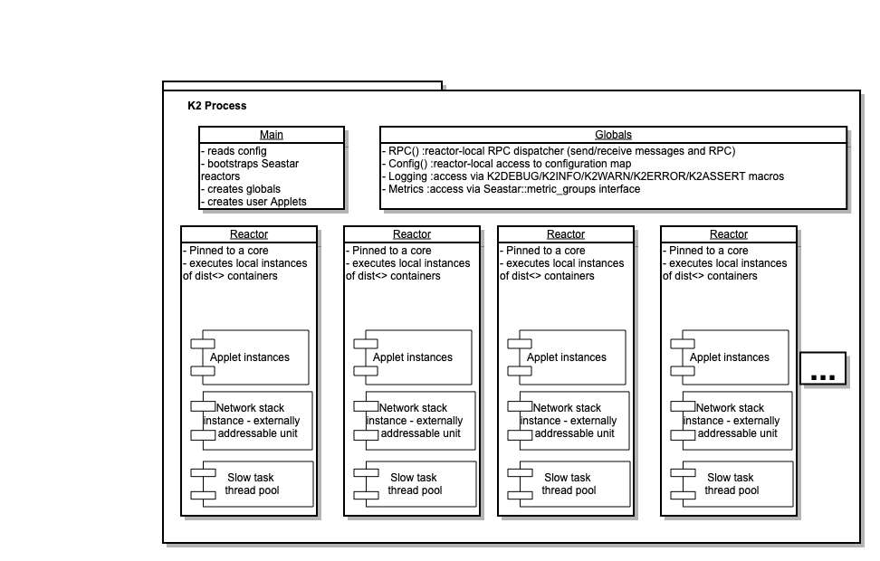

This document describes the architecture for a K2 process.

# General process architecture

We use Seastar to manage our processes. When our process is started, we create N reactor instances - each instance pinned to a particular core. The number of instances and their core assignment is driven via command line configuration.

We have a class used to help create K2 applications, called `K2::App`. It creates all of the necessary subsystems, and allows the user to add their custom code.
The user code is packaged in `Applets`. An `applet` is simply any class which has a start and stop methods (see many examples under k2/src/cmd/demo). The `K2::App` class allows the `applet` to be registered, and the `K2::App` will ensure that there is exactly one instance of the `applet` created and running on each core onto which the process is configured to run.

Underlying services are initialized by the K2 Appbase, to provide access to infrastructure such as:
- RPC/Messaging
- Configuration
- Logging
- Metrics

# K2 Nodepool
In our architecture, a K2 cluster is a cluster of `K2Node`s. Each `K2Node` essentially maps 1-1 to a CPU core, (a reactor in the K2 process) and is externally addressable - it can send and receive messages addressed to it. Our partition maps will contain endpoints, naming particular `K2Node`s which would be responsible for particular data ranges.

When we start `K2Node`s, we don't start each one as a separate process. Instead we start each one as a thread. The process which spins these threads is called the `K2Nodepool`. The main thread in this process is reused as the reactor thread for the first core so that a process which we want to run on 3 cores will have 3 threads.

A `K2Nodepool` is started with pre-determined number of K2Nodes - we cannot add/remove K2Nodes at runtime from a node pool - we can only start/stop nodepools in order to manage capacity.

The K2Node is a set of Applets which we start in each reactor in order to compose the functionality of a node in the K2 cluster. This includes:
- Assignment Manager: This applet receives external partition assign/offload commands from our ControlPlaneOracle and is responsible for creating new partitions or removing existing ones
- Monitor: This applet is responsible for collecting usage statistics and sending them to our ControlPlaneOracle allowing the CPO to monitor the health of the cluster and take scaling/failover actions if needed.
- TSOClient: a client library for the TSO service, which allows the node to obtain K2 timestamps
- APIServer: Exposes a json-over-http port over which some RPCs can be invoked. Mostly used for testing/debugging
