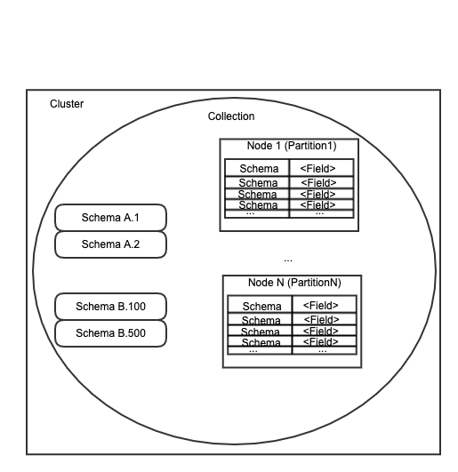
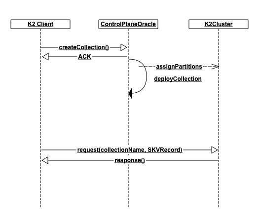

This document describes some basic concepts about K2. To start with, please read the [K2Process](./K2PROCESS.md) document in order to understand how we build a K2 process.

# Working with data in K2
This section covers the data organization in K2. Code snippet for reference:

``` c++
struct Key {
    // schemaName is needed in the key for uniqueness between records of different schemas
    String schemaName;

    // The key used to determine owner partition
    String partitionKey;

    // the range key used to uniquely identify a record in the owner partition
    String rangeKey;
};

// the assignment state of a partition
K2_DEF_ENUM(AssignmentState,
    NotAssigned,
    PendingAssignment,
    Assigned,
    FailedAssignment
);

// the partition version - used to validate the targeted partition in client requests, by
// ensuring that the client and server have the same understanding of the currently hosted
// partition at a particular K2 node
// This is sent on each and every request to the cluster and so we'd like to keep it as tight as possible
struct PVID {
    // the partition id
    uint64_t id = 0;
    // version incremented each time we change the range that this partition owns
    uint64_t rangeVersion = 0;
    // version incremented each time we assign the partition to different K2 node
    uint64_t assignmentVersion = 0;
};

// A descriptor for the key range of a partition
struct KeyRangeVersion {
    // the starting key for the partition
    String startKey;
    // the ending key for the partition
    String endKey;
    // the partition version
    PVID pvid;
};

// Partition in a K2 Collection. By default, the key-range type is String (for range-based partitioning)
// but it can also be an integral type for hash-based partitioning
struct Partition {
    // the key range version
    KeyRangeVersion keyRangeV;
    // the endpoints for the node which is currently assigned to this partition(version)
    std::set<String> endpoints;
    // the current assignment state of the partition
    AssignmentState astate = AssignmentState::NotAssigned;
};

struct PartitionMap {
    uint64_t version =0;
    std::vector<Partition> partitions;
};

struct CollectionCapacity {
    uint64_t dataCapacityMegaBytes = 0;
    uint64_t readIOPs = 0;
    uint64_t writeIOPs = 0;
};

K2_DEF_ENUM(HashScheme,
    Range,
    HashCRC32C
);

K2_DEF_ENUM(StorageDriver,
            K23SI);

struct CollectionMetadata {
    String name;
    HashScheme hashScheme;
    StorageDriver storageDriver;
    CollectionCapacity capacity;
    Duration retentionPeriod{0};
    Duration heartbeatDeadline{0}; // set by the CPO
    // This is used by the CPO only. If deleted is true the CPO will not return the collection
    // for getCollection RPCs, but the user can try to offload it again.
    bool deleted{false};
};

struct Collection {
    PartitionMap partitionMap;
    std::unordered_map<String, String> userMetadata;
    CollectionMetadata metadata;
};

struct Schema {
    String name;
    uint32_t version = 0;
    std::vector<SchemaField> fields;

    // All key fields must come before all value fields (by index), so that a key can be
    // constructed for a read request without knowing the schema version
    std::vector<uint32_t> partitionKeyFields;
    std::vector<uint32_t> rangeKeyFields;
};
```


## Quick overview
This is an overview of how data is organized in K2. Details on each part are following



## Cluster, nodes, nodepool
A recap from the K2PROCESS.md document:
A cluster is a set of machines used to deploy data which is managed as a single unit. We do not have a notion of cluster in code - it is just how we may refer in documentation to a set of machines which are used to deploy a `Collection`(see below). The data lives in partitions, each deployed to a single CPU Core with some particular fixed memory available to it (4-12GB). We call this a `node` and is what messages in the system are sent to. We start these on a given machine as individual threads in a process which we call the `nodepool`. Currently we deploy nodepools one per CPU socket, so a 2-socket machine (each socket with say 20cores) would get 2 nodepools, each running 20 threads for a total of 40 nodes available for deployment on this machine.

## Collection
Collections in K2 is how data is deployed on a set of nodes. Thus to work with data, a collection must already exist:



A collection is akin to a `Database` in the SQL world - it allows the data owner to manage the scalability and capacity of a bunch of datasets(related or not) together. For example, this could be the datasets for an online business: {sellers, users, orders, items, listings, offers, ...}. As the business grows, all of these datasets would see growth and it makes sense to manage their capacity and request/storage distribution as a single unit.

It should now be clear why we require the `collectionName` in each request - the requests are always collection-specific. In addition, we support multiple collections in a single transaction so that the users can still transact over data which isn't necessarily all in a single collection.

## Schema
A Schema is what we use to describe the data in a data record. In particular, it specifies
- the names and types for all fields
- which fields comprise the partitionKey
- which fields comprise the rangeKey

Schemas have names and are versioned. They are akin to `tables` in the SQL world; see [SchemaDesign](./SKV.md). All of the data in a particular schema is supposed to be part of a single data set (e.g. `Users`, or `Orders`). Via versioning, the users can perform schema migration, though we do not support changes to the key fields (partition/range).

- Schemas are created and are therefore scoped inside a particular collection.
- When reading data, the user has to specify from which schema they are reading

## SKVRecord
In our API, keys and data are not specified explicitly. Instead, the user specifies a set of fields with a schema. The combination of these two is an `SKVRecord`.

The `schema` associated with an `SKVRecord` designates a subset of the fields as the `partitionKey`, and a subset of fields as the `rangeKey`. Data will be placed on a given partition based on the `partitionKey` of the record. The `rangeKey` allows records with identical `partitionKey` to be placed adjacent in memory on the same partition in order to allow for very efficient bulk retrieval (see reading multiple records below).

### Reading single record
In order to read data, you need to specify enough of the SKVRecord to identify the record in the system. That means that you have to supply values for all fields of both the `partitionKey` and the `rangeKey`.

We recognize that with schema versioning, it is very much possible to have related data with different schema version at the same time in the system. In order to help with the retrieval, the read requests only consider tha schema name, not version. When a particular SKVRecord response comes back, the record will have a particular version(for whatever was stored in the cluster).

### Reading multiple records
To read multiple records, we provide a `query` api, which allows the user to specify the start and end keys for the range they would like to read. In both the start and end, the user can specify any number of fields of their partition and range keys. It helps to think of the two as a prefix: `partitionKey` + `rangeKey`, where each key is a list of fields: [f1, f2, f3...].

For example, we can have
``` json
Schema= { name: "orders",
          fields: [(int, "order_id"), (int, "user_id"), (string, "item_id"), (string, "item_price"), (double, "discount")],
          partitionKey: ["user_id", "order_id"],
          rangeKey: ["item_id"]
        }
```

In that schema, the full key for each record will be the tuple `(<user_id>:<order_id>:<item_id>)`. In this schema, you may wish to get all orders for a user. To perform such a query, you can specify a range-read request with
`start=<user_id>`
`end=<user_id>`

This would allow the system to find all records which have the prefix `<user_id>` effectively giving a list of all items in all orders for that user.

### Writing full record
This is the normal way to write records. The user will have to create an SKVRecord with a particular schema version, and then specify values for the fields. The record is routed to the correct partition based on the `partitionKey` tuple

### Writing partial record
We also allow partial updates to data. This is done via a separate API where the SKVRecord must still contain all of the key fields (both partition and range), but may specify only some of the non-essential fields. We apply the update on top of the last version of the data record we have in the cluster.

### Writing multiple records
We do not currently support writes to multiple records in a single request. However, our API is fully asynchronous, so the users can simply issue as many writes as they wish in parallel, and wait for their completion as desired.

